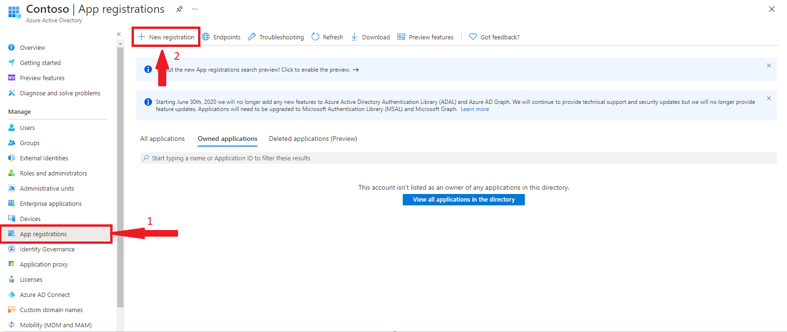
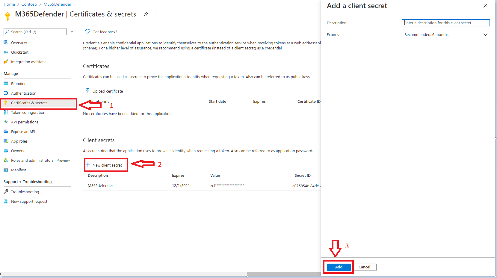
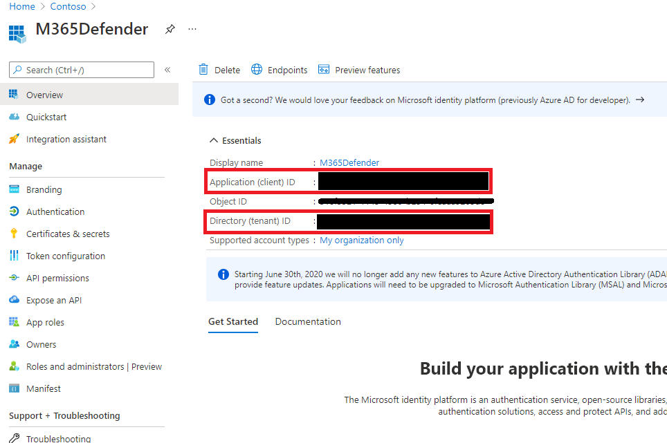
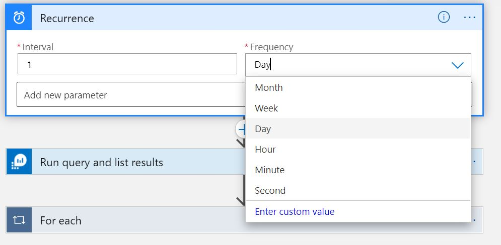

# Sync-Sentinel-Incident-Comments-To-M365Defender
author: Prateek Taneja, Benjamin Kovacevic

This Playbook synchronizes the comments made to Microsoft 365 Defender Incidents in Azure Sentinel to comments in the corresponding Incident in the Microsoft 365 Defender portal. The LogicApp looks for comments added to Incidents in the past 24 hours and writes these comments to the corresponding M365 incident in the M365 Security and Compliance exprience available at https://security.microsoft.com

Deploying this playbook requires the following steps:

1. Register an Azure Active Directory Application

Provide a name and leave everything as defaults and click Register.

2. The permission required to make a PATCH request in M365 Defender is - Incident.readWrite.All

Here's how these permissions can be provided.

On the application that was created in the above step, click on API Permissions on the left blade, then click Add a  Permission.

From the options that open on the right, select APIs mu organization uses and search for and then click Microsft Threat Protection. 

Next, click Application permissions. Select Incident.ReadWrite.All and then click on Add permissions.

Once the permissions have been assigned, you'll need to click on Grant Admin consent.

3. Generate a Secret for Authenticating to M365 Defender

Back on the application that was registered in Step 1, click on Certificates & Secrets.

Click on '+ New client secret'. Provide a description and expiration and click Add.

NOTE: The secret is displayed only once, so make sure you copy and save it NOW so this can be used when deploying the LogicApp.

4. Obtain the Tenant ID and the Client ID for use when deploying the LogicApp from template.

Back on the application that was registered in Step 1, copy the Directory (tenant) ID and the Application (client) ID

# Modifying time interval

Certain situations may dictate Security Operations to lower the frequency of the synchronization of comments from Azure Sentinel to M365 Defender. The following steps can be followed if changing the frequency of comments sync is required:

1. After the LogicApp has been deployed, you could modify the Recurrence trigger to a lower time interval. The default when the LogicApp is deployed is 1 day.

Also, you could add more parameters for the triggers such as Time zone and/or the Start (or Trigger) time.
-------------------------------------------------------------------------------------------
