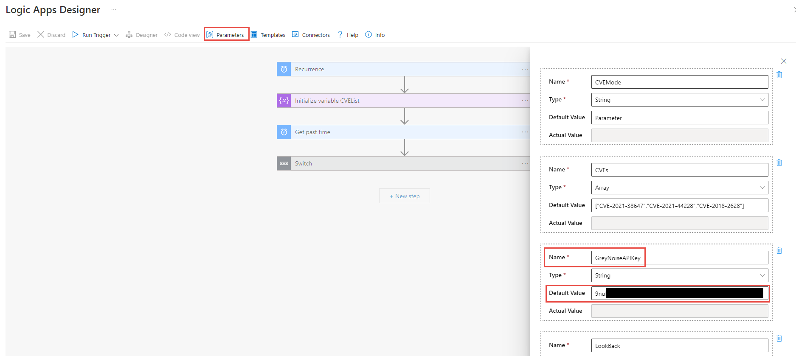
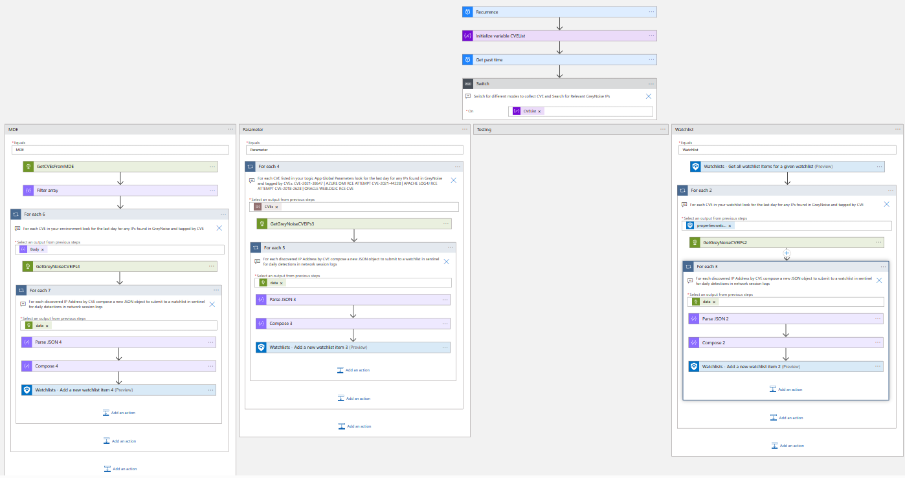

# Update-CVE-IPs-WatchListwithGreyNoise

author: Nathan Swift

This playbook uses the GreyNoise API to search for interesting IPs discovered in the last day tagged per each CVE found in the mode you setup. See below for more information on the Modes to deploy with. Optionally to prevent rate limits you may want to obtain a valid GreyNoise API Key. To learn more about the service and request a trial key, see the [Setting up an Account](https://developer.greynoise.io/docs/setting-up-an-account).

For details around the API used see the [Community API documentation](https://developer.greynoise.io/reference/community-api#get_v3-community-ip).

[](https://portal.azure.com/#create/Microsoft.Template/uri/https%3A%2F%2Fraw.githubusercontent.com%2FAzure%2FAzure-Sentinel%2Fmaster%2FPlaybooks%2FUpdate-CVE-IPs-WatchListwithGreyNoise%2Fazuredeploy.json)
[](https://portal.azure.us/#create/Microsoft.Template/uri/https%3A%2F%2Fraw.githubusercontent.com%2FAzure%2FAzure-Sentinel%2Fmaster%2FPlaybooks%2FUpdate-CVE-IPs-WatchListwithGreyNoise%2Fazuredeploy.json)

##Prepare for install##

**Deploy Logic App with preferred mode:**

_Modes_

MDE - This will start the flow by going to MDE for CVEs found in your devices and servers published in the last 30 days, using those CVEs it will lookup GreyNoises the last 24 hours of tagged IPs found in GeryNoise's sensor network related to each CVE, and place each ip and information into watchlist: GreyNoiseIPsbyCVEs

Watchlist - This will start the flow by going to watchlist: GreyNoiseCVEs for CVEs found in watchlist. Watchlist can be maintained manually by security operations or automatically through your own built integrations from Qualys, Tenable, Rapid7, Crowdstrike, or others sending CVEs found to the watchlist. Using those CVEs it will lookup GreyNoises the last 24 hours of tagged IPs found in GeryNoise's sensor network related to each CVE, and place each ip and information into watchlist: GreyNoiseIPsbyCVEs

Parameter - This will start the flow by going to Logic App Global Parameter: CVEs. Logic App Global Parameter CVEs can be maintained manually by security operations. Using those CVEs it will lookup GreyNoises the last 24 hours of tagged IPs found in GeryNoise's sensor network related to each CVE, and place each ip and information into watchlist: GreyNoiseIPsbyCVEs

_Artifacts_

Logic App Global Parameter: LookBack - Set to 1 day but can be adjusted see GreyNoise Documentation [here](https://docs.greynoise.io/docs/using-the-greynoise-query-language-gnql#time-based-query-options). If you need to make changes to how far you look back for IPs associated by CVE in GreyNoise; this setting should be changed along with the Reoccurrence trigger and should typically match each other.

Network searching for Grey Noise Ips by CVE activity - Is a sentinel detection to run daily matching network sessions that are involed with CVEs and GreyNoise's IPs gathered.

GreyNoiseIPsbyCVEs - watchlist for storing IPs found within GeryNoise associated with bots and scanners searching to exploit CVE

GreyNoiseCVEs - watchlist used to store the CVEs to search for GreyNoise and gather unique IPs associated with bots and scanners searching to exploit CVE

**Deploy Logic App with GreyNoise API Key**

To prevent rate limits you may want to obtain a valid GreyNoise API Key. You can also add later or change by going to the Logic App Global Parameter: GreyNoiseAPIKey. You can obtain a GreyNoise API Key from going to your GreyNoise Account:



**Additional Post Install Notes:**

* Authorize the web.connection APIs deployed into the ResourceGroup.

* The Logic App creates and uses a Managed System Identity (MSI) to read/update the Microsoft Sentinel Watchlists.

* Assign RBAC 'Microsoft Sentinel Contributor' role to the Logic App at the Resource Group level of the Log Analytics Workspace.

* Create a new Analytic Rule based on NetworkSearchingForGreyNoiseIPbyCVEActivity.yaml found in this directory.

## Initial Setup

## Prerequisites

- **For Gov Only** You will need to update the HTTP action URL to the correct URL documented [here](https://docs.microsoft.com/microsoft-365/security/defender-endpoint/gov?view=o365-worldwide#api)
- You will need to grant Vulnerability.Read.All permissions to the managed identity. Run the following code replacing the managed identity object id. You find the managed identity object id on the Identity blade under Settings for the Logic App.

```powershell
$MIGuid = "<Enter your managed identity guid here>"
$MI = Get-AzureADServicePrincipal -ObjectId $MIGuid

$MDEAppId = "fc780465-2017-40d4-a0c5-307022471b92"
$PermissionName = "Vulnerability.Read.All"

$MDEServicePrincipal = Get-AzureADServicePrincipal -Filter "appId eq '$MDEAppId'"
$AppRole = $MDEServicePrincipal.AppRoles | Where-Object {$_.Value -eq $PermissionName -and $_.AllowedMemberTypes -contains "Application"}
New-AzureAdServiceAppRoleAssignment -ObjectId $MI.ObjectId -PrincipalId $MI.ObjectId `
-ResourceId $MDEServicePrincipal.ObjectId -Id $AppRole.Id
```

## (Optional) Manually update Logic App with GreyNoise API Key

To prevent rate limits you may want to obtain a valid GreyNoise API Key. Open the Logic App and Edit. Within the UI editor go to Parameters button towards top and add the key ass a default value as shown below. In addition open the CommunityIP action and add Key and the Parameter GreyNoiseKey.


<br>