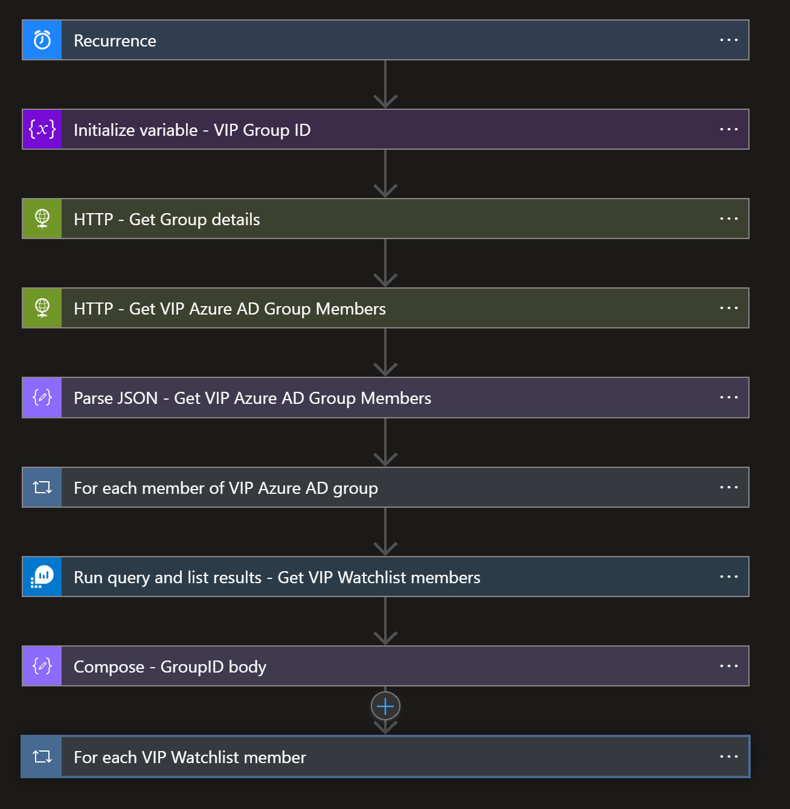

# Update-VIPUsers-Watchlist-from-AzureAD-Group
author: Benjamin Kovacevic

This playbook will sync members of existing/new Azure AD VIP group to the Microsoft Sentinel VIP Users watchlist. Playbook runs once per day, and if new VIP users are added to the Azure AD group, they will be added to the Microsoft Sentinel VIP Users watchlist with the first playbook run. <br>
In the second part of the playbook, it is checking are all members of Azure Sentinel VIP Users watchlist still members of the Azure AD VIP group. If we detect discrepancies, the user will be deleted from the watchlist.

Full deployment instruction is available on Tech Community blog - https://techcommunity.microsoft.com/t5/microsoft-sentinel-blog/update-microsoft-sentinel-vip-users-watchlist-from-azure-ad/ba-p/3100184

# Prerequisites

First we need to create the watchlist from the VIP Users template.
Since we cannot upload empty template, there must be one user in the CSV file. Best case is to use one of the users from your tenant so that you don't receive any errors. <br>
https://github.com/Azure/Azure-Sentinel/blob/master/Playbooks/Update-VIPUsers-Watchlist-from-AzureAD-Group/VIPUsersTemplate.csv
<br><br>
If we already don’t have VIP security group in Azure AD, we need to create one and add members. Please note that only members are synced to VIP watchlist! Once when we have it created, we need to copy Azure AD group Object ID from Overview pane. We will need it in the deployment.<br>
<br>
Next step is to create a Service Principal so that we can assign “Log Analytics Reader” RBAC role to the workplace where Microsoft Sentinel is.<br>
<br>
<br>

# Quick Deployment
[](https://portal.azure.com/#create/Microsoft.Template/uri/https%3A%2F%2Fraw.githubusercontent.com%2FAzure%2FAzure-Sentinel%2Fmaster%2FPlaybooks%2FUpdate-VIPUsers-Watchlist-from-AzureAD-Group%2Fazuredeploy.json)
[](https://portal.azure.us/#create/Microsoft.Template/uri/https%3A%2F%2Fraw.githubusercontent.com%2FAzure%2FAzure-Sentinel%2Fmaster%2FPlaybooks%2FUpdate-VIPUsers-Watchlist-from-AzureAD-Group%2Fazuredeploy.json)
<br><br>

# Post-deployment
When you deploy, you will need to make sure system-assigned identity is enabled, and we need to assign Microsoft Sentinel Contributor role (Microsoft Sentinel Reader and Responder roles cannot update the watchlist). To do so, choose Identity blade under Settings of the Logic App. <br>

Now you need either to assign User Administrator role in Azure AD or to grant following API permissions to the managed identity:<br>

|Microsoft Graph API|Permissions|Playbook connection|
|--------|-----------|-----------|
|GET /groups/{id}|GroupMember.Read.All,<br> Group.Read.All,<br> Directory.Read.All,<br> Group.ReadWrite.All,<br> Directory.ReadWrite.All| HTTP - Get Group details|
|GET /groups/{id}/members|GroupMember.Read.All,<br> Group.Read.All, <br>GroupMember.ReadWrite.All,<br> Group.ReadWrite.All,<br> Directory.Read.All|HTTP - Get VIP Azure AD Group Members|
|GET /users/{id or userPrincipalName}|User.Read.All,<br> User.ReadWrite.All,<br> Directory.Read.All,<br> Directory.ReadWrite.All|HTTP - does user have SID|
|POST /groups/{id}/checkMemberGroups|GroupMember.Read.All,<br> Group.Read.All,<br> Directory.Read.All,<br> Directory.ReadWrite.All|HTTP - check is the Watchlist user still member of Azure AD group|
|

<br>
To assign Microsft Graph API permissions, first you will have to connect to Azure AD PowerShell module - https://docs.microsoft.com/powershell/module/azuread/?view=azureadps-2.0#connect-to-your-directory
<br>
After login, run the following code replacing the managed identity object ID. You can find the managed identity object ID on the Identity blade under Settings for the Logic App.<br><br>

```powershell
$MIGuid = "<Enter your managed identity guid here>"
$MI = Get-AzureADServicePrincipal -ObjectId $MIGuid

$GraphAppId = "00000003-0000-0000-c000-000000000000"
$PermissionName1 = "User.Read.All"
$PermissionName2 = "User.ReadWrite.All"
$PermissionName3 = "GroupMember.ReadWrite.All"
$PermissionName4 = "GroupMember.Read.All"
$PermissionName5 = "Group.Read.All"
$PermissionName6 = "Directory.Read.All"
$PermissionName7 = "Group.ReadWrite.All"
$PermissionName8 = "Directory.ReadWrite.All"

$GraphServicePrincipal = Get-AzureADServicePrincipal -Filter "appId eq '$GraphAppId'"
$AppRole1 = $GraphServicePrincipal.AppRoles | Where-Object {$_.Value -eq $PermissionName1 -and $_.AllowedMemberTypes -contains "Application"}
New-AzureAdServiceAppRoleAssignment -ObjectId $MI.ObjectId -PrincipalId $MI.ObjectId `
-ResourceId $GraphServicePrincipal.ObjectId -Id $AppRole1.Id

$AppRole2 = $GraphServicePrincipal.AppRoles | Where-Object {$_.Value -eq $PermissionName2 -and $_.AllowedMemberTypes -contains "Application"}
New-AzureAdServiceAppRoleAssignment -ObjectId $MI.ObjectId -PrincipalId $MI.ObjectId `
-ResourceId $GraphServicePrincipal.ObjectId -Id $AppRole2.Id

$AppRole3 = $GraphServicePrincipal.AppRoles | Where-Object {$_.Value -eq $PermissionName3 -and $_.AllowedMemberTypes -contains "Application"}
New-AzureAdServiceAppRoleAssignment -ObjectId $MI.ObjectId -PrincipalId $MI.ObjectId `
-ResourceId $GraphServicePrincipal.ObjectId -Id $AppRole3.Id

$AppRole4 = $GraphServicePrincipal.AppRoles | Where-Object {$_.Value -eq $PermissionName4 -and $_.AllowedMemberTypes -contains "Application"}
New-AzureAdServiceAppRoleAssignment -ObjectId $MI.ObjectId -PrincipalId $MI.ObjectId `
-ResourceId $GraphServicePrincipal.ObjectId -Id $AppRole4.Id

$AppRole5 = $GraphServicePrincipal.AppRoles | Where-Object {$_.Value -eq $PermissionName5 -and $_.AllowedMemberTypes -contains "Application"}
New-AzureAdServiceAppRoleAssignment -ObjectId $MI.ObjectId -PrincipalId $MI.ObjectId `
-ResourceId $GraphServicePrincipal.ObjectId -Id $AppRole5.Id

$AppRole6 = $GraphServicePrincipal.AppRoles | Where-Object {$_.Value -eq $PermissionName6 -and $_.AllowedMemberTypes -contains "Application"}
New-AzureAdServiceAppRoleAssignment -ObjectId $MI.ObjectId -PrincipalId $MI.ObjectId `
-ResourceId $GraphServicePrincipal.ObjectId -Id $AppRole6.Id

$AppRole7 = $GraphServicePrincipal.AppRoles | Where-Object {$_.Value -eq $PermissionName7 -and $_.AllowedMemberTypes -contains "Application"}
New-AzureAdServiceAppRoleAssignment -ObjectId $MI.ObjectId -PrincipalId $MI.ObjectId `
-ResourceId $GraphServicePrincipal.ObjectId -Id $AppRole7.Id

$AppRole8 = $GraphServicePrincipal.AppRoles | Where-Object {$_.Value -eq $PermissionName8 -and $_.AllowedMemberTypes -contains "Application"}
New-AzureAdServiceAppRoleAssignment -ObjectId $MI.ObjectId -PrincipalId $MI.ObjectId `
-ResourceId $GraphServicePrincipal.ObjectId -Id $AppRole8.Id
```
Open the playbook in edit mode to authorize connections.<br>
- Azure Monitor Logs - 'Run query and list results - if user is in VIP watchlist' - using service principal
- Azure Monitor Logs - 'Run query and list results - Get VIP Watchlist members' - using service principal


Go back to Overview page of the playbook and click on Enable to enable the playbook.<br>

It will run automatically first time. <br>
<br>

# Troubleshooting 
- Make sure that all API permissions and user/application roles are assigned.
- Make sure that Logic App connectors are authorized with correct identity
- If using user identity, make sure that user has needed permissions
<br><br>

# Screenshots

**Playbook** <br>
