# Zscaler-add-Domains-to-URL-Category

Author: Arbala Security

For any technical questions, please contact info@arbalasystems.com   

This ARM template will deploy an Integration Account and a Playbook. It will pull domains from Sentinel Incidents and add them to a Zscaler URL Category of your choice. URL Categories can be configured to Block and Allow domains in the Zscaler Access Policies. This is extremely useful when a Sentinel Incident identifies a malicious domain communication and you want to quickly add it to your Zscaler Block list. 

#

Subdomains are parsed from a url string by first removing the following substrings, if found: "https://", "http://", and "www.". 
The result is saved in a new string and then a search is performed on said string for the first occurring "/". 
If found, all characters starting at this position to the end of the string are removed.

For example:

**https://www.example.com/example-subfolder/gate.php**

would result in:  

**.example.com**

The **.** before the TDL and subdomains is added after parsing as a wildcard per Zscaler documentation to include subdomains of the TLD.  
                                                
                                                 
#

You will need the following items to enter in to the template settings during deployment: 

* URL for your Zscaler instance.
* A Zscaler Local Admin Account configured for this API access.
* The Username/Password Local Administrator API account in your Zscaler environment.
* The API key for your Zscaler instance.
* The name of the Zscaler Custom URL Category you wish to add the domains to.

This deployment template contains two resources: An integration account and a logic app. The integration account is a requirement for executing javascript code, which is an operation used by the logicapp.

(https://portal.azure.com/#create/Microsoft.Template/uri/https%3A%2F%2Fraw.githubusercontent.com%2FAzure%2FAzure-Sentinel%2Fmaster%2FPlaybooks%2Zscaler-add-Domains-to-URL-Category%2Fmaster%2Fazuredeploy.json)

 #

First we will need to configure the Zscaler API Roles, API Admin Accounts, and gather the necessary information to fill in the ARM deployment template.  

For this Playbook to add URLs to your Zscaler custom domain list you will need a local ZScaler admin account that has access to read and modify policy. To limit the access to the account we will need to make a Custom Administrator Role. 

In the Zscaler administration console hover over **Administration then click on Role Management**

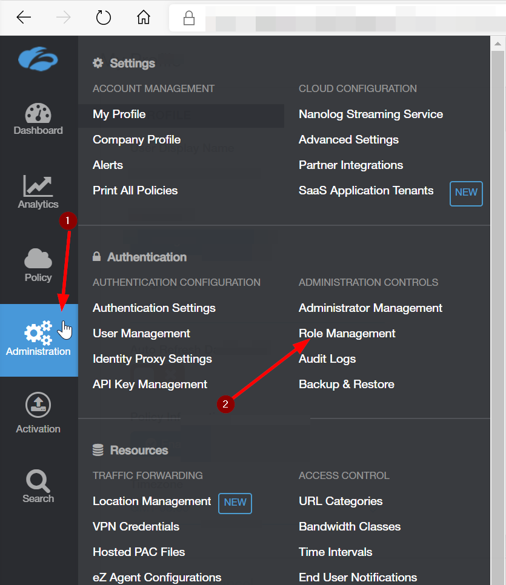

Click on **Add Administrator Role**

Create a **Name** for the **Administrator Role** and use the settings **exactly** as depicted in the image below. Then click the **Save** button.

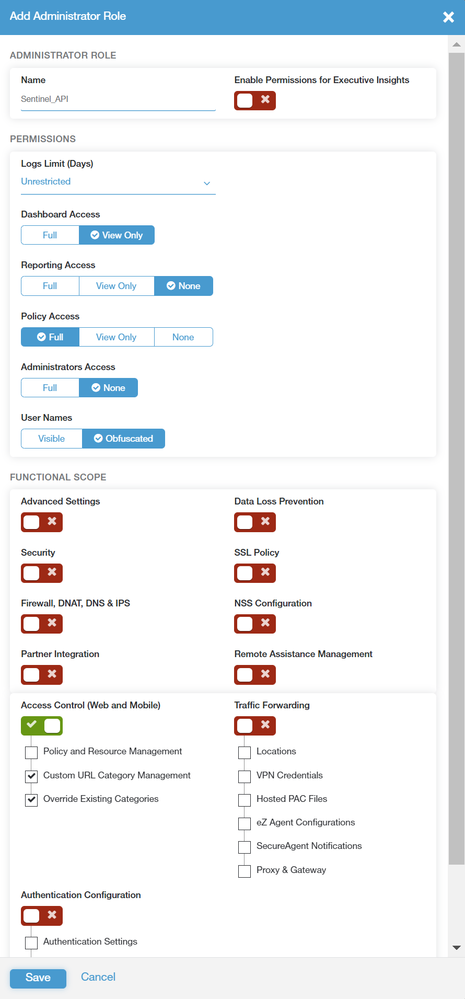

Hover over the **Activation** button and click **Activate** to enable the new Role.

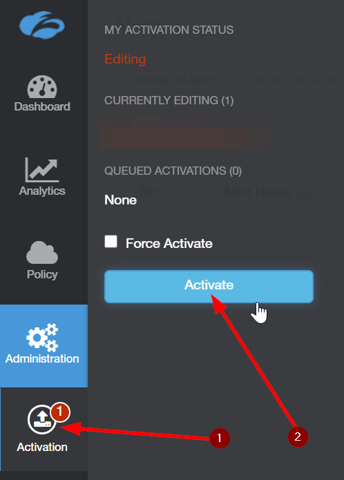

Next, hover over **Administration** and click on **Administrator Management**

Click on **Add Administrator**

Enter a **Login ID** for the API Administrator account you want to create. 
In the **Email** box you can enter a service account that exists in your domain for this purpose or just make up an email that you will not use in your domain. There is no need for email access for this account.
Enter a name for the account and in the drop-down box below that select the Role you created in the previous step.
Make sure **Password Based Login** is checked and create a secure password for this API account.
The **email address and password** will be required when deploying the ARM template.
Click on **Save** then hover over the **Activation** button and click **Activate** to enable the new Administrator Account.

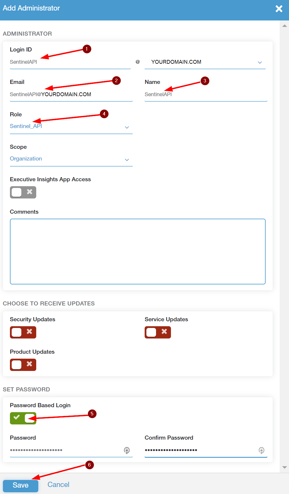

To get your **API key** hover over the **Administration** button and click on **API Key Management**

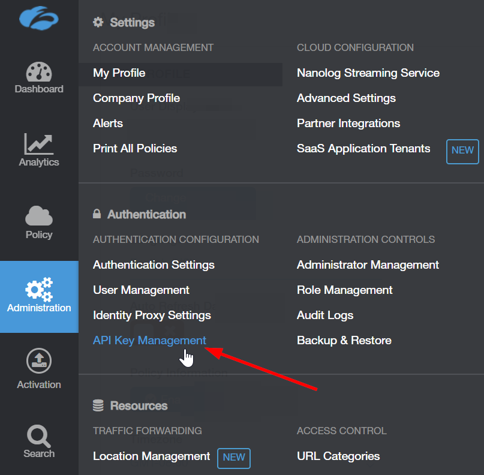

Here you will find you **API Key** as well as **Zscaler Instance Name.** You will need **both** when deploying the ARM template.  The typical instance names are Zscaler, ZscalerOne, ZscalerTwo, ZscalerThree, and ZsCloud.

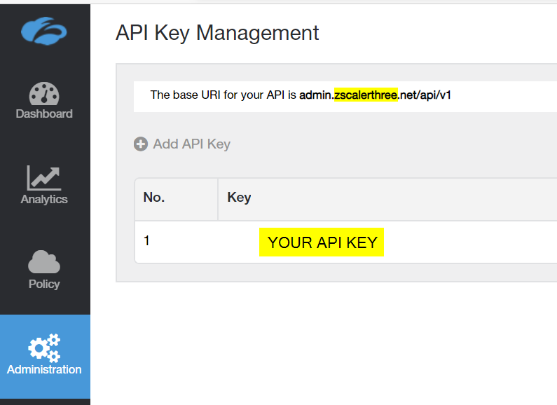

The last thing we will need from the Zscaler Portal is the Custom URL category. Hover over the **Administration** button and click on **URL Categories.** You will need to copy down the **exact** name of the Custom URL category you want the domains from the Sentinel Incident added to. In the example below we use name of our Custom category AS_Blocklist. This category in our test environment configured to a Zscaler access policy that disallows users access to any domain in in that list.

 # 
Up Next is the ARM template configuration and deployment. 
 
Open your browser and ensure you are logged into your Azure Sentinel workspace. In a separate tab, open the link to our playbook on the Arbala Security GitHub Repository:

https://github.com/Arbala-Security/Zscaler-add-Domains-to-URL-Category

From there, click the “Deploy to Azure” button at the bottom and it will bring you to the Custom Deployment Template.

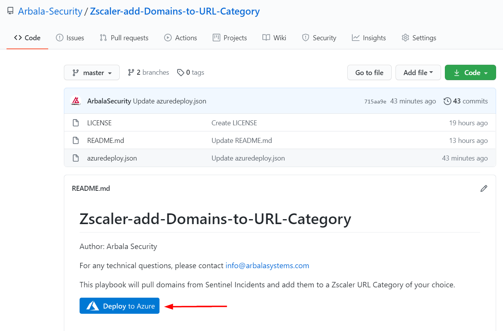

In the **BASICS** section:  

* Select the “**Subscription**” and “**Resource Group**” from the dropdown boxes you would like the playbook deployed to.  

In the **SETTINGS** section:   

* **Integration Account Name**: This can be left as “Zscaler-Logicapp” or you may change it.  

* **Integration Account Pricing Tier**: You will need to select your Integration Account pricing tier here. Note that there are a limited number of free Integration Accounts you are allotted and you will need to select a higher tier if you have used these up.  

* **Playbook Name**: This can be left as “Zscaler-add-Domains-to-URL-Category” or you may change it.  

* **ZscalerURL**: Enter your Zscaler tenant URL here.

* **Zscaler Username**:  Replace text with username of the Zscaler Admin account you want to use. 

* **Zscaler Password**: Replace text with password of the Zscaler Admin account you want to use. 

* **Zscaler API Key**: Replace text with API Key of your Zscaler org. 

* **Zscaler Custom URL Category Name**: Replace text with a Zscaler Custom URL Category Name. 

Towards the bottom ensure you check the box accepting the terms and conditions and then click on “Purchase”. 

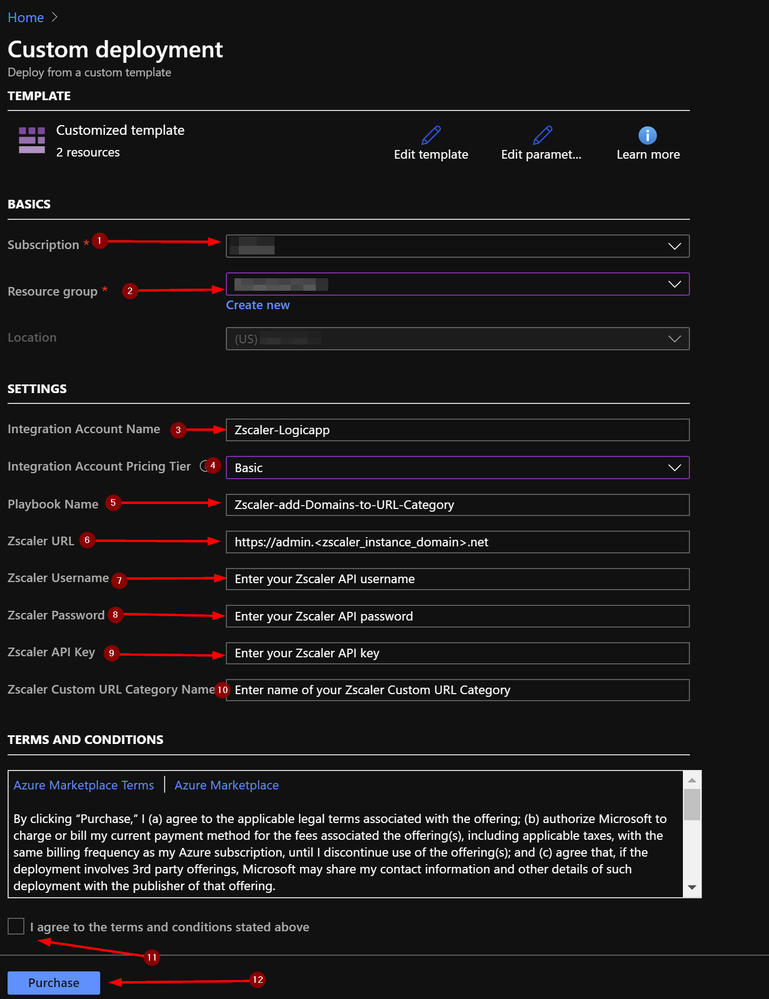

The resources should take around a minute to deploy. Once the deployment is complete, you should see two resources. One is an Integration Account and the other is the Logic App.  
Click the "Go to resource group" button.

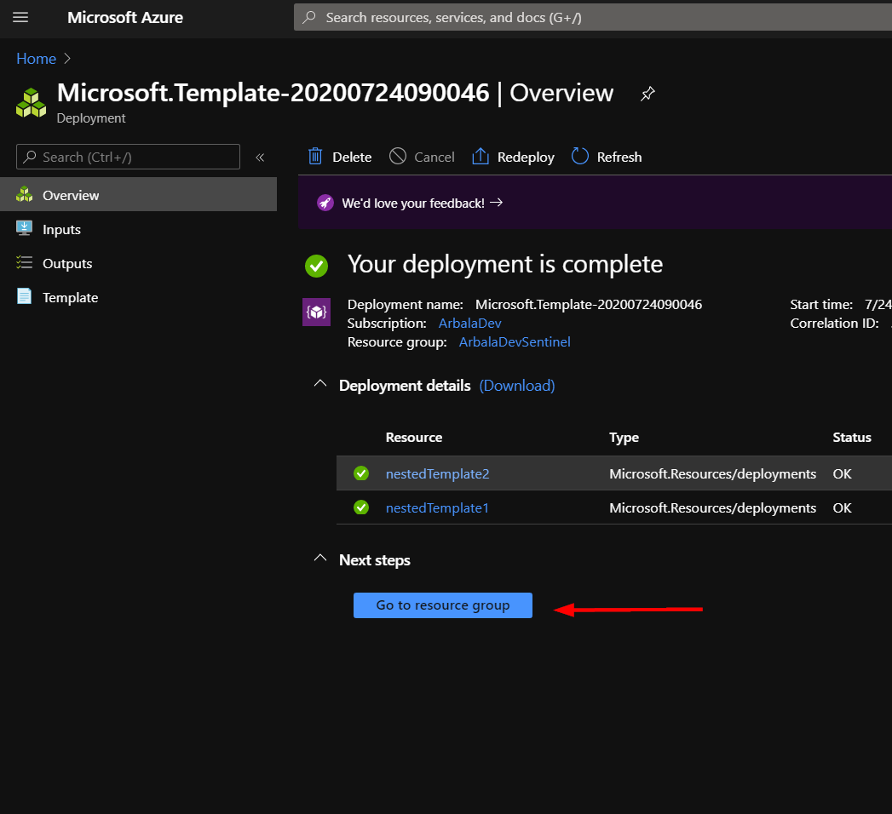

Click the logic app resource.

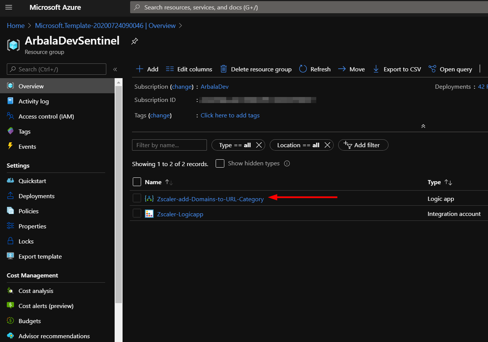

Click on the “Edit” button. This will bring us into the Logic Apps Designer.

Click on the bar labled “Connections”.  

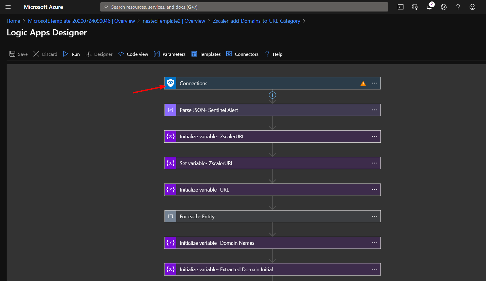

Here you can select an existing connection or create a new one.

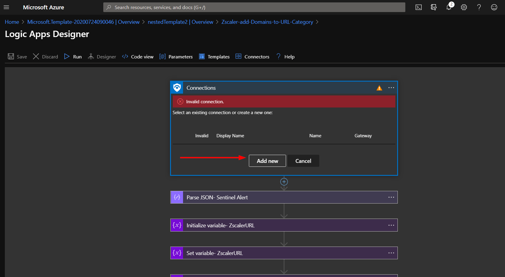

Click the save button.

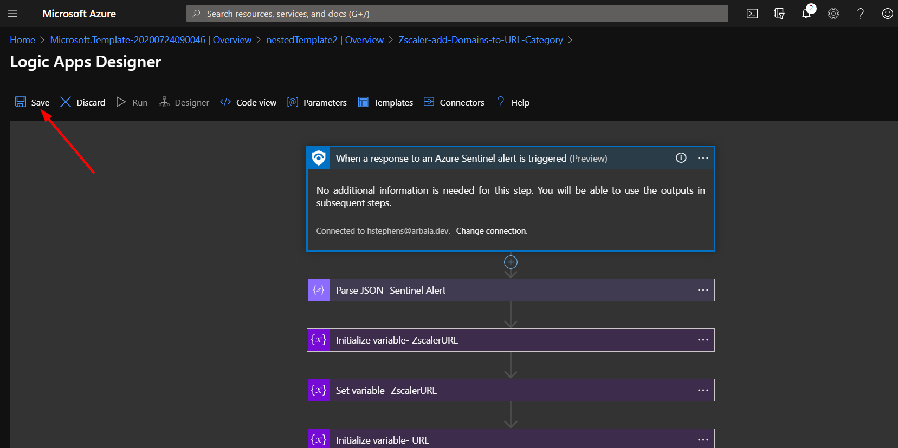

#

To run your new Logic App, navigate to the Azure Sentinel workspace you used during deployment.

Here you can select an Incident that has an associated URL. Note that this Logic App will not work if no URL is associated with the Incident (item 2). 

Click the "View full details" button.

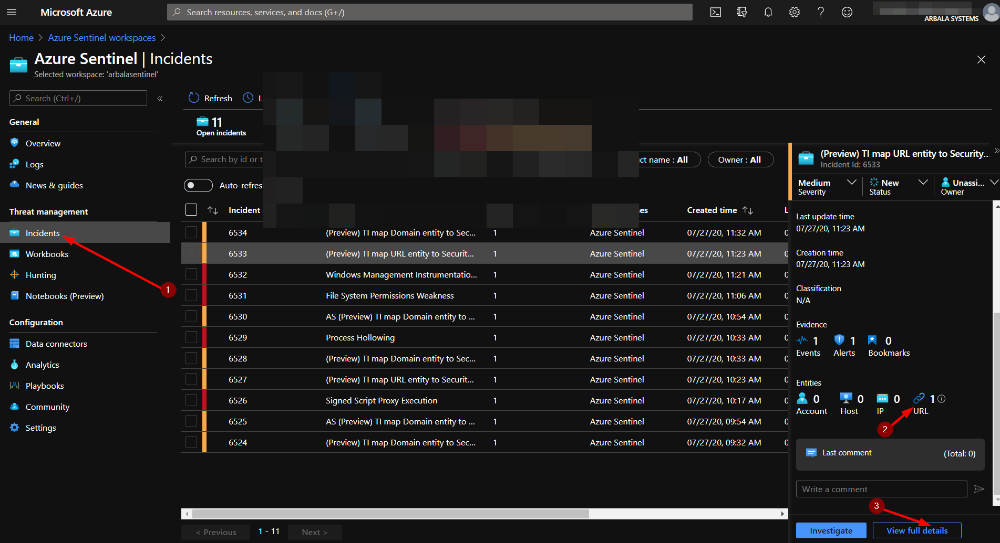

Click the "View playbooks" link.

Click the "Run" button.

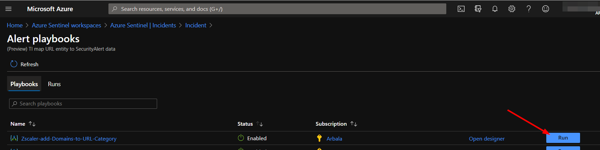

As you can see below - the domain/subdomains were parsed from the URL Entity in the Incident and added to the the Custom URL Category. 

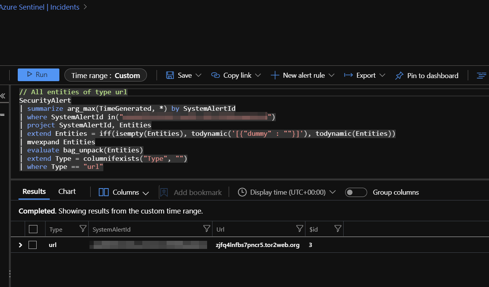
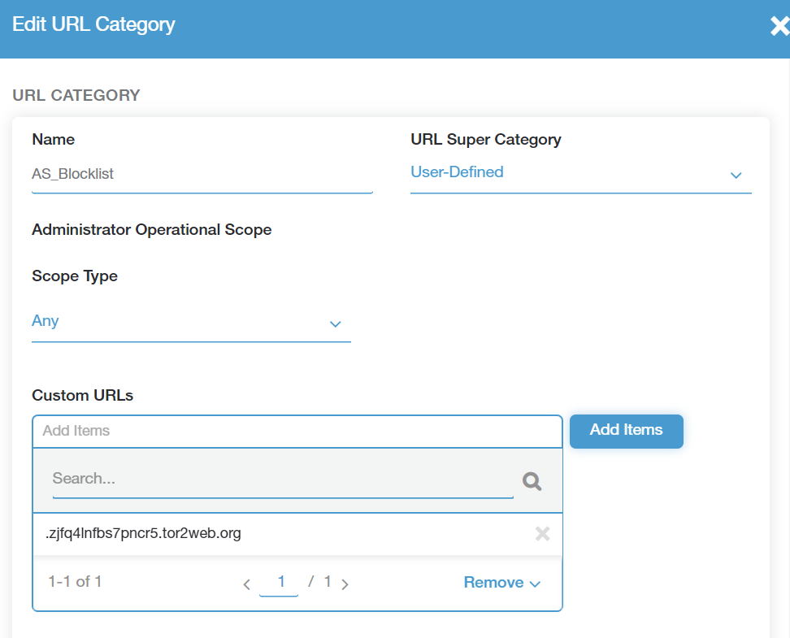

