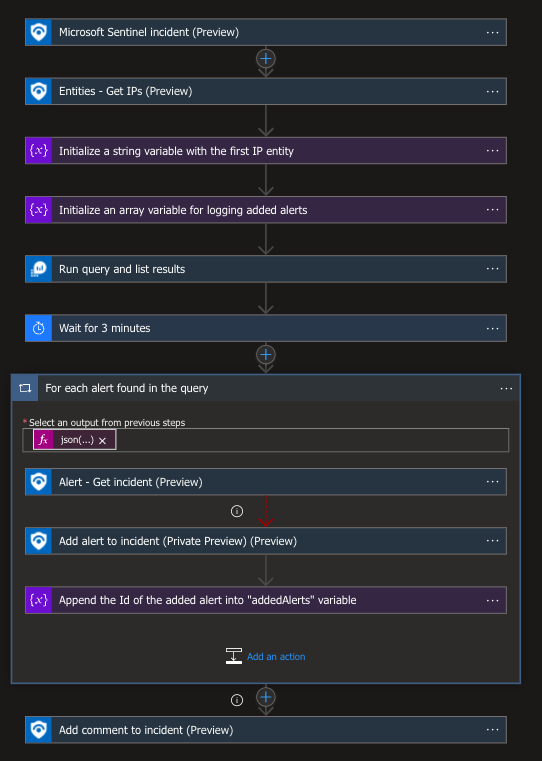
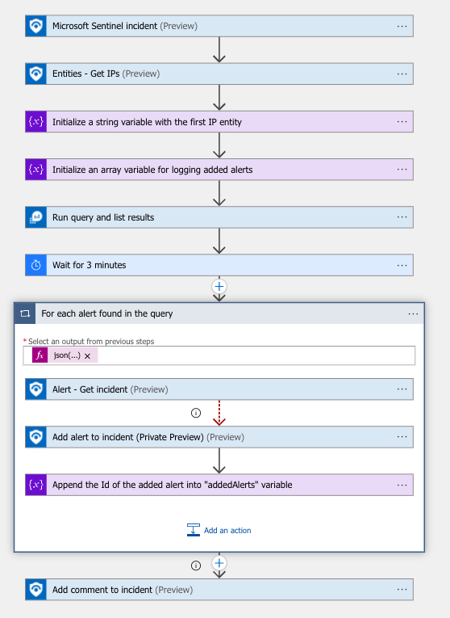

# relateAlertsToIncident-basedOnIP
 ## Summary
This playbook looks for other alerts with the same IP as the triggered incident. When such an alert is found, it will add each one to the incident only if they aren't related already to another incident.

 ## Playbook steps explained
 When a new incident is created:
1.Get the first IP entity of the incident
2.Make a list of alerts with the IP fetched in the previous step.Please note we exclude all the alerts with the same IP already related to the triggered incident
3.For each alert in the list:
3.1. Get the incident of the alert
3.2. If the last step fails (meaning the current alert is not related to another incident): add this alert to the incident\

4.Add a comment to the incident specifying all the alerts added to it by listing their "SystemAlertId" field

## Screenshots

**Incident Trigger** 

