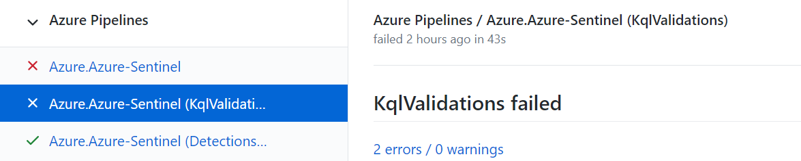
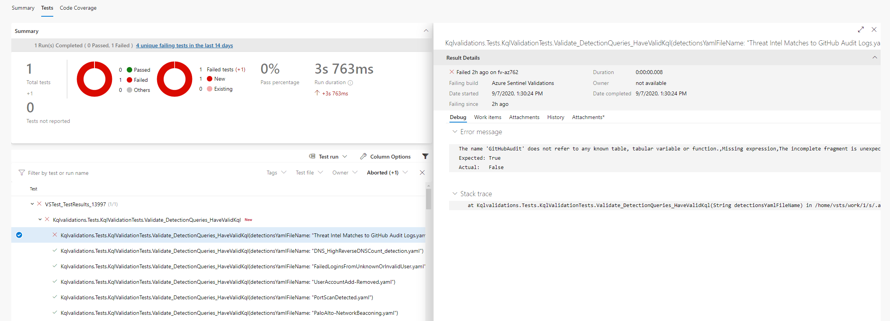

# Azure Sentinel
Welcome to the Azure Sentinel repository! This repository contains out of the box detections, exploration queries, hunting queries, workbooks, playbooks and much more to help you get ramped up with Azure Sentinel and provide you security content to secure your environment and hunt for threats. You can also submit to [issues](https://github.com/Azure/Azure-Sentinel/issues) for any samples or resources you would like to see here as you onboard to Azure Sentinel. This repository welcomes contributions and refer to this repository's [wiki](https://aka.ms/threathunters) to get started. For questions and feedback, please contact [AzureSentinel@microsoft.com](AzureSentinel@microsoft.com) 

# Resources
* [Azure Sentinel documentation](https://go.microsoft.com/fwlink/?linkid=2073774&clcid=0x409)
* [Security Community Webinars](https://aka.ms/securitywebinars)
* [Getting started with GitHub](https://help.github.com/en#dotcom)

We value your feedback. Here are some channels to help surface your questions or feedback:
1. General product specific Q&A - Join in the [Azure Sentinel Tech Community conversations](https://techcommunity.microsoft.com/t5/Azure-Sentinel/bd-p/AzureSentinel)
1. Product specific feature requests - Upvote or post new on [Azure Sentinel feedback forums](https://feedback.azure.com/forums/920458-azure-sentinel)
1. Report product or contribution bugs - File a GitHub Issue using [Bug template](https://github.com/Azure/Azure-Sentinel/issues/new?assignees=&labels=&template=bug_report.md&title=)
1. General feedback on community and contribution process - File a GitHub Issue using [Feature Request template](https://github.com/Azure/Azure-Sentinel/issues/new?assignees=&labels=&template=feature_request.md&title=)


# Contributing

This project welcomes contributions and suggestions.  Most contributions require you to agree to a
Contributor License Agreement (CLA) declaring that you have the right to, and actually do, grant us
the rights to use your contribution. For details, visit https://cla.microsoft.com.

## Add in your new or updated contributions to GitHub
Note: If you are a first time contributor to this repository, [Fork the repo](https://docs.github.com/github/getting-started-with-github/fork-a-repo) before cloning. 

Brand new or update to a contribution via these methods:
* Submit for review directly on GitHub website 
    * Browse to the folder you want to upload your file to
    * Choose Upload Files and browse to your file. 
    * You will be required to create your own branch and then submit the Pull Request for review.
* Use [GitHub Desktop](https://help.github.com/en/desktop/getting-started-with-github-desktop) or [Visual Studio](https://visualstudio.microsoft.com/vs/) or [VSCode](https://code.visualstudio.com/?wt.mc_id=DX_841432)
    * [Fork the repo](https://docs.github.com/github/getting-started-with-github/fork-a-repo)  
    * [Clone the repo](https://help.github.com/en/github/creating-cloning-and-archiving-repositories/cloning-a-repository)
    * [Create your own branch](https://help.github.com/en/desktop/contributing-to-projects/creating-a-branch-for-your-work)
    * Do your additions/updates in GitHub Desktop 
    * [Push your changes to GitHub](https://help.github.com/en/github/using-git/pushing-commits-to-a-remote-repository)

## Pull Request
* After you push your changes, you will need to submit the [Pull Request (PR)](https://help.github.com/en/github/collaborating-with-issues-and-pull-requests/about-pull-requests)
* After submission, check the [Pull Request](https://github.com/Azure/Azure-Sentinel/pulls) for comments
* Make changes as suggested and update your branch or explain why no change is needed. Resolve the comment when done.

### Pull Request Kql Validation Check
As part of the PR checks we run a syntax validation of the kql queries defined in the template. If this check fails go to Azure Pipeline (by pressing on the errors link on the checks tab in your PR)

In the pipeline you can see which test failed and what is the cause:

If you are using custom logs table (a table which is not defined on all workspaces by default) you should verify
your table schema is defined in json file in the folder *Azure-Sentinel\\.script\tests\KqlvalidationsTests\CustomTables*

**Example for table tablexyz.json**
```json
{
  "Name": "tablexyz",
  "Properties": [
    {
      "Name": "SomeDateTimeColumn",
      "Type": "DateTime"
    },
    {
      "Name": "SomeStringColumn",
      "Type": "String"
    },
    {
      "Name": "SomeDynamicColumn",
      "Type": "Dynamic"
    }
  ]
}
```
### Run Kql Validation Locally
In order to run the kql validation before submitting Pull Request in you local machine:
* You need to have **.Net Core 3.1 SDK** installed [How to download .Net](https://dotnet.microsoft.com/download) (Supports all platforms)
* Open Shell and navigate to  `Azure-Sentinel\\.script\tests\KqlvalidationsTests\`
* Execute `dotnet test`

Example of output (in Ubuntu):
```
Welcome to .NET Core 3.1!
---------------------
SDK Version: 3.1.403

Telemetry
---------
The .NET Core tools collect usage data in order to help us improve your experience. The data is anonymous. It is collected by Microsoft and shared with the community. You can opt-out of telemetry by setting the DOTNET_CLI_TELEMETRY_OPTOUT environment variable to '1' or 'true' using your favorite shell.

Read more about .NET Core CLI Tools telemetry: https://aka.ms/dotnet-cli-telemetry

----------------
Explore documentation: https://aka.ms/dotnet-docs
Report issues and find source on GitHub: https://github.com/dotnet/core
Find out what's new: https://aka.ms/dotnet-whats-new
Learn about the installed HTTPS developer cert: https://aka.ms/aspnet-core-https
Use 'dotnet --help' to see available commands or visit: https://aka.ms/dotnet-cli-docs
Write your first app: https://aka.ms/first-net-core-app
--------------------------------------------------------------------------------------
Test run for /mnt/c/git/Azure-Sentinel/.script/tests/KqlvalidationsTests/bin/Debug/netcoreapp3.1/Kqlvalidations.Tests.dll(.NETCoreApp,Version=v3.1)
Microsoft (R) Test Execution Command Line Tool Version 16.7.0
Copyright (c) Microsoft Corporation.  All rights reserved.

Starting test execution, please wait...

A total of 1 test files matched the specified pattern.

Test Run Successful.
Total tests: 171
     Passed: 171
 Total time: 25.7973 Seconds
```

### Detection structure validation tests
Similarly to KQL Validation, there is an automatic validation the structure of a detection.
The structure includes the detection's frequency and period, the detection's trigger type and threshold, etc.
A wrong format or missing attributes will result with an informative check failure, which should guide you through the resolution of the issue, but make sure to look into the format of already approved detection.

### Run Detection Structure Validation Locally
In order to run the kql validation before submitting Pull Request in you local machine:
* You need to have **.Net Core 3.1 SDK** installed [How to download .Net](https://dotnet.microsoft.com/download) (Supports all platforms)
* Open Shell and navigate to  `Azure-Sentinel\\.script\tests\DetectionTemplateStructureValidation\`
* Execute `dotnet test`


When you submit a pull request, a CLA-bot will automatically determine whether you need to provide
a CLA and decorate the PR appropriately (e.g., label, comment). Simply follow the instructions
provided by the bot. You will only need to do this once across all repos using our CLA.

This project has adopted the [Microsoft Open Source Code of Conduct](https://opensource.microsoft.com/codeofconduct/).
For more information see the [Code of Conduct FAQ](https://opensource.microsoft.com/codeofconduct/faq/) or
contact [opencode@microsoft.com](mailto:opencode@microsoft.com) with any additional questions or comments.

For information on what you can contribute and further details, refer to the ["get started"](https://github.com/Azure/Azure-Sentinel/wiki#get-started) section on the project's [wiki](https://aka.ms/threathunters).
