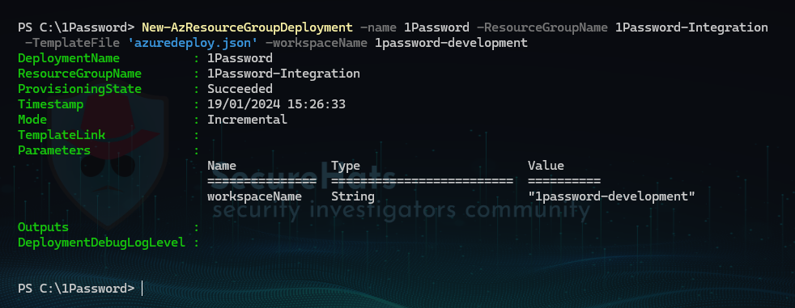

# 1Password (Preview)

## Overview

The key function of this solution is to retrieve data provided by the 1Password API and store this is a Log Analytics workspace using the cloud-native solutions.

## Azure services needed

### Required

- [1Password API key](https://support.1password.com/events-reporting/#appendix-issue-or-revoke-bearer-tokens)
- [Microsoft Azure](https://azure.microsoft.com/en-us/free)
- [Microsoft Sentinel](https://azure.microsoft.com/en-us/products/microsoft-sentinel/)
- Contributor role with User Access Administrator role on the Microsoft Sentinel Resource Group <br>
**or**
- Owner on the Microsoft Sentinel Resource Group 

## Automated Installation

The installation of the 1Password Solution for Microsoft Sentinel is very straight forward.  
Just click the button below and the deployment wizard will be opened. <br>

[](https://portal.azure.com/#create/Microsoft.Template/uri/https%3A%2F%2Fraw.githubusercontent.com%2Fazurekid%2FAzure-Sentinel%2Ffeature%2F1password%2FSolutions%2F1Password%2FData%20Connectors%2F1Password%2Fazuredeploy_1Password_API_FunctionApp.json/createUIDefinitionUri/https%3A%2F%2Fraw.githubusercontent.com%2Fazurekid%2FAzure-Sentinel%2Ffeature%2F1password%2FSolutions%2F1Password%2FData%20Connectors%2F1Password%2Fdeployment%2FUiDefinition.json)

> NOTE: To deploy the solution, the user account executing the deployment needs to have `Owner` permissions on the Microsoft Sentinel `Resource Group` in Azure.<br>
> This is required to assign the correct RBAC role to the managed identity of the FunctionApp!  

## Manual Installation using the ARM template

<details>

<summary>Deployment steps</summary>
<br/>

## Manual Installation using the ARM template

1. Install the data connector using the ARM template or use this link to skip the steps below



2. After the deployment of the template has completed open the Microsoft Sentinel portal and select the data connector


3. Select the `Open connector page` button to open the data connector configuration
4. click on the `Deploy to Azure` button<br>
This will open a new browser page containing a deployment wizard in Microsoft Azure.<br>
Fill in all the required fields and select `create` on the last page.


The required resources for the deployment will now be created.

</details>

## Deployed Resources

The 1Password solution exists out of the following resources:

> Click on the topics below to fold them out.

<details>

<summary>Resource Group</summary>
<br/>

### **Resource Group**

The Azure resource group is used as a container to group a set of resources that share the same lifecycle.
> NOTE: Known limitation is that the solution can only be deployed within the same `resourcegroup` as where Microsoft Sentinel is hosted.

</details>

<details>

<summary>Function App</summary>
<br/>

### **FunctionApp**

The Azure FunctionApp runs on top of an Azure App Service and is used to host the _PowerShell_ function to query the 1Password API endpoint. The Azure FunctionApp has the following components:

```powershell
|- WWWROOT
|-|- Modules
|-|-|- HelperFunctions.psm1
|-|- function
|-|-|- function.json
|-|-|- run.ps1
|-|- host.json
|-|- profile.ps1
|-|- requirements.psd1
```

The ```HelperFunctions.psm1``` module is used to simplify the FunctionApp code and handles security related tasks like:

- Query the 1Password API endpoint
- Send the data to the Data Collection Rule endpoint
- Set and retrieve the cursor and timestamp to a storage account

</details>

<details>

<summary>Key Vault</summary>
<br/>

### **Key Vault**

The Azure Key Vault resource is currently used to protect secure settings that are used in the 1Password API solution.
Because of the sensitivity of the secrets in the Key Vault, the access is restricted to the Managed Identity (MSI) of the FunctionApp.
Secrets that reside in the vault are:

- APIKey (1password)
- functionAppPackage (location to zip package hosting the function)
- dataCollectionEndpoint (endpoint for uploading 1Password logs)

</details>

<details>

<summary>Storage Account</summary>
<br/>

### **Storage Account**

For the storage of logs and properties of the Azure FunctionApp a storage account is used.

</details>

<details>

<summary>Application Insights</summary>
<br/>

### **Application Insights**

The Application Insights instance is used for collecting telemetry of the Azure FunctionApp.
It is used to give a view of the application including availability, performance, and usage patterns

</details>

<details>

<summary>Data Collection Rule</summary>
<br/>

### **Data Collection Rule (DCR)**

The Data Collection Rule including is attached to a _data collection endpoint_ and a Log Analytics table table
For the authentication against the data collection endpoint the MI (managed identity) of the FunctionApp is used.

</details>

<details>

<summary>Custom Table</summary>
<br/>

## **Custom Table**

During deployment a custom table with the name OnePasswordEventLogs_CL is created in the Log Analytics workspace.

</details>

<details>

<summary>Role Assignment</summary>
<br/>

### **Role Assignment**

The identity used to send the data to the Data Collection Endpoint needs to have _Monitoring Metrics Publisher_ role on the Data Collection Rule (DCR)
> NOTE: I can take up to 30 minutes after deployment before the first data is received by the table. <br>

</details>

## Implementation resources

The 1Password solution for Microsoft Sentinel is deployed from the data connector which needs to be created first.
> Note: In the 1Password (Preview) solution the installation in done using an ARM (Azure Resource Manager) template.<br>Once the solution is GA (general available) it will be installed from the Microsoft Sentinel content hub.


## Post Deployment steps

- N/A
