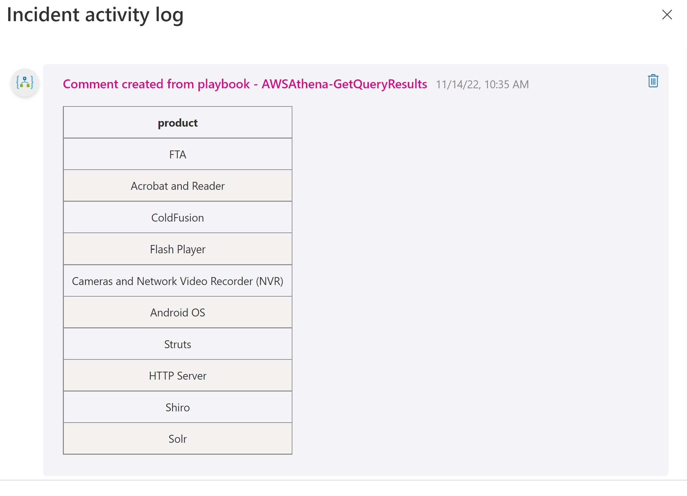

# AWSAthena-GetQueryResults

## Summary

When a new sentinel incident is created, this playbook gets triggered and performs the following actions:

1. It executes the query specified during playbook setup on given database. 
2. Downloads the query result and adds as a comment to the incident.

 
 

### Prerequisites

1. Prior to the deployment of this playbook, [AWS Athena API Function App Connector](../../CustomConnector/AWSAthena_FunctionAppConnector/) needs to be deployed under the same subscription.
2. Refer to [AWS Athena API Function App Connector](../../CustomConnector/AWSAthena_FunctionAppConnector/readme.md) documentation to obtain AWS Access Key ID, Secret Access Key and Region. 

### Deployment instructions

1. To deploy the Playbook, click the Deploy to Azure button. This will launch the ARM Template deployment wizard.
2. Fill in the required parameters:
    * Playbook Name
    * Data Catlog (e.g. AwsDataCatalog)
    * Database (e.g. testdb)
    * Output Location (e.g. s3://test-bucket/)
    * Query String (e.g. select * from testtable)

 

### Post-Deployment instructions

#### a. Authorize connections

Once deployment is complete, authorize each connection.

1. Click the Microsoft Sentinel connection resource
2. Click edit API connection
3. Click Authorize
4. Sign in
5. Click Save
6. Repeat steps for other connections

#### b. Assign Playbook Microsoft Sentinel Responder Role
1. Select the Playbook (Logic App) resource
2. Click on Identity Blade
3. Choose System assigned tab
4. Click on Azure role assignments
5. Click on Add role assignments
6. Select Scope - Resource group
7. Select Subscription - where Playbook has been created
8. Select Resource group - where Playbook has been created
9. Select Role - Microsoft Sentinel Responder
10. Click Save (It takes 3-5 minutes to show the added role.)

#### c. Function App Settings Update Instructions
Refer to [AWS Athena API Function App Connector](../../CustomConnector/AWSAthena_FunctionAppConnector/readme.md) documentation for Function App **Application Settings (Access Key ID, Secret Access Key and Region)** update instruction.

#  References
 - [AWS Athena API Guide](https://docs.aws.amazon.com/athena/latest/APIReference/Welcome.html)
 - [AWS Athena Boto3 Documentation](https://boto3.amazonaws.com/v1/documentation/api/latest/reference/services/athena.html)