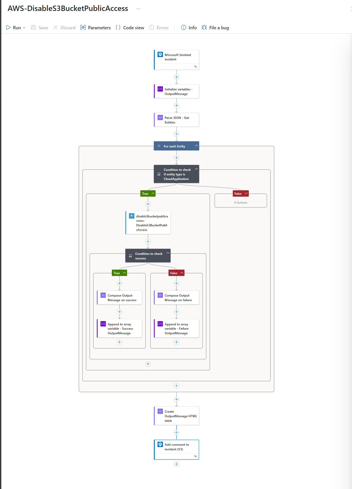
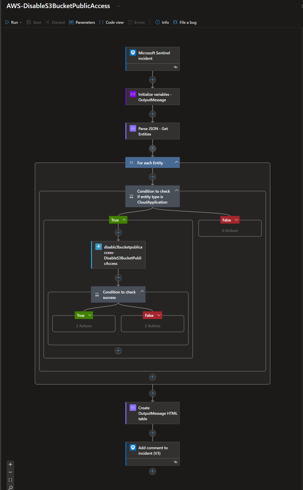
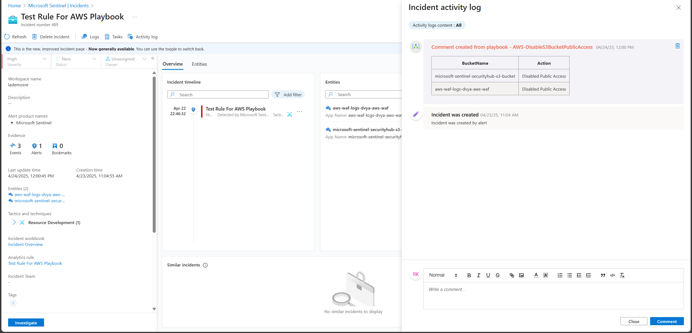

# AWS-DisableS3BucketPublicAccess

## Summary

When a new Sentinel incident is created, this playbook gets triggered and performs the following actions:

1. Get the Bucket Name from incident entities.
2. Call the AWS IAM Function App Connector to disable public access of S3 bucket.
3. Add a comment to the incident with the result of the action.

 
 
 

### Prerequisites

1. Prior to the deployment of this playbook, [AWS IAM Function App Connector](../../AWS_IAM_FunctionAppConnector/) needs to be deployed under the same subscription.
2. Refer to [AWS IAM Function App Connector](../../AWS_IAM_FunctionAppConnector/readme.md) documentation to obtain AWS Access Key ID and Secret Access Key.

### Deployment instructions

1. To deploy the Playbook, click the Deploy to Azure button. This will launch the ARM Template deployment wizard.
2. Fill in the required parameters:
    * Playbook Name: Enter the playbook name here

 

### Post-Deployment instructions

#### a. Authorize connections for Playbook

Once deployment is complete, authorize each connection.

1. Click the Microsoft Sentinel connection resource
2. Click edit API connection
3. Click Authorize
4. Sign in
5. Click Save
6. Repeat steps for other connections

#### b. Configure Analytic Rule to trigger Playbook in Microsoft Sentinel

1. In Microsoft sentinel, analytical rules should be configured to trigger an incident that contains Cloud Application instance. In the *Entity mapping* section of the analytics rule creation workflow, Cloud Application instance should be mapped to **Name** identifier of the **Cloud Application** entity type. Check the [documentation](https://docs.microsoft.com/azure/sentinel/map-data-fields-to-entities) to learn more about mapping entities.
2. Configure the automation rules to trigger the playbook. Check the [documentation](https://docs.microsoft.com/azure/sentinel/tutorial-respond-threats-playbook) to learn more about automation rules.

#### c. Assign Playbook Microsoft Sentinel Responder Role
1. Select the Playbook (Logic App) resource
2. Click on Identity Blade
3. Choose System assigned tab
4. Click on Azure role assignments
5. Click on Add role assignments
6. Select Scope - Resource group
7. Select Subscription - where Playbook has been created
8. Select Resource group - where Playbook has been created
9. Select Role - Microsoft Sentinel Responder
10. Click Save

#  References
- [AWS S3 API Documentation](https://docs.aws.amazon.com/AmazonS3/latest/API/Type_API_Reference.html)
- [AWS S3 User Guide](https://docs.aws.amazon.com/AmazonS3/latest/userguide/Welcome.html)
- [AWS S3 Boto3 Documentation](https://boto3.amazonaws.com/v1/documentation/api/latest/reference/services/s3.html)