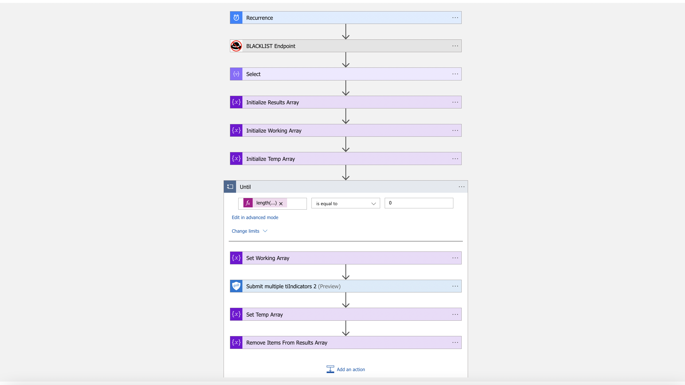

# AbuseIPDB-BlacklistIpToThreatIntelligence
 ## Summary
By every day reccurence, this playbook gets triggered and performs the following actions:
 1. Gets [list](https://docs.abuseipdb.com/#blacklist-endpoint) of the most reported IP addresses form the Blacklist Endpoint.

 
### Prerequisites 
1. AbuseIPDB Custom Connector has to be deployed prior to the deployment of this playbook under the same subscription.
2. To use the Microsoft Graph Security connector actions, Azure Active Directory (AD) tenant administrator consent needs to be provided. The Microsoft Graph Security connector application ID and name for Azure AD in is as follows for Azure AD administrator consent: 
 - Application Name - MicrosoftGraphSecurityConnector
 - Application ID - c4829704-0edc-4c3d-a347-7c4a67586f3c
3.To view the Threat Indicators submitted by Microsoft Graph Security connector, "Threat Intelligence Platforms" connector from "Threat Intelligence" Solution need be installed. 

### Deployment instructions 
1. To deploy the Playbook, click the Deploy to Azure button. This will launch the ARM Template deployment wizard.
2. Fill in the required paramteres:
    * Playbook Name: Enter the playbook name here

 

### Post-Deployment instructions 
#### a. Authorize connections
Once deployment is complete, authorize each connection.
1. Open playbook which has been deployed
2. Click API connection on left side blade
3. Click the AbuseIPDB connection resource
4. Click edit API connection
5. Click Authorize
6. Sign in
7. Click Save
8. Repeat steps for tiIndicators connector API Connection
