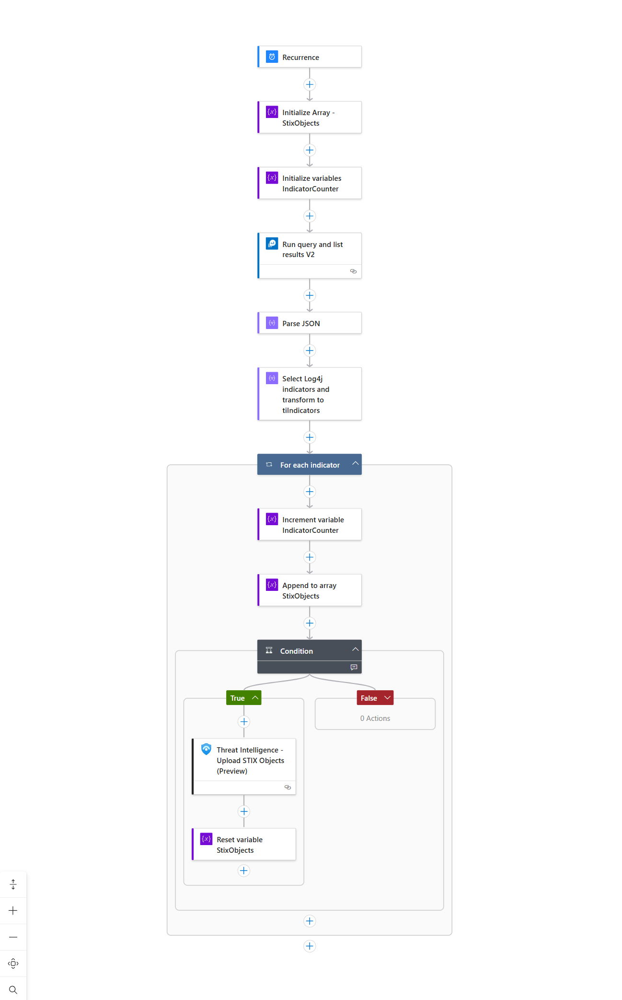
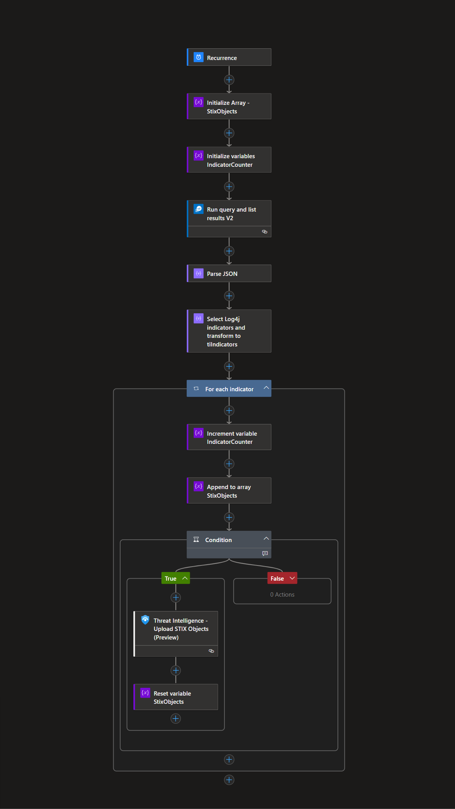

# Microsoft Sentinel Log4j Indicator Playbooks

This playbook automates the ingestion of threat indicators into the ThreatIntelIndicators table within a Microsoft Sentinel workspace. Sample data for Log4j IOC can be found at [Log4j IOC List](https://raw.githubusercontent.com/Azure/Azure-Sentinel/master/Sample%20Data/Feeds/Log4j_IOC_List.csv).

## Prerequisites

1. Have the Microsoft Sentinel Workspace name handy.

### Deployment instructions

1. To deploy the Playbook, click the Deploy to Azure button. This will launch the ARM Template deployment wizard.
2. Fill in the required parameters:
    * Playbook Name
    * Microsoft Sentinel Workspace Name

 

## Post Deployment Instructions

### Authorize Connections

After deployment, authorize all connections:

1. Click the Microsoft Sentinel connection resource.
2. Click edit API connection.
3. Click Authorize.
4. Sign in.
5. Click Save. Repeat steps for all connections.

### Assign Azure Contributor Role to Playbook

This playbook uses a managed identity, which must have Azure Contributor role assigned in the Log Analytics workspace instances to perform data insertion,

1. Select the Playbook resource.
2. In the left menu, click Settings>>Identity.
3. Under Permissions, click Azure role assignments.
4. Click Add role assignment.
5. Use the drop-down lists to select the resource group that your Sentinel Workspace is in. If multiple workspaces are used in different resource groups, consider selecting subscription as a scope instead.
6. In the Role drop-down list, select the role 'Contributor'.
7. Click Save to assign the role.

## Screenshots

