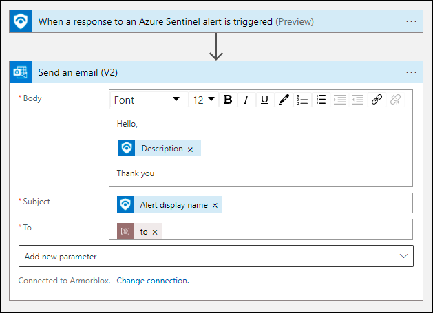

# Needs-Review-Incident-Email-Notification
**Author:** Armorblox

This playbook will send an email notification when a new incident is created in Microsoft Sentinel.
## Pre-requisites
An O365 account to be used to send email notification. The user account will be used in O365 connector (Send an email).

## Parameters
Notification Email - The receiver's mail address.

## Deployment                                                                                         

 

## Post-deployment

### Configure connections
Once this Playbooks template is deployed, you will need to go into the Logic App, edit it and click on each of the steps that require an authenticated connection to your tenant and complete the connection process. These steps will have an exclamation mark showing that the connection needs to be completed. Make sure to also open the "For each" step which also contains a step that requires an authenticated connection. 
Note:  Emails sent with this playbook will be from the user that creates the connection.

### Attach the playbook
After deployment, attach this playbook to the `Armorblox Needs Review` analytic rule so it runs when the alert is created. 
Note: Playbook is disabled by default. Please enable it before assigning to the Automation rule.

## Screenshots
### Playbook screenshot

