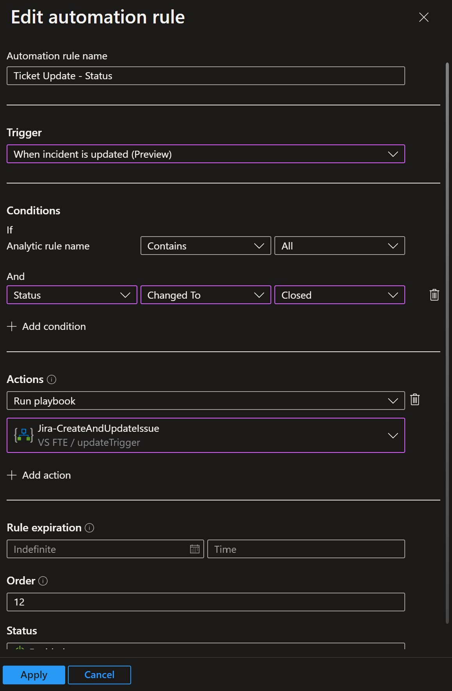
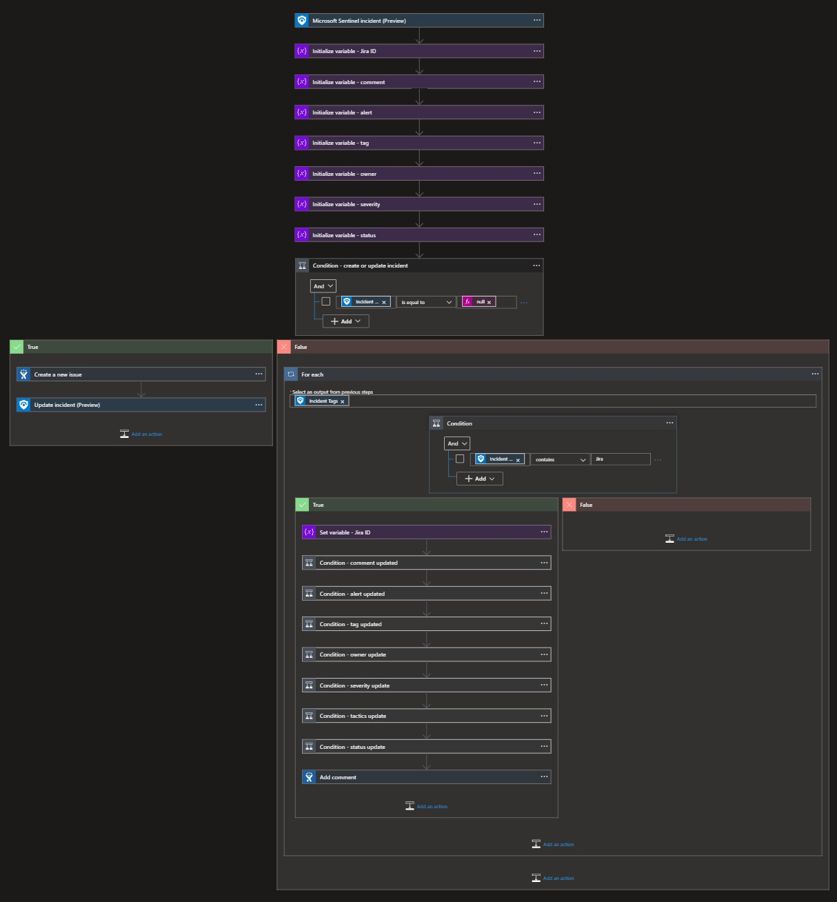
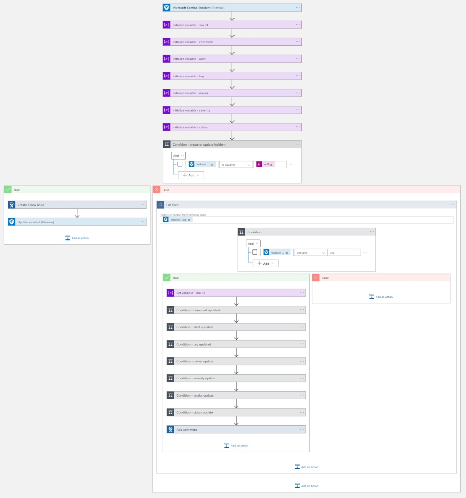
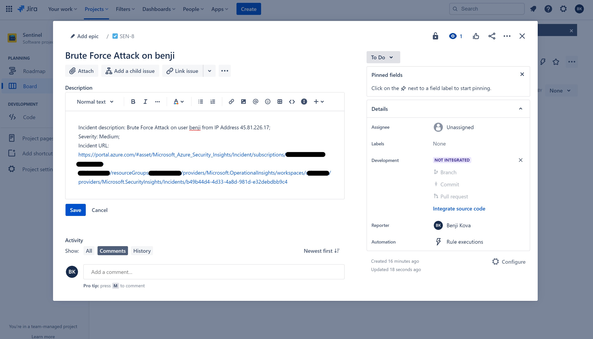
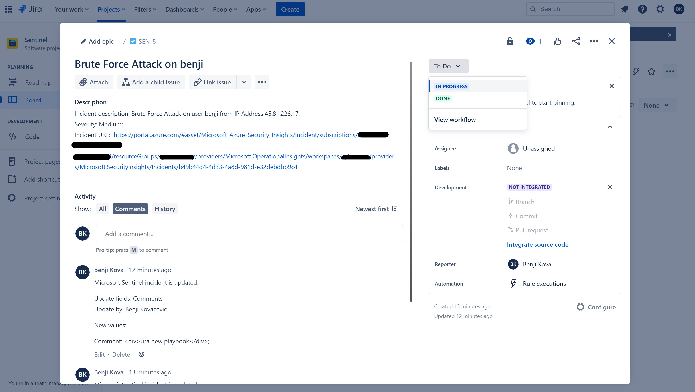

# Jira-CreateAndUpdateIssue
author: Benjamin Kovacevic

This playbook will create or update incident in Jira. When incident is created, playbook will run and create issue in Jira. When incident is updated, playbook will run and add update to comment section.

# Prerequisites

We will need following data to make Jira connector: 
1. Jira instance (ex. xyz.atlassian.net) 
2. Jira API (create API token on https://id.atlassian.com/manage-profile/security/api-tokens) 
3. User email 
 

# Quick Deployment

  

# Post-deployment
1. Authorize Jira connector and choose:
- Jira Project (where you want to sync Microsoft Sentinel incidents to) and
- Issue Type Id (Microsoft Sentinel incident issue type in Jira - Task, Story, Bug,...). 
2. Assign Microsoft Sentinel Responder role to playbook's managed identity. To do so, choose Identity blade under Settings of the Logic App.
3. Add playbook as an action to the automation rule, ex.:
- Trigger = When incident is updated;  
- Condition = Staus > Changed To > Closed;. 
**Automation rule example** 

# Screenshots

**Playbook**  
 
  

**Jira New Issue**  
  

**Jira Update Issue**  
 