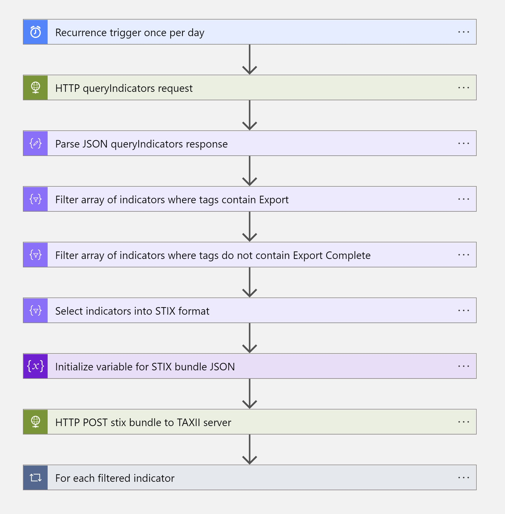

# AusCtisExportTaggedIndicators

## Summary

This playbook gets triggered every day and perform the following actions:

1. Get all the threat intelligence indicators from Sentinel Workspace with given tag.
2. Filter all the indicators whose export in not completed. 
3. Export the indicators to provided TAXII server. 

 

### Prerequisites

1. Have TAXII Server Url, Collection ID, Username and Password handy before the deployment of the Playbook

### Deployment instructions

1. To deploy the Playbook, click the Deploy to Azure button. This will launch the ARM Template deployment wizard.
2. Fill in the required parameters:
    * Playbook Name
    * TAXII Server Url
    * Collection ID
    * TAXII Server Username
    * TAXII Server Password
    * Sentinel Workspace
    * Tag for indicators to be exported
    * Tag for indicators after export completion

 

### Post-Deployment instructions

#### a. Authorize Playbook to access Log Analytics Workspace

Once deployment is complete, assign playbook Log Analytics contributor role.

1. Go to Log Analytics Workspace resource
2. Select Access control (IAM) tab
3. Add role assignments
4. Select Contributor role
5. In the Members tab choose "Assign access to" Managed Identity
6. Click on "Select members"
8. Provide correct Subscription and Managed Identity 
7. Provide the playbook name in "Search by name" textbox
8. Select the correct identity and click on Select
9. Click on "Review + assign" 

#  References
* [Australian Cyber Security Centre](https://www.cyber.gov.au/)