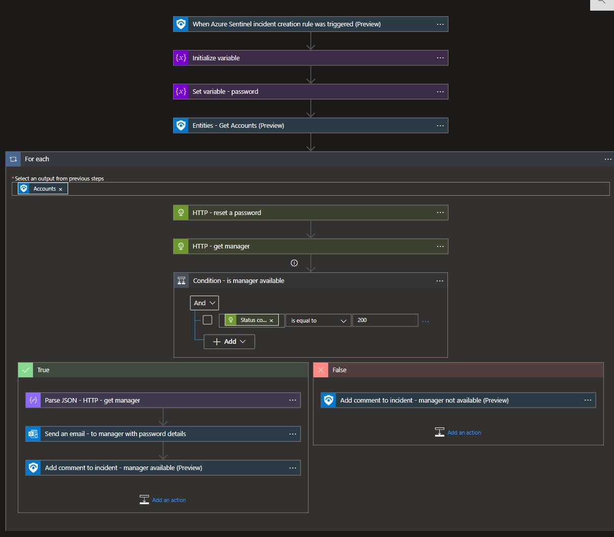
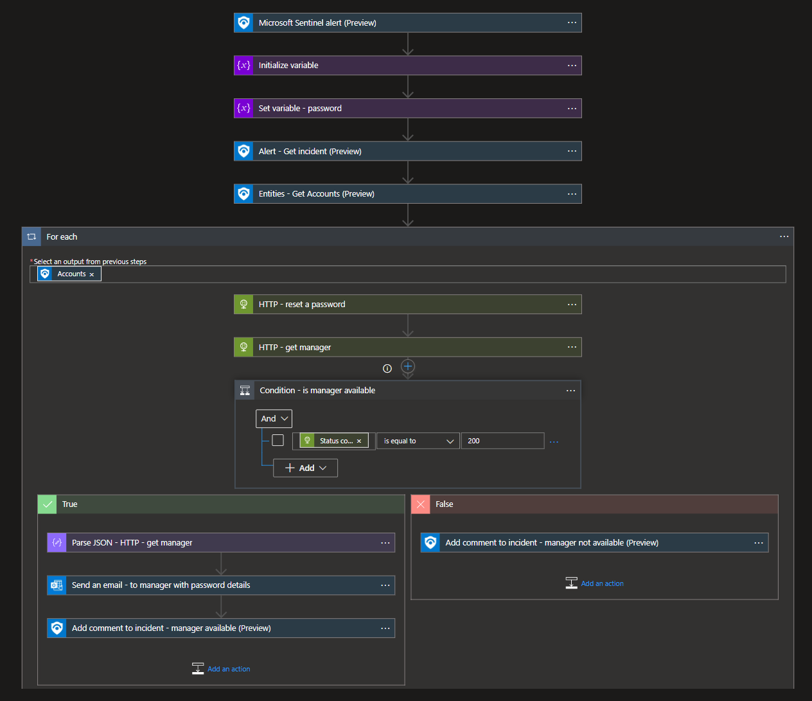
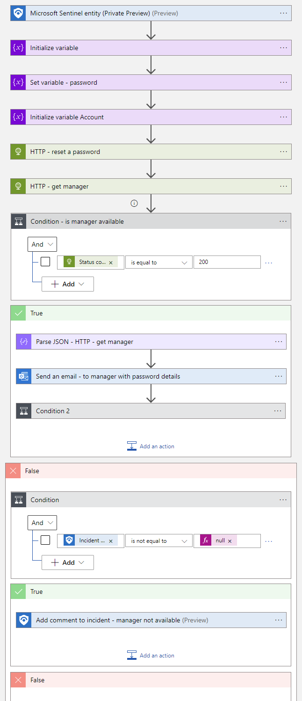
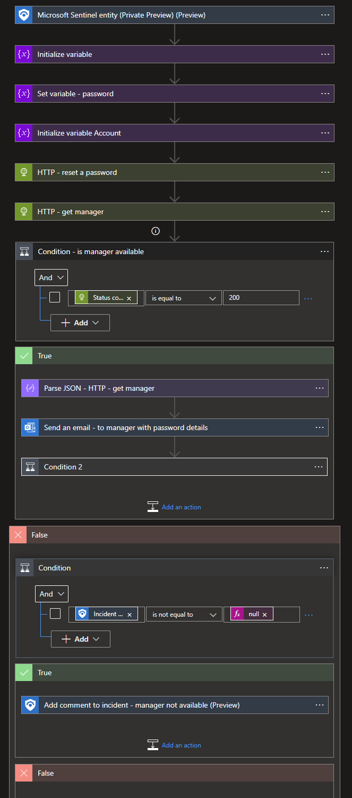

# Reset-AADPassword
author: Nicholas DiCola

This playbook will reset the user password using Graph API.  It will send the password (which is a random guid substring) to the user's manager.  The user will have to reset the password upon login.  <br>
Permissions needed will wary do you need to reset password for regular users (Password Administrator) or admins and regular users (Global administrators). Admin users include active and eligible admin users.

## Quick Deployment
**Deploy with incident trigger** (recommended)

After deployment, attach this playbook to an **automation rule** so it runs when the incident is created.

[Learn more about automation rules](https://docs.microsoft.com/azure/sentinel/automate-incident-handling-with-automation-rules#creating-and-managing-automation-rules)

[](https://portal.azure.com/#create/Microsoft.Template/uri/https%3A%2F%2Fraw.githubusercontent.com%2FAzure%2FAzure-Sentinel%2Fmaster%2FSolutions%2FAzure%2520Active%2520Directory%2FPlaybooks%2FReset-AADUserPassword%2Fincident-trigger%2Fazuredeploy.json)
[](https://portal.azure.us/#create/Microsoft.Template/uri/https%3A%2F%2Fraw.githubusercontent.com%2FAzure%2FAzure-Sentinel%2Fmaster%2FSolutions%2FAzure%2520Active%2520Directory%2FPlaybooks%2FReset-AADUserPassword%2Fincident-trigger%2Fazuredeploy.json)

**Deploy with alert trigger**

After deployment, you can run this playbook manually on an alert or attach it to an **analytics rule** so it will rune when an alert is created.

[](https://portal.azure.com/#create/Microsoft.Template/uri/https%3A%2F%2Fraw.githubusercontent.com%2FAzure%2FAzure-Sentinel%2Fmaster%2FSolutions%2FAzure%2520Active%2520Directory%2FPlaybooks%2FReset-AADUserPassword%2Falert-trigger%2Fazuredeploy.json)
[](https://portal.azure.us/#create/Microsoft.Template/uri/https%3A%2F%2Fraw.githubusercontent.com%2FAzure%2FAzure-Sentinel%2Fmaster%2FSolutions%2FAzure%2520Active%2520Directory%2FPlaybooks%2FReset-AADUserPassword%2Falert-trigger%2Fazuredeploy.json)

**Deploy with entity trigger**

After deployment, you can run this playbook manually from an entity context in the incident.

[](https://portal.azure.com/#create/Microsoft.Template/uri/https%3A%2F%2Fraw.githubusercontent.com%2FAzure%2FAzure-Sentinel%2Fmaster%2FPlaybooks%2FReset-AADUserPassword%2Fentity-trigger%2Fazuredeploy.json)
[](https://portal.azure.us/#create/Microsoft.Template/uri/https%3A%2F%2Fraw.githubusercontent.com%2FAzure%2FAzure-Sentinel%2Fmaster%2FPlaybooks%2FReset-AADUserPassword%2Fentity-trigger%2Fazuredeploy.json)


## Prerequisites

## Post deployment
- Authorize Office 365 Outlook connection
- Grant Password Administrator (reset password for regular users)/Global Administrator (reset password for admins and regular users) and Microsoft Sentinel Responder permissions to the managed identity.<br>
 Run the following code replacing the managed identity object id.  You find the managed identity object ID on the "Identity" blade under "Settings" for the Logic App.
```powershell
$MIGuid = "<Enter your managed identity guid here>"
$SubscriptionId = "<Enter your subsciption id here>"
$ResourceGroupName = "<Enter your resource group name here>"

$MI = Get-AzureADServicePrincipal -ObjectId $MIGuid
$GraphAppId = "00000003-0000-0000-c000-000000000000"
$roleName = "Password Administrator"
$SentinelRoleName = "Microsoft Sentinel Responder"

$GraphServicePrincipal = Get-AzureADServicePrincipal -Filter "appId eq '$GraphAppId'"
$role = Get-AzureADDirectoryRole | Where {$_.displayName -eq $roleName}
if ($role -eq $null) {
$roleTemplate = Get-AzureADDirectoryRoleTemplate | Where {$_.displayName -eq $roleName}
Enable-AzureADDirectoryRole -RoleTemplateId $roleTemplate.ObjectId
$role = Get-AzureADDirectoryRole | Where {$_.displayName -eq $roleName}
}
Add-AzureADDirectoryRoleMember -ObjectId $role.ObjectId -RefObjectId $MI.ObjectID
New-AzRoleAssignment -ObjectId $MIGuid -RoleDefinitionName $SentinelRoleName -Scope /subscriptions/$SubscriptionId/resourcegroups/$ResourceGroupName
```


## Screenshots
**Incident Trigger**<br>
<br>
<br>
**Alert Trigger**<br>
<br>
<br>
**Entity Trigger**<br>
<br>
<br>