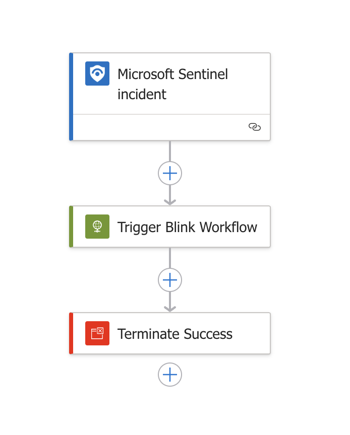
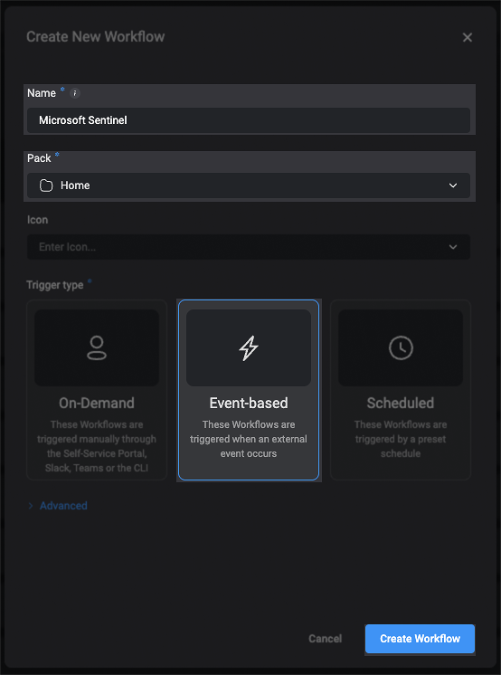
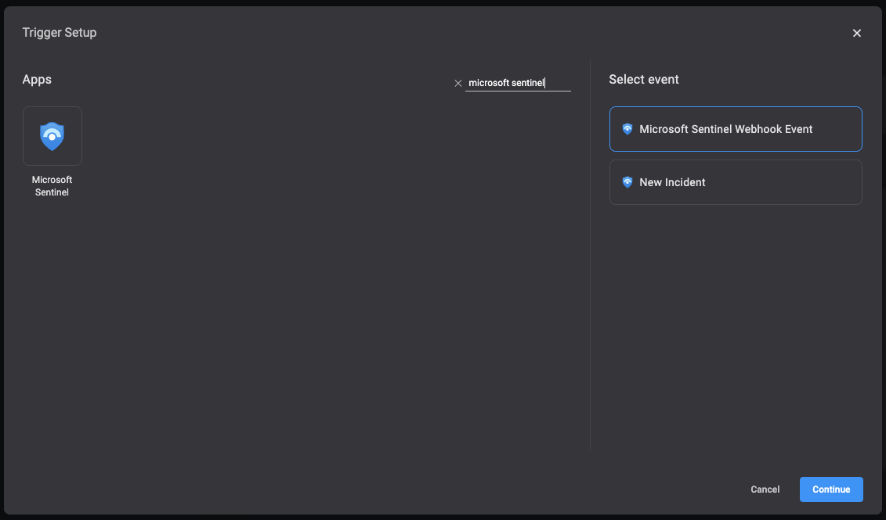

# Blink-Sentinel-Incident-Trigger

## Summary

This playbook automatically triggers when a **Microsoft Sentinel incident is created or updated**, and sends a structured HTTPS POST request to **Blink**. The integration enables seamless coordination between Sentinel Incident alerts and Blink automation workflows, allowing for rapid incident response, ticketing, notification dispatch, or any custom workflow configured in Blink.

---

## Prerequisites

Before deploying this playbook, ensure the following prerequisites are completed:

1. Create an **Event-Based Workflow** in [Blink](https://docs.blinkops.com/docs/workflows/building-workflows/triggers/event-based-triggers/webhooks) that is configured to trigger via webhook.

2. Note down the following required value from Blink:
   - **Blink Webhook Full URL** – the full HTTPS endpoint URL to trigger your Blink workflow.

---

## Deployment Instructions

To deploy the playbook into your Azure environment:

1. Click the **Deploy to Azure** button below to launch the ARM Template deployment wizard.
2. Provide the following required parameters:
   - `Playbook-Name`: Choose a clear and descriptive name for the Logic App (e.g., `Blink_Sentinel_Incident_Trigger`).
   - `Blink-Webhook-Full-URL`: Paste the full webhook URL from your Blink workflow.

  

---

## Post-Deployment Instructions

Once the playbook is deployed successfully, follow these steps to connect it with Microsoft Sentinel's automation rules:

### 1. Create Automation Rule for **Incident Created**

- Go to: **Microsoft Sentinel > Configuration > Automation**.
- Click **+ Create > Automation rule**.
- Fill in the following:
  - **Name**: e.g., `Notify Blink when new incident is created`.
  - **Trigger**: Select `When incident is created`.
  - **Conditions**: Leave default unless you want specific filters.
  - **Actions**: Choose `Run playbook`.
  - **Playbook**: Select your deployed playbook (e.g., `Blink_Sentinel_Incident_Trigger`).
- Click **Apply**.

### 2. Create Automation Rule for **Incident Updated**

- Repeat the same steps as above.
- For the **Trigger**, select `When incident is updated`.
- Click **Apply**.

---

## Support

For guidance on integrating Blink with other tools and services, visit the official [Blink Documentation](https://docs.blinkops.com/).

---

