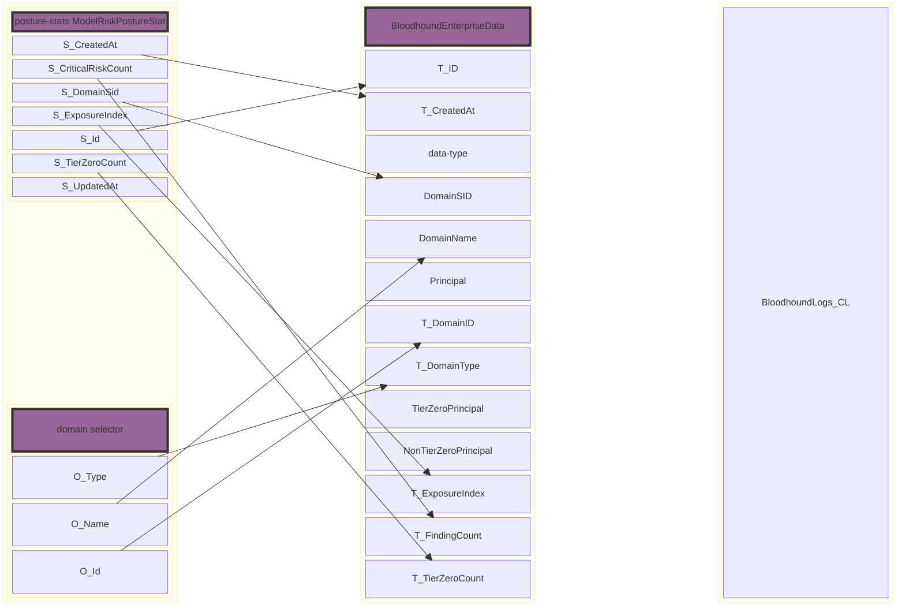

# Schema Documentation (Experimental)

#### Source

| Column Name             | Type      | Description                  | Source | Column                        |
|-------------------------|-----------|------------------------------|--------|-------------------------------------------|
| TimeGenerated           | datetime  | Timestamp when the log was generated      |        |                                           |
| domain_sid              | string    | Security Identifier of the domain         |        |                                           |
| exposure_index          | real      | Index indicating exposure level           |        |                                           |
| tier_zero_count         | real      | Count of tier zero entities               |        |                                           |
| domain_id               | string    | Identifier of the domain                  |        |                                           |
| non_tier_zero_principal | string    | Non-tier zero principal                   |        |                                           |
| tier_zero_principal     | string    | Tier zero principal                       |        |                                           |
| group                   | string    | Group information                         |        |                                           |
| principal               | string    | Principal information                     |        |                                           |
| path_id                 | string    | Identifier of the path                    |        |                                           |
| user                    | string    | User information                          |        |                                           |
| finding_id              | string    | Identifier of the finding                 |        |                                           |
| path_title              | string    | Title of the path                         |        |                                           |
| path_type               | string    | Type of the path                          |        |                                           |
| exposure                | real      | Exposure level                            |        |                                           |
| finding_count           | real      | Count of findings                         |  posture-stats (ModelRiskPostureStat)     |             CriticalRiskCount                              |
| principal_count         | real      | Count of principals                       |        |                                           |
| id                      | long      | Unique identifier                         |        |                                           |
| created_at              | datetime  | Creation timestamp                        |        |                                           |
| updated_at              | datetime  | Update timestamp                          |        |                                           |
| deleted_at              | datetime  | Deletion timestamp                        |        |                                           |
| deleted_at_v            | boolean   | Deletion status                           |        |                                           |
| severity                | string    | Severity level                            |        |                                           |
| domain_impact_value     | real      | Impact value on the domain                |        |                                           |
| domain_name             | string    | Name of the domain                        |        |                                           |
| domain_type             | string    | Type of the domain                        |        |                                           |
| data_type               | string    | Type of the data                          |        |                                           |
| event_type              | string    | Type of the event                         |        |                                           |
| event_details           | string    | Details of the event                      |        |                                           |
### Questions

 1) The ExposureIndex starts at is from 0 - .1
