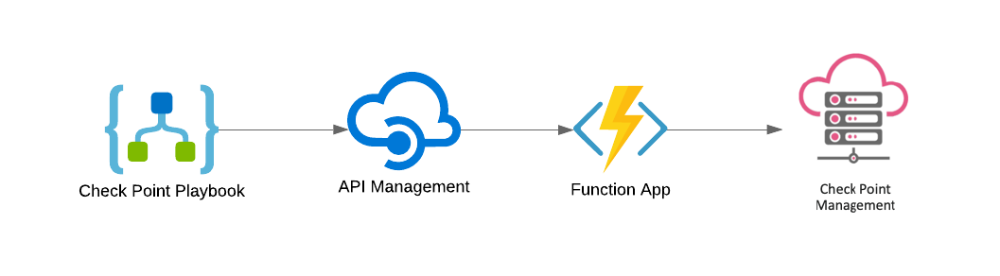

# Check Point Software Technologies Logic Apps Connector
 
 

  
 </a>

 

# Table of Contents

1. [Overview](#overview)
1. [Deploy Connector](#deployall)
1. [Deployment instructions](#deployinstr)

 

<a name="overview">

# Overview

  
 </a>

The Check Point Logic App Connector allows you to connect to a Cloud or On-Prem Check Point Management Server using Check Point Managmeent API. The Function App Proxy is to overcome the platform limitation. 

For more information see

[Check Point Management API](https://sc1.checkpoint.com/documents/latest/APIs/#introduction~v1.6%20)  
[Logic App Overview](https://azure.microsoft.com/services/logic-apps/) 

 

<a name="deployall">

# Deploy Connector

## This package includes: 

1. Custom Connector which is based on Check Point Management API v1.6
2. FunctionApp Proxy

   
   
 

 

<a name="deployinstr">

# Deployment instructions

1. Create an API key from Check Point management console

    
  
     </a>
    

2. Launch the template
 

   
   
 

3. Fill in the template - Make sure you include the backslash of API extension /web_api/ 

    
  
     </a>
    

4. Copy the API key from the function app

    
  
     </a>
    

5. Paste function API key into the API management

    
  
     </a>
    

