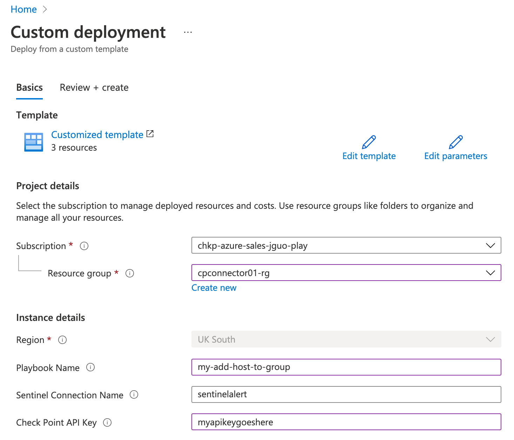
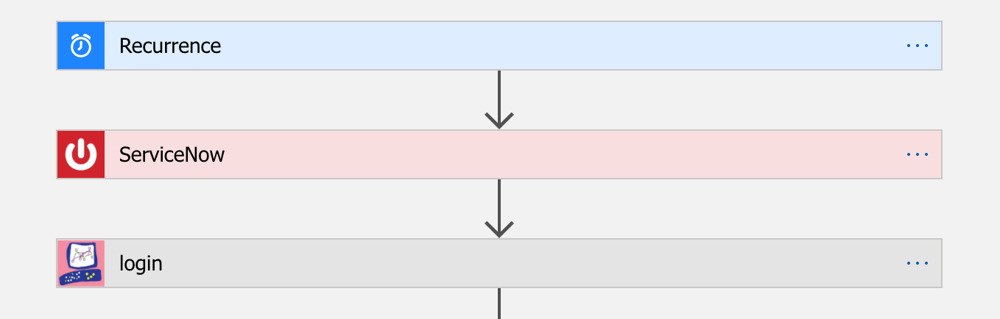
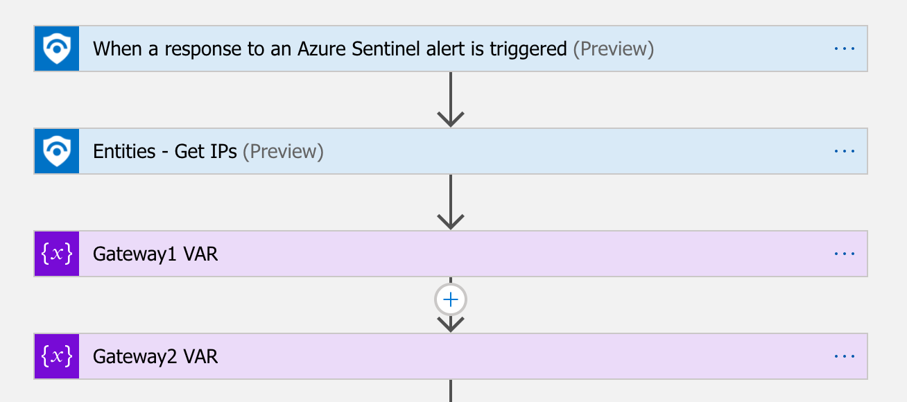
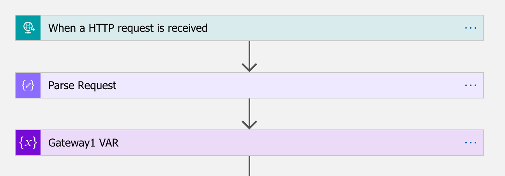
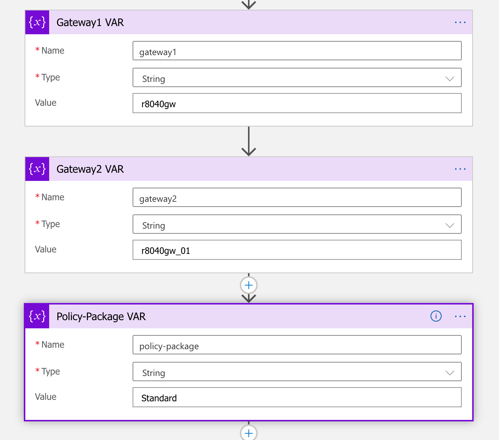
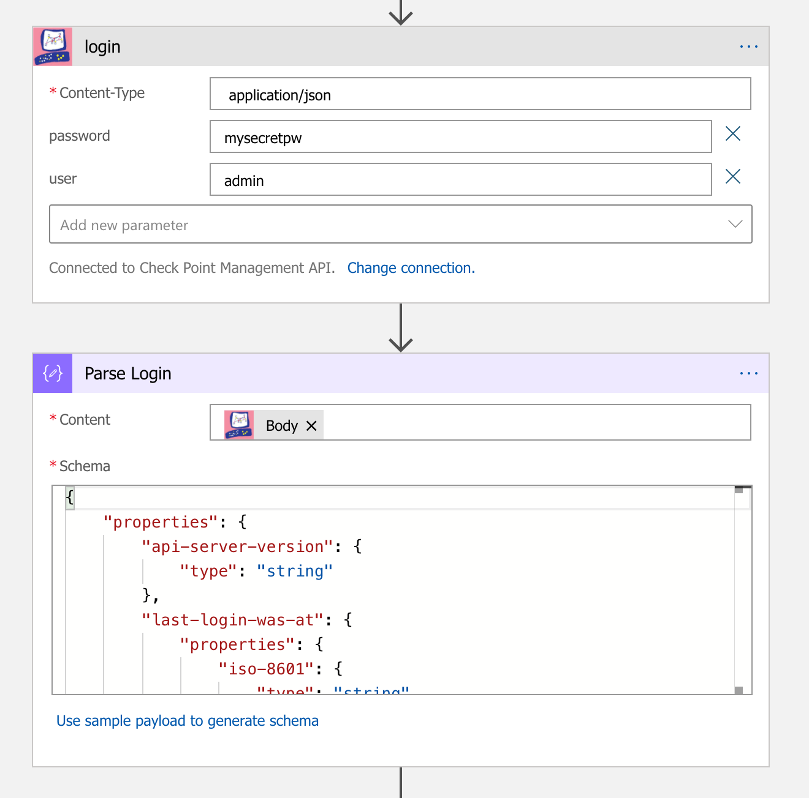
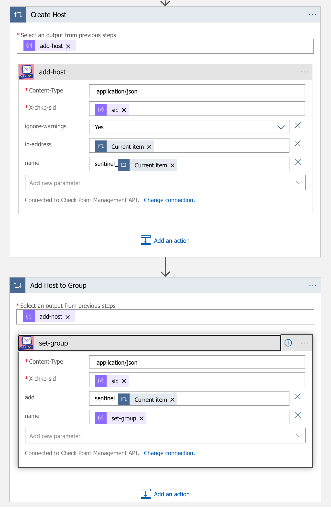
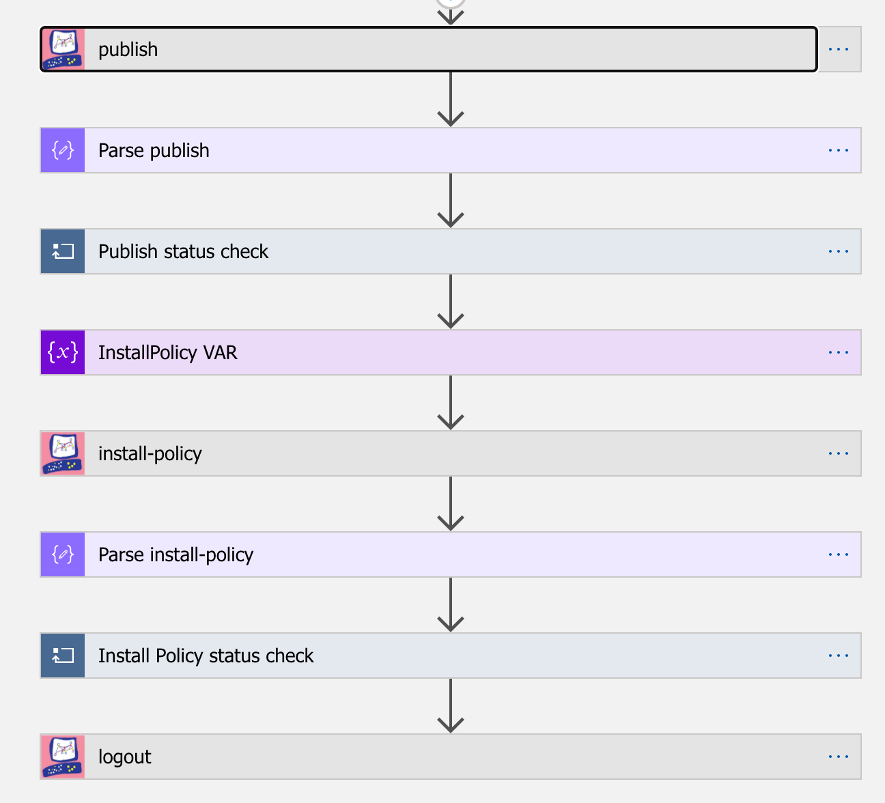

# Check Point Software Technologies Logic Apps Playbook
 
 

  
 </a>

 

# Table of Contents

1. [Overview](#overview)
1. [Deploy Playbook](#deploy)
1. [Test Playbook](#testplaybook)
1. [Key Playbook Components](#playbookdetail)

 

<a name="overview">

# Overview

The Check Point Logic App Playbook allow you to make changes to Check Point firewalls via Check PointManagement API.

  
 </a>

Common use cases include: 

  1. Enable operation teams to automate common security functions such as creating objects, updating security policies, and schedule security policy updates to gateways. 
  2. Fully integrate with any orchestration platforms for both on-prem or public cloud providers
  3. Integrate with all leading SIEM/SOAR providers such as Azure Sentinel

For more information see

[Check Point Management API](https://sc1.checkpoint.com/documents/latest/APIs/#introduction~v1.6%20)  
[Logic App Overview](https://azure.microsoft.com/services/logic-apps/) 

<a name="deploy">

# Deploy Playbook

## This package includes: 

This Playbook will create IP objects and add objects to group. 

As prerequisite you'll need to first deploy the Check Point Connector in your subscription before you can install this playbook. 

   
   

 

<a name="deployinstr">

# Deployment instructions

1. Create an API key from Check Point management console

    
  
     </a>
    

2. Launch the template

   
   

3. Fill in the template

    
  
     </a>
    

4. Update LogicApp Sentinel Connection

    
  
     </a>
    

 

<a name="testplaybook"> 

# Test Playbook

* Dry run

    
  
     </a>
    

    
* Dry run result

    
  
     </a>
    

<a name="playbookdetail"> 

# Key Playbook Components
 

1. Trigger point - It can be scheduled, use HTTP post, or trigger point from a connector

    Example 1 - Scheduled tasks
    
  
     </a>
    

    Example 2 - Azure Sentinel Alert
    
  
     </a>
    

    Example 3 - HTTP post
    
  
     </a>
    

2. Workflow - Logic App instructions

    Define the Check Point gateway and policy package
    
  
     </a>
    

	Define the Check Point Management Station API Key or usr/pw
    
  
     </a>
    

    Define what action to take, in this case, create and add each host to predefined group
    
  
     </a>
    

    Publish and Install Security Policy
    
  
     </a>
    

