# Check Point Software Technologies Logic Apps Connector and Sentinel Playbook templates

 
 

  
 </a>

 

# Table of Contents

1. [Overview](#overview)
1. [Deploy Connector and Playbook templates](#deployall)
1. [Deployment instructions](#deployinstr)
1. [Test the playbook](#testplaybook)
1. [Security Recommendations](#securityrecommendation)

 

<a name="overview">

# Overview

The Check Point Logic App Connector and Playbooks allows you to automate security operations to all managed Check Point devices. The connector enables you to run Logic App playbooks that utilize Check Point Management API to automate most common security operations tasks. 

  
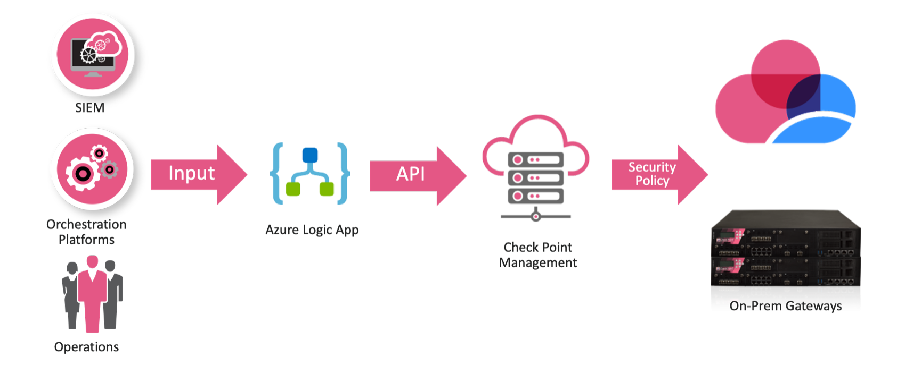 </a>

For more information see:

[Check Point Management API](https://sc1.checkpoint.com/documents/latest/APIs/#introduction~v1.6%20)  
[Logic App Overview](https://azure.microsoft.com/services/logic-apps/) 

 
<a name="deployall">

# Deploy Connector and Playbook templates

## This package includes: 

1. Custom Connector which is based on Check Point Management API v1.6
2. Playbook that will create IP objects and add objects to group
3. FunctionApp Proxy

You can deploy Custom Connector, FunctionApp Proxy and Playbook all together or seperately from their specific folder.

   
   

 

<a name="deployinstr">

# Deployment instructions

1. Create an API key from Check Point management console

    
  
    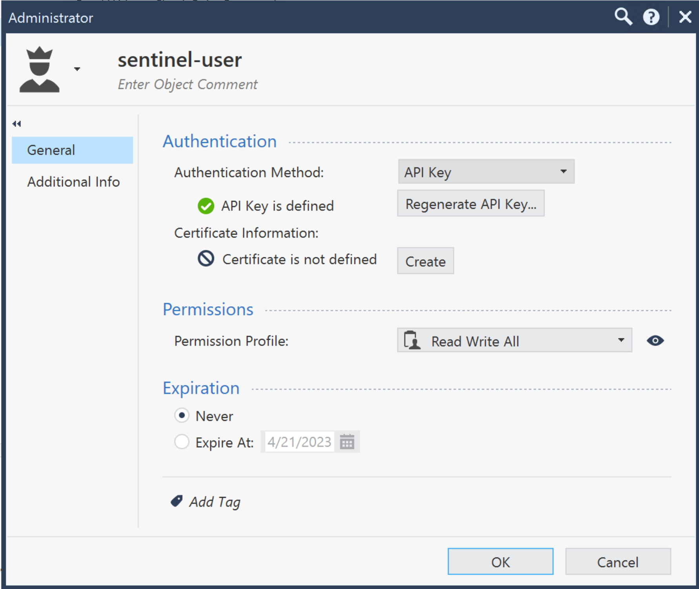 </a>
    

2. Launch the template
 

   
   

3. Fill in the template - Make sure you include the backslash of API extension /web_api/ 

    
  
    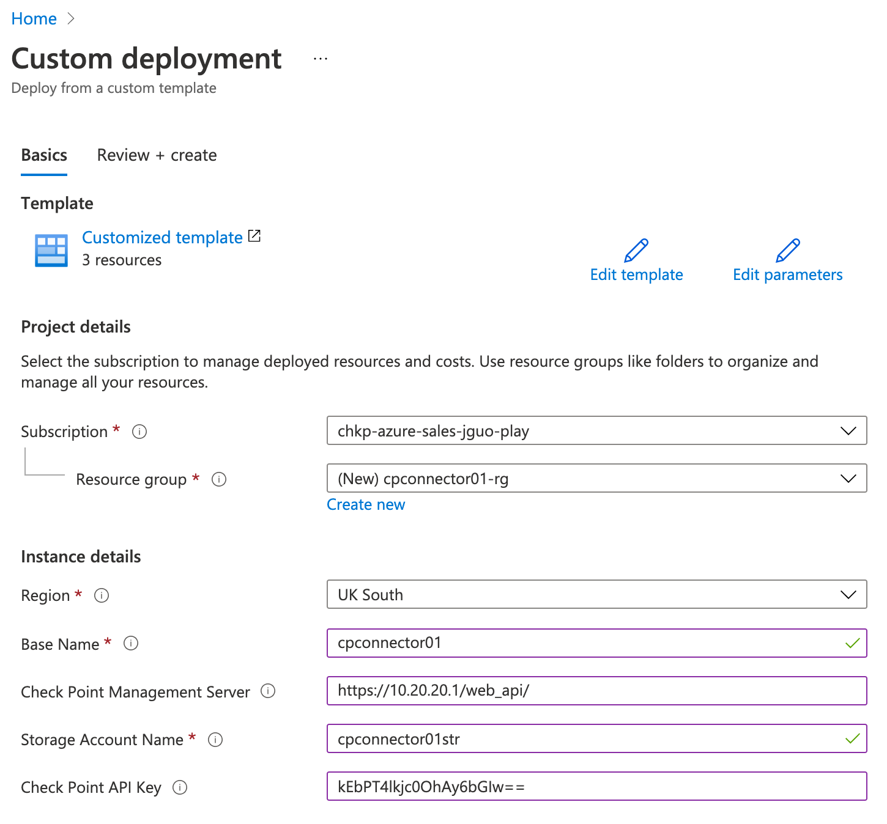 </a>
    

4. Copy the API key from the function app

    
  
    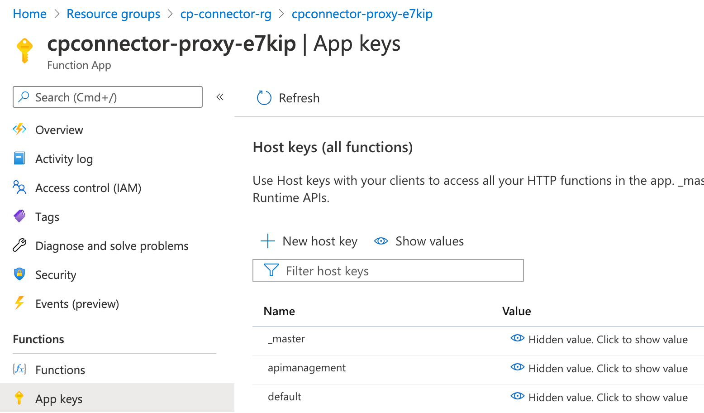 </a>
    

5. Paste function API key into the API management

    
  
    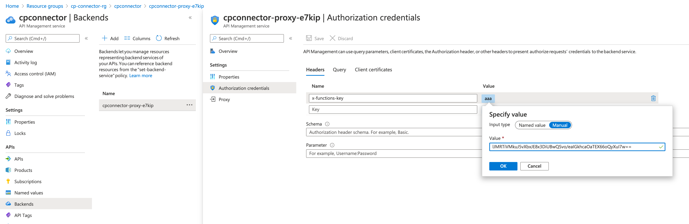 </a>
    

6. Update LogicApp Sentinel Connection

    
  
    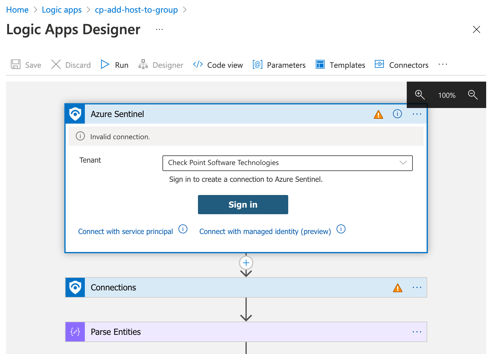 </a>
    

7. Configure Sentinel Analytics Rule

    
  
    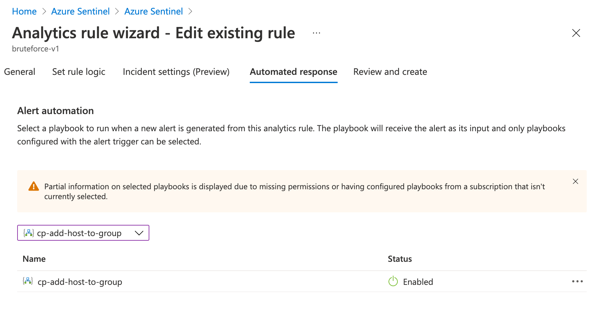 </a>
    

<a name="testplaybook"> 

# Test the playbook

* Dry run

    
  
    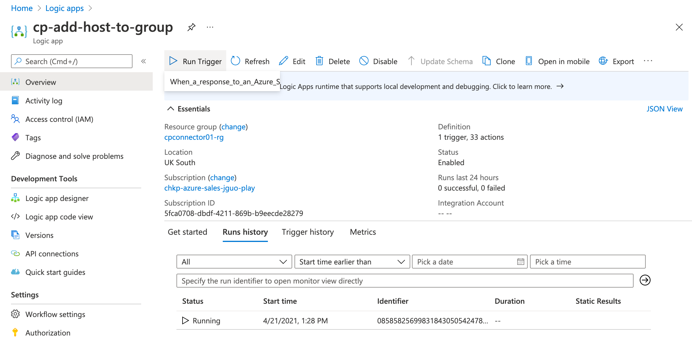 </a>
    

    
* Dry run result

    
  
    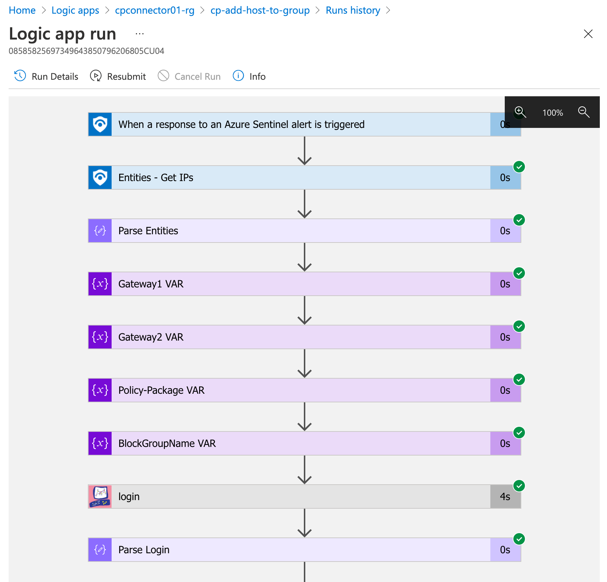 </a>
    

 
 

<a name="securityrecommendation"> 

# Security Recommendations

## Define Check Point Management User Profile

The following is the recommended Check Point user profile which will allow the Sentinel user to manage objects, policy and install security policy, all other access are turned off. 

1. Create a new user profile

    
  
     </a>
    

2. Access Control

    
  
    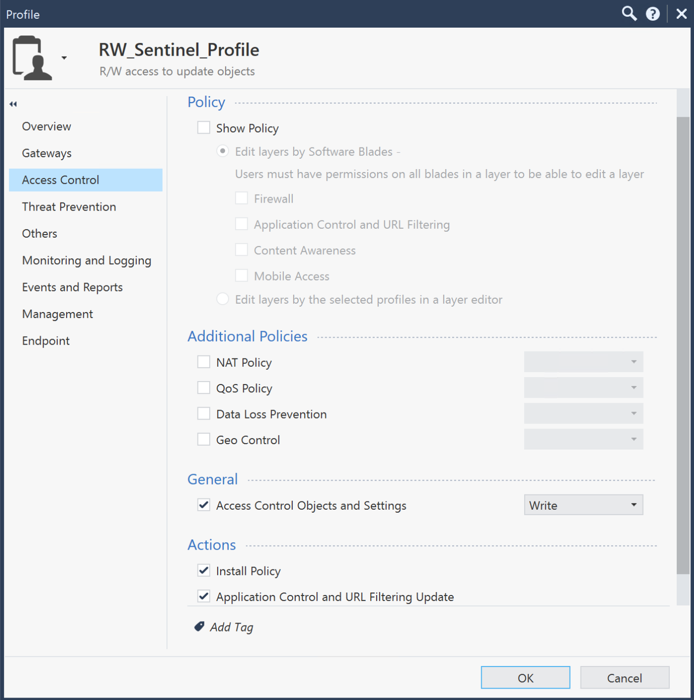 </a>
    

3. Threat Prevention

    
  
     </a>
    

4. Management

    
  
    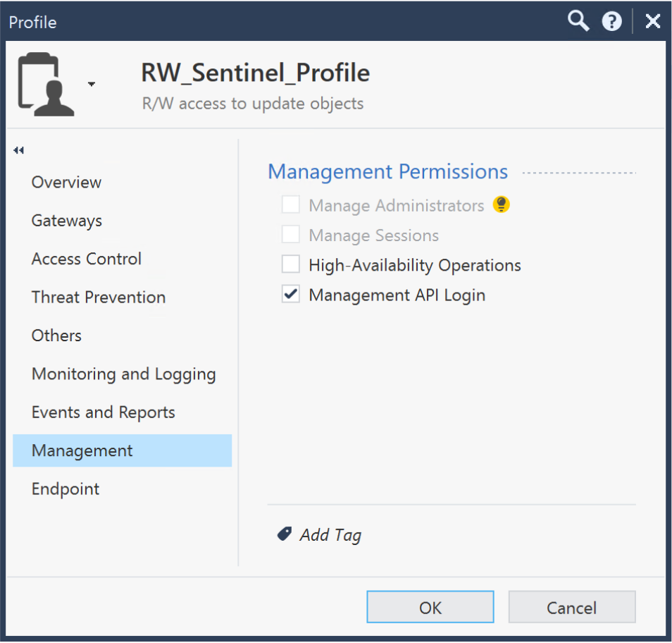 </a>
    

5. Disable all other settings

 

## Access Control for Function Proxy

 
### Ingress to Function Proxy
Only the Azure API Management is required to access the Proxy Function. 

This deployment template is using Management API "Consumption" SKU, this is the lightweight and serverless version of API Management service, billed per execution and first 1M calls are free. However, this Management API SKU does not offer a static ip address, you will need to extract the IP address ranges of the entire region and apply it to the function rule. 

For example, the following JSON fragment is what the allowlist for Western Europe might look like, Refer to [Azure Region outbound IP ranges](https://docs.microsoft.com/azure/azure-functions/ip-addresses#data-center-outbound-ip-addresses) for your region. 
 

    {
    "name": "AzureCloud.westeurope",
    "id": "AzureCloud.westeurope",
    "properties": {
        "changeNumber": 9,
        "region": "westeurope",
        "platform": "Azure",
        "systemService": "",
        "addressPrefixes": [
        "13.69.0.0/17",
        "13.73.128.0/18",
        ... Some IP addresses not shown here
        "213.199.180.192/27",
        "213.199.183.0/24"
        ]
    }
    }

Once you have the IP address ranges, you can define the IP address under Access Restrictions

    # Setting the SCM to be same as function
    az functionapp config access-restriction set --use-same-restrictions-for-scm-site true -g ResourceGroup -n AppName

    # Repeat the following per subnet
    az functionapp config access-restriction add -g ResourceGroup -n AppName --action Allow --ip-address 13.64.0.0/16 --priority 200

    Example: 
    az functionapp config access-restriction set --use-same-restrictions-for-scm-site true -g guoapr2311130-rg -n guoapr2311130-proxy-mrbz7

    az functionapp config access-restriction add -g guoapr2311130-rg -n guoapr2311130-proxy-mrbz7 --action Allow --ip-address 13.64.0.0/16 --priority 200

    az functionapp config access-restriction add -g guoapr2311130-rg -n guoapr2311130-proxy-mrbz7 --action Allow --ip-address 13.73.32.0/19 --priority 200

    ....

Function Access Restrictions from Azure portal: 

  
    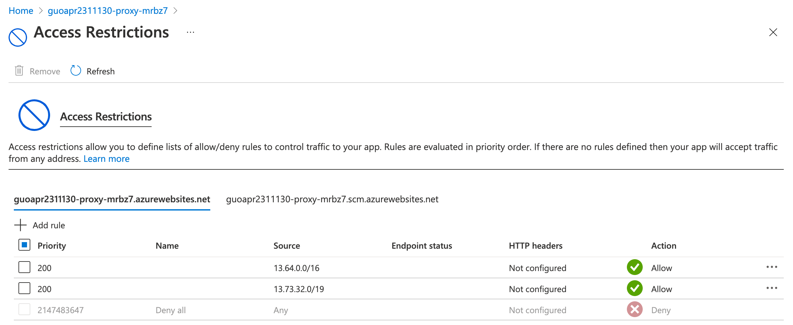 </a>
    

 

Note: If your subscription is already using API management other than "Consumption" SKU then you can extract the IP address as per [api-management-howto-ip-addresses](https://docs.microsoft.com/azure/api-management/api-management-howto-ip-addresses)

 

### Egress from Function Proxy

The function proxy will connect to Check Point Management Station

[How to get Function IP outbound IP address](https://docs.microsoft.com/azure/azure-functions/ip-addresses)

To find the available outbound IP addresses is by using the Cloud Shell:

    az webapp show --resource-group <group_name> --name <app_name> --query outboundIpAddresses --output tsv
    az webapp show --resource-group <group_name> --name <app_name> --query possibleOutboundIpAddresses --output tsv

1. Modify nesseary Firewall rules to allow the IP ranges from above
2. Apply IP ranges as Check Point Mangement GUI clients, [how to define GUI Clients](https://sc1.checkpoint.com/documents/R80.30/WebAdminGuides/CP_R80.30_Gaia_AdminGuide/html_frameset.htm?topic=documents/R80.30/WebAdminGuides/CP_R80.30_Gaia_AdminGuide/214749)

 

## Rotate API Keys

Rotate the following API Keys every 90 days

    * Check Point API Key
    * Mgmt API Key
    * Function Proxy Key
