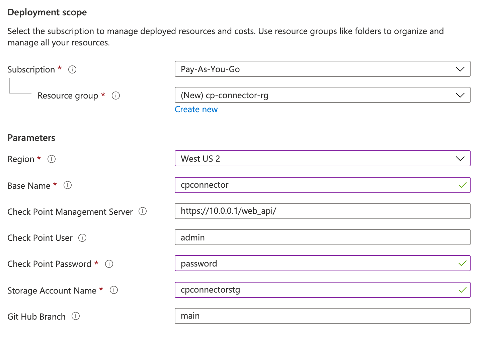
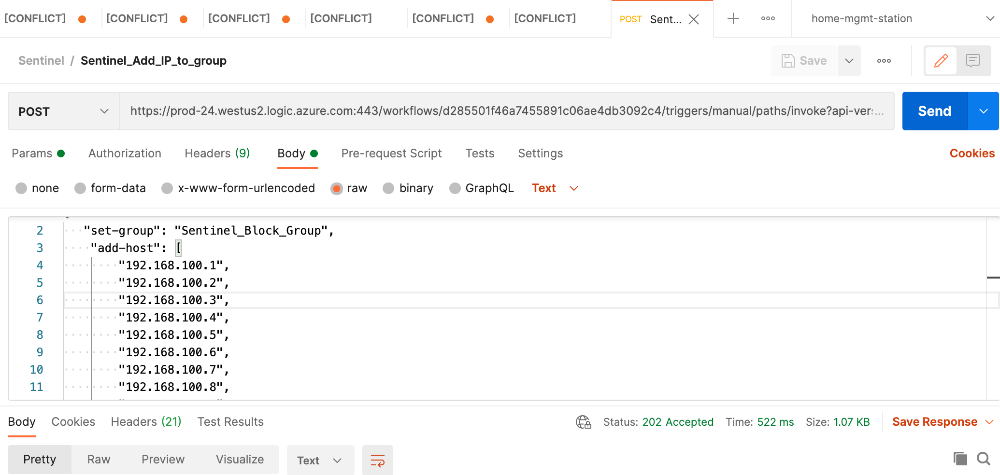
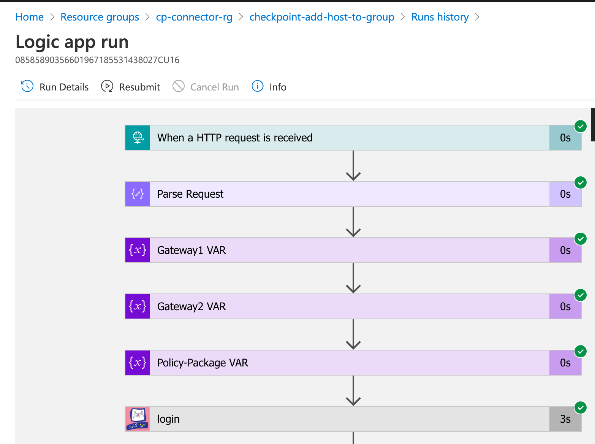
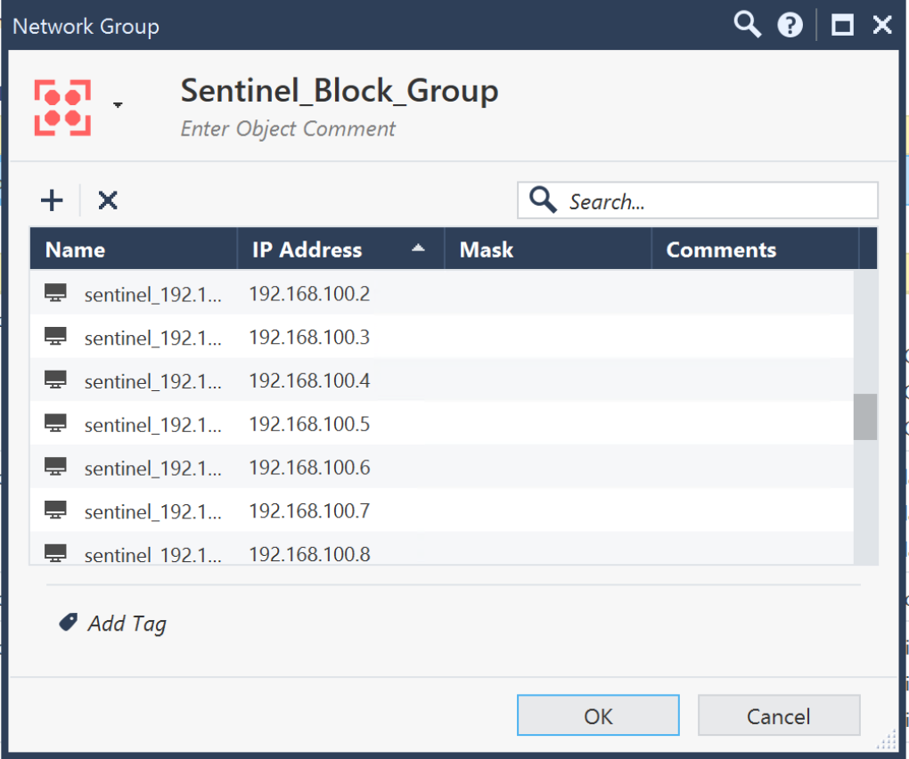

# Check Point Software Technologies Azure Logic App Connector

The Check Point Logic App Connector will allow you to automate security operations to all managed Check Point devices. The connector enables you to create Logic App workbooks that utilize Check Point Management API to automate most common security operations tasks. 

Logic App can easily integrate Check Point with all native Azure services and hundreds of connectors such as ServiceNow, Jira, PagerDuty, ZenDesk, and more. See the [full list of available connectors here.](https://docs.microsoft.com/connectors/connector-reference/)

Common use cases include: 

  1. Enable operation teams to automate common security functions such as creating objects, updating security policies, and schedule security policy updates to gateways. 
  2. Fully integrate with any orchestration platforms for both on-prem or public cloud providers
  3. Integrate with all leading SIEM/SOAR providers such as Azure Sentinel


For more information see
[Check Point Management API](https://sc1.checkpoint.com/documents/latest/APIs/#introduction~v1.7%20) and 
[Logic App Overview](https://azure.microsoft.com/services/logic-apps/) 

# How does the Logic App Connector work? 

<p align="left">  
 </a>
</p>

The Logic App workbook can get triggers from any of the hundreds of connectors containing user-defined perimeters to fulfill the change request. 

Change request items include IP addresses, URLs, groups, gateways, and policy packages. 

The Check Point Logic App Connector contains Check Point Mgmt API parameters to cater most common tasks you want to automate. 

# How does everything tie together?

<p align="left">  
 </a>
</p>

The solution is using Azure API Management, Function App, and Logic Apps. These services are secured by allowing access from respective Azure IP ranges and secured by API keys. See security guidance below.

  * API Management allows you to consolidate all API from a single static IP, fine-grained control and provides detailed reporting of your APIs. 
  * The Function App help connect Logic App to both cloud and on-prem Check Point Management station


# Deploy 

   [](https://portal.azure.com/#create/Microsoft.Template/uri/https%3A%2F%2Fraw.githubusercontent.com%2Fchkp-jguo%2FAzure-Sentinel%2Fmaster%2FSolutions%2FCheck%2520Point%2FPlaybooks%2FdeployCP.json)
   [](https://portal.azure.us/#create/Microsoft.Template/uri/https%3A%2F%2Fraw.githubusercontent.com%2Fchkp-jguo%2FAzure-Sentinel%2Fmaster%2FSolutions%2FCheck%2520Point%2FPlaybooks%2FdeployCPgov.json)

# Logic App playbook components

1. Trigger point - It can be scheduled, use HTTP post, or trigger point from a connector

    Example 1 - Scheduled tasks
    <p align="left">  
     </a>
    </p>

    Example 2 - Azure Sentinel Alert
    <p align="left">  
     </a>
    </p>

    Example 3 - HTTP post
    <p align="left">  
     </a>
    </p>

2. Workflow - Logic App instructions

	  Define the Check Point gateway and policy package
    <p align="left">  
     </a>
    </p>

	  Define the Check Point management station user/pw
    <p align="left">  
     </a>
    </p>

    Define what action to take, in this case, create and add each host to predefined group
    <p align="left">  
     </a>
    </p>

    Publish and Install security policy
    <p align="left">  
     </a>
    </p>

# Deployment instructions

1. Create API user from Check Point management console

2. Launch the template

   [](https://portal.azure.com/#create/Microsoft.Template/uri/https%3A%2F%2Fraw.githubusercontent.com%2Fchkp-jguo%2FAzure-Sentinel%2Fmaster%2FSolutions%2FCheck%2520Point%2FCheckPointConnector%2FdeployCP.json)
   [](https://portal.azure.us/#create/Microsoft.Template/uri/https%3A%2F%2Fraw.githubusercontent.com%2Fchkp-jguo%2FAzure-Sentinel%2Fmaster%2FSolutions%2FCheck%2520Point%2FCheckPointConnector%2FdeployCPgov.json)

3. Template - Make sure you include the backslash of API extension /web_api/ 

    <p align="left">  
     </a>
    </p>

4. Copy the API key from the function app

    <p align="left">  
     </a>
    </p>

5. Paste function API key into the API management

    <p align="left">  
     </a>
    </p>

## Test

1. From SmartConsole - create a simple group, for example, Sentinel_Block_Group

2. Copy the logic app trigger URL

    <p align="left">  
     </a>
    </p>

3. Paste the URL and Body into Postman

    <p align="left">  
     </a>
    </p>

    Request Body

```
    {
      "set-group": "Sentinel_Block_Group",
        "add-host": [
            "192.168.100.1",
            "192.168.100.2",
            "192.168.100.3",
            "192.168.100.4",
            "192.168.100.5",
            "192.168.100.6",
            "192.168.100.7",
            "192.168.100.8",
            "192.168.100.9",
            "192.168.100.10",
        ]
    }
```

4. Logic App run history should have green tickets next to each successful tasks

    <p align="left">  
     </a>
    </p>

5. Smart Console should contain the above IP addresses in the Sentinel group created earlier

    <p align="left">  
     </a>
    </p>