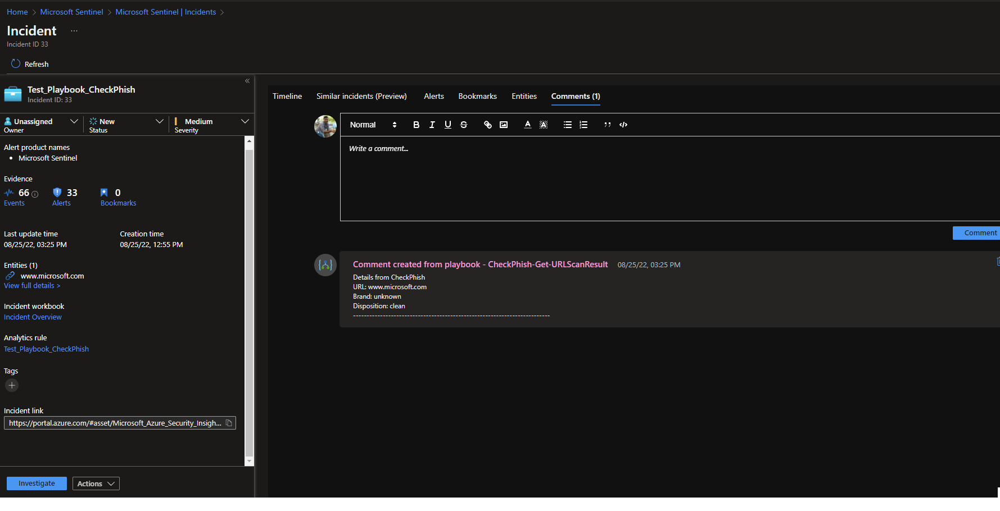
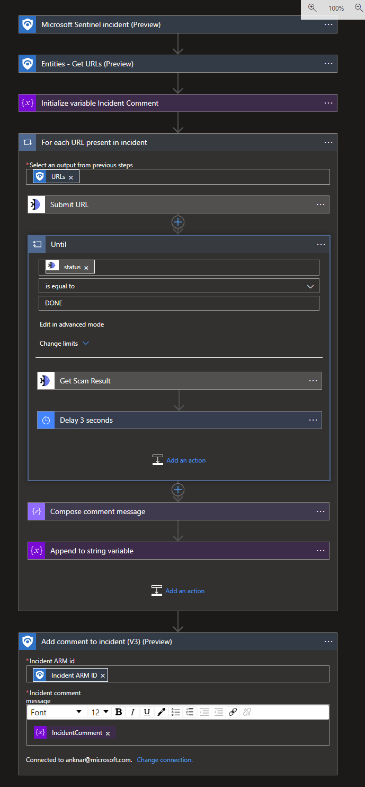

# CheckPhish- Get Reputation of URL
 ## Summary
 
 Once a new sentinal incident is created, this playbook gets triggered and performs the following actions:

    1. Gets Information from CheckPhish by URL, provided in the alert custom entities.
    2. Enriches the incident with the obtained info.

 

 

### Prerequisites 
1. CheckPhishbyBolsterCustomConnector Custom Connector needs to be deployed prior to the deployment of this playbook under the same subscription.
2. API key. To get API Key, login into CheckPhish portal and select APIKey from the left side menu.

### Deployment instructions 

1. To deploy the Playbook, click the Deploy to Azure button. This will launch the ARM Template deployment wizard.

2. Fill in the required paramteres:
    * Playbook Name: Enter the playbook name here (Ex: CheckPhish-Get-URLScanResult)
    * Custom Connector Name: Enter the OpenCTI custom connector name here (Ex: CheckPhishbyBolsterCustomConnector)

    
### Post-Deployment instructions 
#### a. Authorize connections
Once deployment is complete, you will need to authorize each connection.
1.	Click the Azure Sentinel connection resource
2.	Click edit API connection
3.	Click Authorize
4.	Sign in
5.	Click Save
6.	Repeat steps for CheckPhishbyBolsterCustomConnector Connection (For authorizing the CheckPhish API connection, API Key needs to be provided)
#### b. Configurations in Sentinel
1. None

