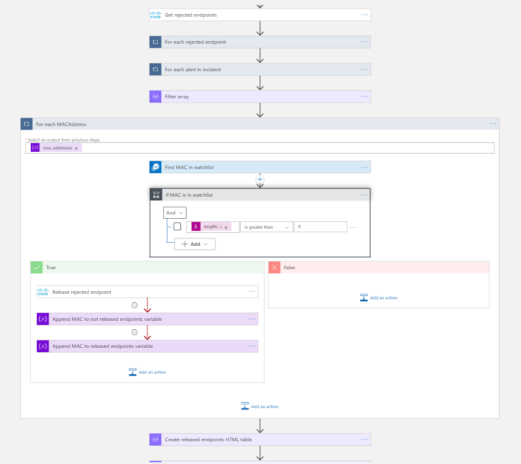

# CiscoISE-FalsePositivesClearPolicies

## Summary

When a new sentinel incident is created, this playbook gets triggered and performs the following actions:

1. For each MAC address (*MACAddress* provided in the alert custom entities) in the incident checks if it is was rejected in Cisco ISE.
2. If MAC address was rejected, checks if it is in the safe list (safe list is a custom [Watchlist](https://docs.microsoft.com/azure/sentinel/watchlists) that contains safe MAC addresses).
If it is in safe list, releases endpoint with this MAC address in Cisco ISE.
3. Adds comment to the incident with information about the released endpoints.

 

### Prerequisites

1. Prior to the deployment of this playbook, Cisco ISE Connector needs to be deployed under the same subscription.
2. Obtain Cisco ISE ERS API credentials. Refer to Cisco ISE Custom Connector documentation.
3. [Watchlist](https://docs.microsoft.com/azure/sentinel/watchlists) with safe MAC addresses list needs to be created.

### Deployment instructions

1. To deploy the Playbook, click the Deploy to Azure button. This will launch the ARM Template deployment wizard.
2. Fill in the required paramteres:
    * Playbook Name: Enter the playbook name here
    * Watchlist Name: Name of the Watchlist that contains safe MAC addresses list
    * Watchlist Field Name: Watchlist field name that contains MAC address

 

### Post-Deployment instructions

#### a. Authorize connections

Once deployment is complete, authorize each connection.

1. Click the Azure Sentinel connection resource
2. Click edit API connection
3. Click Authorize
4. Sign in
5. Click Save
6. Repeat steps for other connections

#### b. Configurations in Sentinel

1. In Azure sentinel, analytical rules should be configured to trigger an incident. An incident should have the *MACAddress* custom entity that contains MAC address of an endpoint in Cisco ISE. It can be obtained from the corresponding field in Cisco ISE logs. Check the [documentation](https://docs.microsoft.com/azure/sentinel/surface-custom-details-in-alerts) to learn more about adding custom entities to incidents.
2. Configure the automation rules to trigger the playbook.