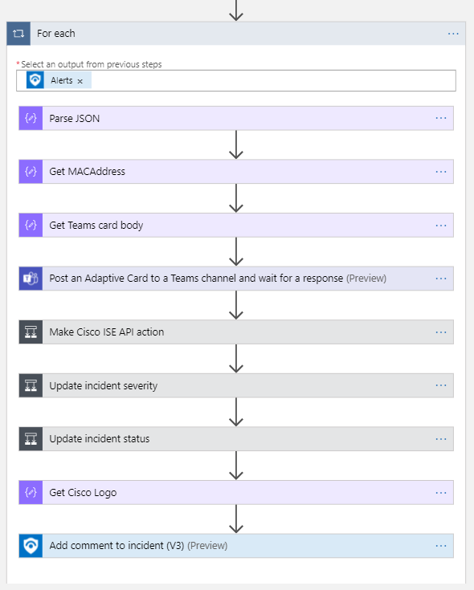

# CiscoISE-TakeEndpointActionFromTeams

## Summary

When a new sentinel incident is created, this playbook gets triggered and performs the following actions:

1. Sends an adaptive card to the Teams channel where the analyst can choose an action to be taken.

 

2. Assigns a policy (policy name is provided during the deployment stage) to an and point (*MACAddress* of the endpoint is provided in the alert custom entities) depending on the action chosen in the adaptive card.
3. Changes incident status and severity depending on the action chosen in the adaptive card.
4. Adds comment to the incident with information about the actions taken.

 

### Prerequisites

1. Prior to the deployment of this playbook, Cisco ISE Connector needs to be deployed under the same subscription.
2. Obtain Cisco ISE ERS API credentials. Refer to Cisco ISE Custom Connector documentation.
3. Obtain Teams group id and channel id.

### Deployment instructions

1. To deploy the Playbook, click the Deploy to Azure button. This will launch the ARM Template deployment wizard.
2. Fill in the required paramteres:
    * Playbook Name: Enter the playbook name here
    * Teams Group Id: Id of the Teams Group where the adaptive card will be posted
    * Teams Channel Id: Id of the Teams Channel where the adaptive card will be posted
    * Policy Name: Policy name to be assigned to an endpoint

 

### Post-Deployment instructions

#### a. Authorize connections

Once deployment is complete, authorize each connection.

1. Click the Azure Sentinel connection resource
2. Click edit API connection
3. Click Authorize
4. Sign in
5. Click Save
6. Repeat steps for other connections

#### b. Configurations in Sentinel

1. In Azure sentinel, analytical rules should be configured to trigger an incident. An incident should have the *MACAddress* custom entity that contains MAC address of an endpoint in Cisco ISE. It can be obtained from the corresponding field in Cisco ISE logs. Check the [documentation](https://docs.microsoft.com/azure/sentinel/surface-custom-details-in-alerts) to learn more about adding custom entities to incidents.
2. Configure the automation rules to trigger the playbook.