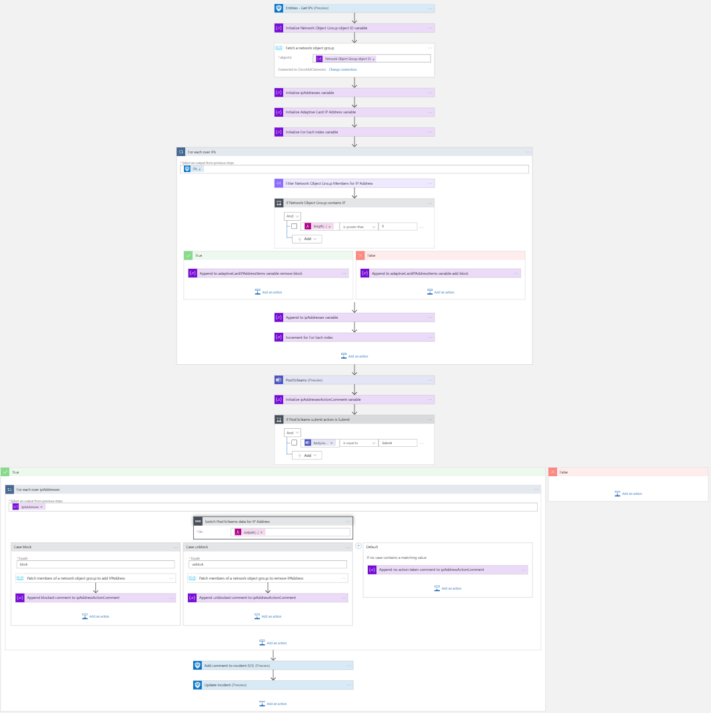

# Cisco ASA - Add or remove IP Addresses from a Network Object Group

## Summary

This playbook allows blocking/allowing of IPs in Cisco ASA, using a **Network Object Group**. This allows making changes to a Network Object Group members, instead of making Access Control Entries. The Network Object Group itself should be part of an Access Control Entry.

When a new Sentinel incident is created,this playbook gets triggered and performs below actions
1. For the IPs we check if the are already a member of the Network Object Group
2. An adaptive card is sent to a Teams channel with information about the incident and giving the option to ignore an IP, or depdening on it's current status block it by adding it to the Network Object Group or unblock it by removing it from the Network Object Group

    
3. Comment is added to Microsoft Sentinel incident.
    

**IP is added to Cisco ASA object group:**

**Playbook overview:**

### Prerequisites
1. **This playbook template is based on Microsoft Sentinel Incident Trigger which is currently in Private Preview (Automation Rules).** You can change the trigger to the Sentinel Alert trigger in cases you are not part of the Private Preview.
2. Cisco ASA custom connector needs to be deployed prior to the deployment of this playbook, in the same resource group and region. Relevant instructions can be found in the connector doc page.
3. In Cisco ASA there needs to be a Network Object Group. You can create a Network Object Group using Cisco ASDM, [Configure a Network Object Group](https://www.cisco.com/c/en/us/td/docs/security/asa/asa96/asdm76/firewall/asdm-76-firewall-config/access-objects.html#ariaid-title6), or using the CLI, [Configuring a Network Object Group](https://www.cisco.com/c/en/us/td/docs/security/asa/asa90/configuration/guide/asa_90_cli_config/acl_objects.html#86292). The Network Object Group can be blocked using an access rule, [Configure Access Rules](https://www.cisco.com/c/en/us/td/docs/security/asa/asa96/asdm76/firewall/asdm-76-firewall-config/access-rules.html#ID-2124-00000152)

### Deployment instructions 
1. Deploy the playbook by clicking on "Depoly to Azure" button. This will take you to deplyoing an ARM Template wizard.

2. Fill in the required paramteres:
    * Playbook Name: Enter the playbook name here (ex:CiscoASA-AddIPtoNetworkObjectGroup)
    * Cisco ASA Connector name : Enter the name of the Cisco ASA custom connector (default value:CiscoASAConnector)
    * Network Object Group object ID : The object ID of the Network Object Group. It is the sames as the name of the created Network Object Group.

### Post-Deployment instructions 
#### a. Authorize connections
Once deployment is complete, you will need to authorize each connection.
1.	Click the Microsoft Sentinel connection resource
2.	Click edit API connection
3.	Click Authorize
4.	Sign in
5.	Click Save
6.	Repeat steps for other connections such as Teams and Cisco ASA (For authorizing the Cisco ASA API connection, the username and password needs to be provided)

#### b. Select Teams channel
The Teams channel to which the adaptive card will be posted will need to be configured.
1. Click the Azure Logic app resource
2. Edit the Logic App
3. Find the 'PostToTeams' action
4. Select a Team and Channel
5. Save the Logic App

#### c. Configurations in Sentinel
1. In Microsoft Sentinel analytical rules should be configured to trigger an incident with IP Entity.
2. Configure the automation rules to trigger this playbook
