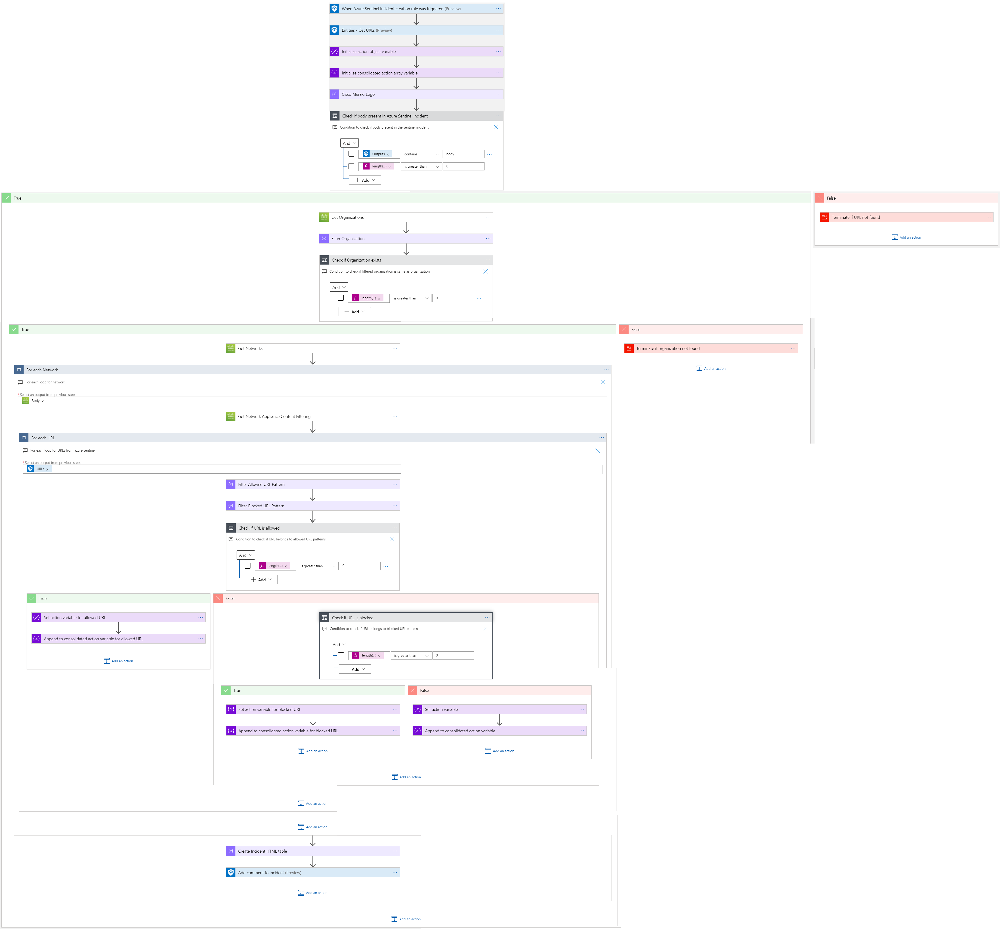
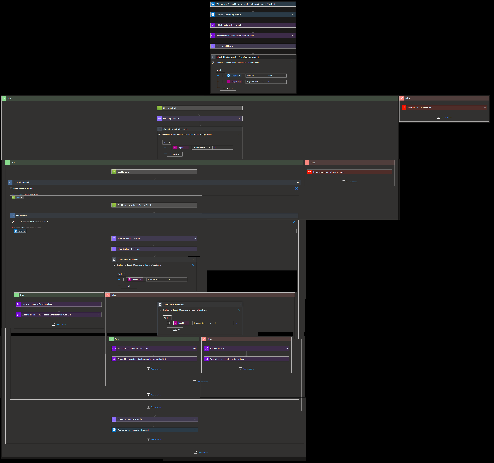
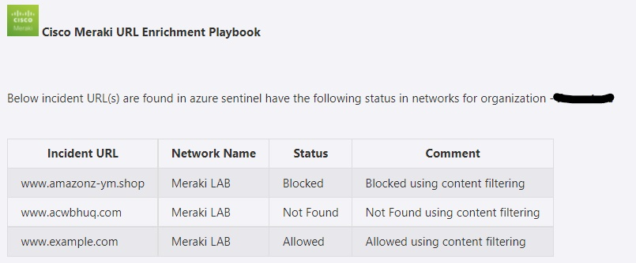
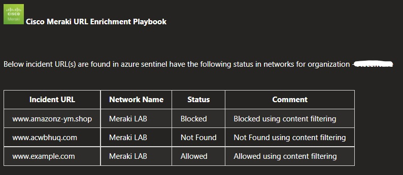

# Cisco Meraki URL Enrichment Playbook

## Summary
 When a new Microsoft Sentinel incident is created, this playbook gets triggered and performs the below actions:
 1. Fetches a list of potentially malicious URLs.
 2. For each URL in the list, checks if the URL is blocked by any of the networks of the organization.
  - If URL is allowed by the network, then incident comment is created saying URL is allowed.
  - If URL is blocked by the network, then incident comment is created saying URL is blocked.
  - If URL is not blocked by the network and not part of the network, then incident comment is created saying URL not found in network.

 ## Pre-requisites for deployment
1. Deploy the Cisco Meraki Custom Connector before the deployment of this playbook under the same subscription and same resource group. Capture the name of the connector during deployment.
2. Cisco Meraki API Key should be known to establish a connection with Cisco Meraki Custom Connector. [Refer here](https://developer.cisco.com/meraki/api-v1/#!getting-started/authorization)
3. Organization name should be known. [Refer here](https://developer.cisco.com/meraki/api-v1/#!getting-started/find-your-organization-id) 

 ## Deployment Instructions
 1. Deploy the playbook by clicking on the "Deploy to Azure" button. This will take you to deploy an ARM Template wizard.

 

 2. Fill in the required parameters for deploying the playbook.

 | Parameter  | Description |
| ------------- | ------------- |
| **Playbook Name** | Enter the playbook name without spaces |
| **Cisco Meraki Connector name**|Enter the name of Cisco Meraki custom connector without spaces |
| **Organization Name** | Enter organization name |

# Post-Deployment Instructions 
## a. Authorize API connection
* Once deployment is complete, go under deployment details and authorize Cisco Meraki connection. 
1.  Click the Cisco Meraki connection
2.  Click **Edit API connection**
3.  Enter API Key
4.  Click Save

## b. Configurations in Sentinel
- In Microsoft sentinel analytical rules should be configured to trigger an incident with URLs. 
- Configure the automation rules to trigger the playbook.

# Playbook steps explained
## When Microsoft Sentinel incident creation rule is triggered
Captures potentially malicious or malware URL incident information.

## Entities - Get URLs
Get the list of URLs as entities from the Incident.

## Check if Organization exists
 *  If organization name exists in list of organizations associated with the account, then get list of networks associated with the organization. 
 *  If organization name does not exist, then terminate with the error that organization not found.

## For each malicious URL received from the incident
 - Checks if the URL is blocked by any of the networks of the organization.
    - If URL is allowed by the network, then incident comment is created saying URL is allowed.
    - If URL is blocked by the network, then incident comment is created saying URL is blocked.   
    - If URL is not blocked by network and not part of the network, then incident comment is created saying URL not found.
 - Add incident Comment from all the cases.

## Incident Comment 

