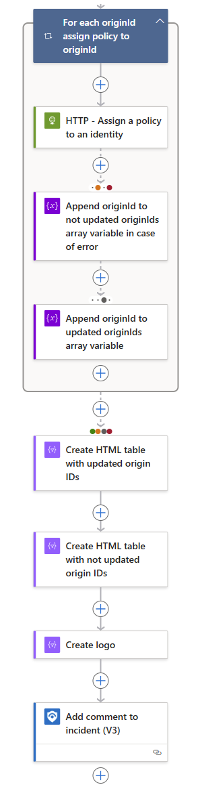
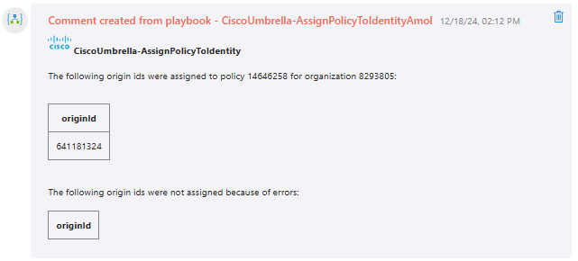
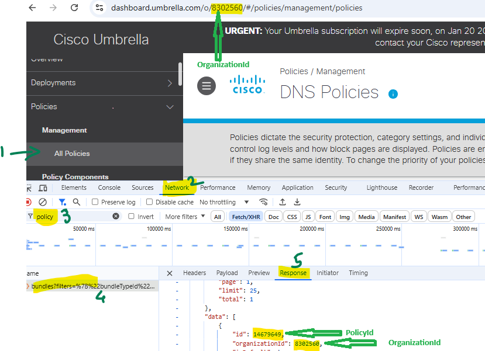

# CiscoUmbrella-AssignPolicyToIdentity

## Summary

When a new sentinel incident is created, this playbook gets triggered and performs the following actions

 

1. Assigns a new DNS or web policy (*PolicyId* is provided on the playbook deployment step) to an identity (*originId* of the identity provided in the alert custom entities).
2. Adds comment to the incident with information about the assigned policies.

 

### Prerequisites

1. Login to Cisco Umbrella dashboard and navigating to Admin-->API Keys. Create New API Key if not already created and select the appropriate "Key Scope" with Read/Write permission. Store "Api Key" and "Key Secret" to a safe place. This "Api Key" is a "Client Id" and "Key Secret" is a "Secret" used for this Playbook.
2. Store the "Api Key" and "Key Secret" from previous step to Key vault Secrets. 
3. To obtain the Organization ID and Policy ID, press F12 or right-click on the page and select 'Inspect' in your browser on the Cisco Umbrella dashboard page. Then, navigate to the 'Policies' section and click on the 'All Policies' tab. Now open the 'Network' tab and search with 'policy'. Open the 'Response' tab of the request to get the Policy ID and Organization ID as shown in the screenshot below.

    > **NOTE:** The **ID** and **OrganizationID** values in the screenshot below are for illustration purposes only and are not intended for actual use.

 

### Deployment instructions

1. To deploy the Playbook, click the Deploy to Azure button. This will launch the ARM Template deployment wizard.
2. Fill in the required parameters:
    * Playbook Name: Enter the playbook name here.
    * Cisco Umbrella Organization Id: Organization id in Cisco Umbrella.
    * Cisco Umbrella Policy Id: ID of the DNS or web policy to act upon.
    * Keyvault name: Name of the key vault where secrets are stored.
    * Umbrella API Client Id Key Name: Name of the Secrets field from Keyvault where Cisco Umbrella "API Key" value is stored.
    * Umbrella API Secret Key Name: Name of the Secrets field from Keyvault where Cisco Umbrella "Key Secret" value is stored.
    * Host End Point: Default is "api.umbrella.com" and is used for any API call to Cisco Umbrella REST API's.

 

### Post-Deployment instructions

#### a. Authorize connections

Once deployment is complete, authorize each connection.

1. Click the Microsoft Sentinel connection resource
2. Click edit API connection
3. Click Authorize
4. Sign in
5. Click Save
6. Repeat steps for Cisco Umbrella Network Device Management connector API Connection. Provide your key and the secret for authorizing.

#### b. Configurations in Sentinel

1. In Microsoft sentinel, analytical rules should be configured to trigger an incident. An incident should have the *originId* custom entity. OriginId is an Umbrella-wide unique identifier for this traffic source (origin). It can be obtained from the corresponding field in Cisco Umbrella logs. Check the [documentation](https://docs.microsoft.com/azure/sentinel/surface-custom-details-in-alerts) to learn more about adding custom entities to incidents.
2. Configure the automation rules to trigger the playbook.

#### c. Assign Playbook Microsoft Sentinel Responder Role
1. Select the Playbook (Logic App) resource
2. Click on Identity Blade
3. Choose System assigned tab
4. Click on Azure role assignments
5. Click on Add role assignments
6. Select Scope - Resource group
7. Select Subscription - where Playbook has been created
8. Select Resource group - where Playbook has been created
9. Select Role - Microsoft Sentinel Responder
10. Click Save (It takes 3-5 minutes to show the added role.)

#### d. Assign access policy on key vault for Playbook to fetch the secret key
1. Select the Key vault resource where you have stored the secret
2. Click on Access policies Blade
3. Click on Create
4. Under Secret permissions column , Select Get , List from "Secret Management Operations"
5. Click next to go to Principal tab and choose your deployed playbook name
6. Click Next leave application tab as it is .
7. Click Review and create
8. Click Create

#  References
 - [Cisco Umbrella API Documentation](https://developer.cisco.com/docs/cloud-security/authentication/#authentication)
 - [Rest API Request And Response Sample](https://developer.cisco.com/docs/cloud-security/policies/#add-identity-to-policy)