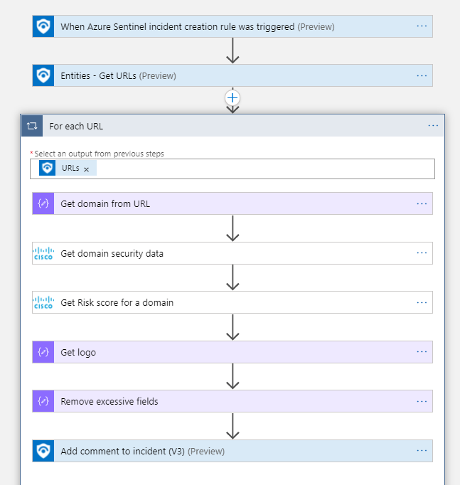

# CiscoUmbrella-GetDomainInfo

## Summary

When a new sentinel incident is created, this playbook gets triggered and performs the following actions

1. Obtains domains from URL entities in the incident.
2. Enriches incident with security information about domains using [Cisco Umbrella Investigate API](https://developer.cisco.com/docs/cloud-security/#!investigate-overview).

 

### Prerequisites

1. Prior to the deployment of this playbook, Cisco Umbrella Investigate API Connector needs to be deployed under the same subscription.
2. Obtain Cisco Umbrella API credentials. Refer to Cisco Umbrella Investigate API Custom Connector documentation.

### Deployment instructions

1. To deploy the Playbook, click the Deploy to Azure button. This will launch the ARM Template deployment wizard.
2. Fill in the required paramteres:
    * Playbook Name: Enter the playbook name here

 

### Post-Deployment instructions

#### a. Authorize connections

Once deployment is complete, authorize each connection.

1. Click the Microsoft Sentinel connection resource
2. Click edit API connection
3. Click Authorize
4. Sign in
5. Click Save
6. Repeat steps for Cisco Umbrella Investigate connector API Connection. For authorizing, provide your API key in the following format: "Bearer YOUR_API_KEY".

#### b. Configurations in Sentinel

1. In Microsoft sentinel, analytical rules should be configured to trigger an incident. In the *Entity maping* section of the analytics rule creation workflow, malicious URL should be mapped to **Url** identitfier of the **URL** entity type. Check the [documentation](https://docs.microsoft.com/azure/sentinel/map-data-fields-to-entities) to learn more about mapping entities.
2. Configure the automation rules to trigger the playbook.
