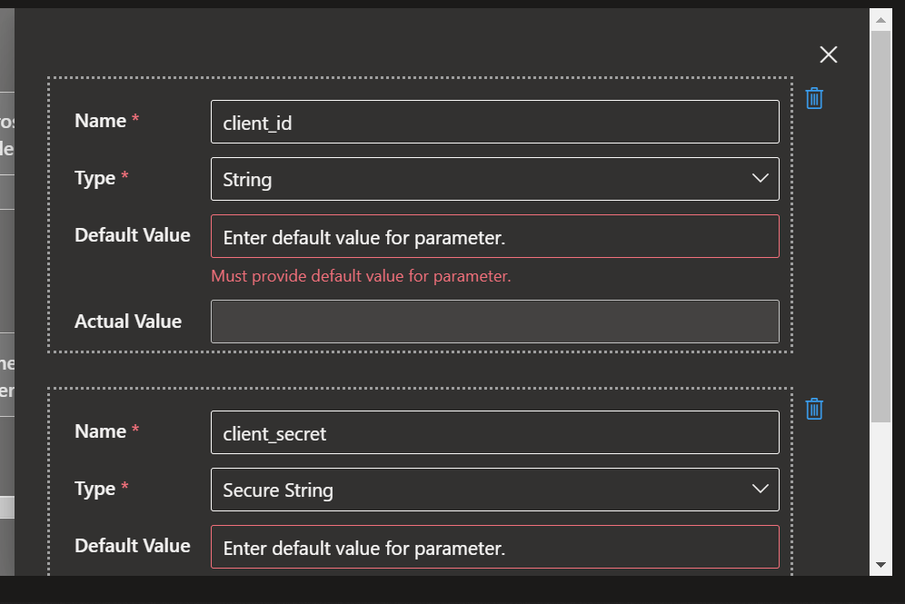
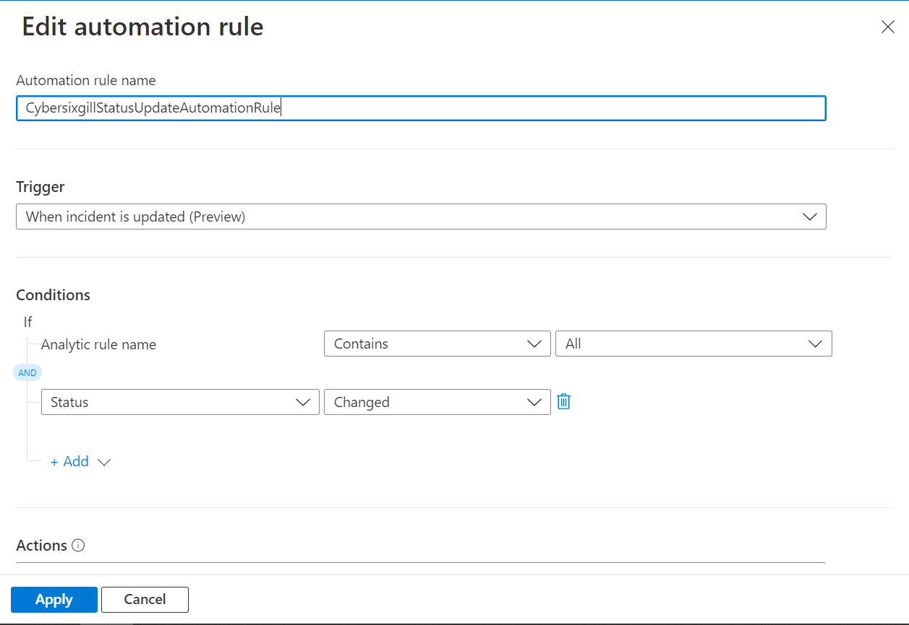

# CybersixgillAlertStatusUpdate
author: Loginsoft

This playbook will update status of Actionable alerts in Cybersixgill Portal. When incident is updated in Microsoft Sentinel, playbook will run and update status Actionable alerts from Cybersixgill Portal 

# Prerequisites
We will need the following data to do one time setup.

1. Cybersixgill Client ID (client_id)
2. Cybersixgill Client Secret (client_secret)

Client ID and Client Secret can be obtained from [Cybersixgill Developer Portal](https://developer.cybersixgill.com/dashboard)
* You can skip below step if you already have Client ID and Client Secret.
* Visit [Cybersixgill Developer Portal](https://developer.cybersixgill.com/dashboard)
* Click on Create an application.
* Enter Application name and brief description and optional Application image
* All other fields can be left to default.
* Once done click on Create the app.
* Copy Client ID and Client Secret.

# Quick Deployment

# Post-deployment
1. Create new automation rule, ex: CybersixgillStatusUpdateAutomationRule
   * Trigger = When Incident is updated
   * Condition = Status Changed

*Automation rule example*

