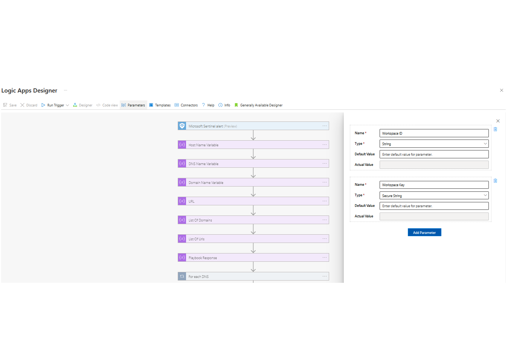

 
## DomainTools ASIM DNS Playbook
## Table of Contents

1. [Overview](#overview)
2. [Deploy DomainTools-ASIM-DNS-Playbook](#deployplaybook)
3. [Authentication](#authentication)
4. [Prerequisites](#prerequisites)
5. [Deployment](#deployment)
6. [Post Deployment Steps](#postdeployment)

<a name="overview">

## Overview
This playbook uses the DomainTools Iris Enrich API. It is able to get domain infrastructure information for a domain or set of domains associated with an alert. If your account is provisioned for Iris Enrich, use the Iris Enrich endpoint to return Whois, mailserver, DNS, SSL and related indicators from Iris Enrich for a given domain or set of domains. The enrichment data is saved in the custom table for further analysis.
 
Visit https://www.domaintools.com/integrations to request a Api key.

When a new Azure Sentinel Incident is created, and this playbook is triggered, it performs these actions:

- It fetches all the DNS entities in the Incident.
- Iterates through the DNS entities and fetches the results from Iris Enrich for each entity.
- All the details from DomainTools Iris Enrich will be saved in the custom table.

<a name="deployplaybook">

## Links to deploy the DomainTools Iris Enrich Domain Playbook

 

<a name="authentication">

## Authentication
Authentication methods this connector supports:
 - [API Key authentication](https://www.domaintools.com/integrations)

<a name="prerequisites">

## Prerequisites
- A DomainTools API Key provisioned for Iris Enrich
- DomainTools Function App should be deployed

<a name="deployment">

### Deployment instructions
- Deploy the playbooks by clicking on "Deploy to Azure" button. This will take you to deploying an ARM Template wizard.
- Fill in the required parameters for deploying the playbook.
  
- Click "Review + create". Once the validation is successful, click on "Create".

<a name="postdeployment">

### Post-Deployment instructions
Once deployment is complete, you can change the playbook parameters to get the desired results as explained below.
- Open the Logic App in the edit mode. click on parameters
  
- You need to provide a "Workspace ID" and "Workspace Key", You can obtain the "Workspace ID" in the overview of your "Log Analytics Workspace" and "Workspace key" from the "Agents> Log Analytics agent instructions" section. You can use either a "Primary key" or a "Secondary key".  
- Save the Logic App.
- As a best practice, we have used the Sentinel connection in Logic Apps that use "ManagedSecurityIdentity" permissions. Please refer to [this document](https://techcommunity.microsoft.com/t5/microsoft-sentinel-blog/what-s-new-managed-identity-for-azure-sentinel-logic-apps/ba-p/2068204) and provide permissions to the Logic App accordingly.
#### b. Configurations in Sentinel:
- In Azure Sentinel, analytical rules should be configured to trigger an alert with newly found Domain indicators.
- Configure the automation rules to trigger the playbook.
