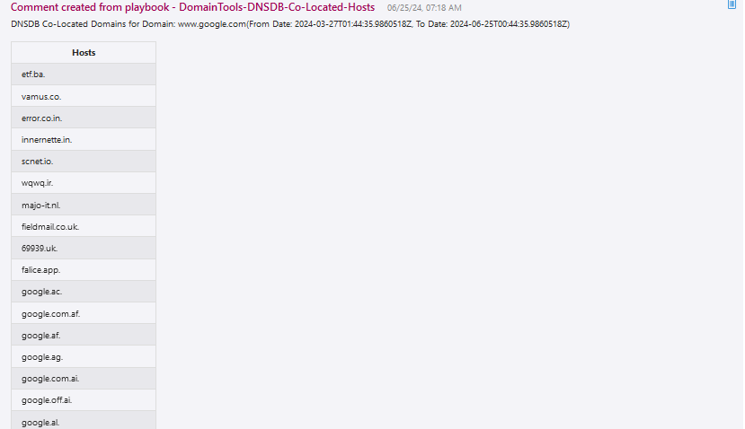
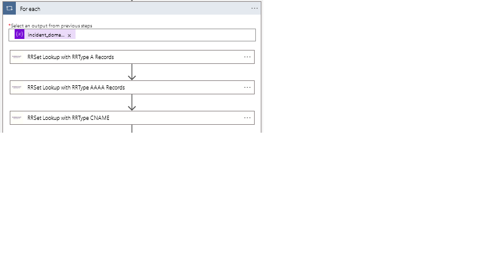
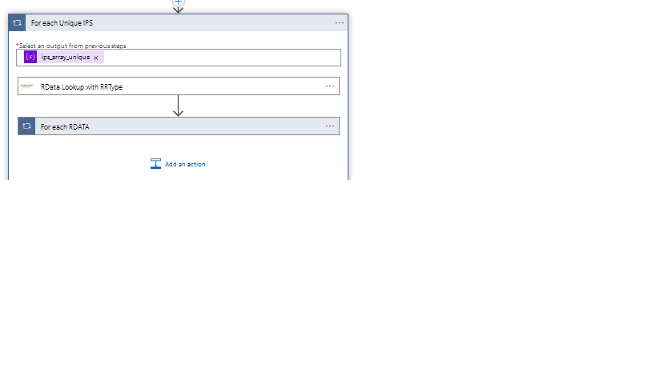
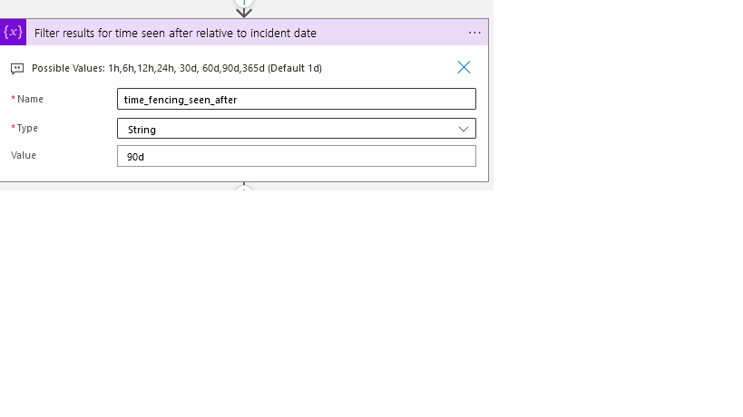
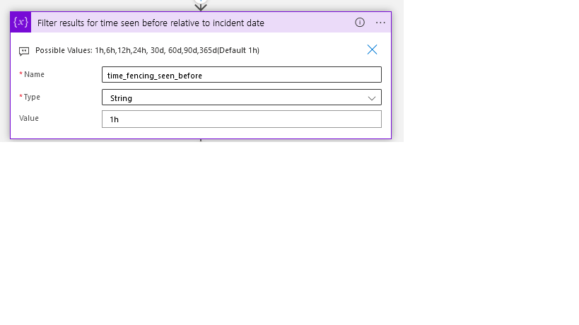

# DomainTools DNSDB Co-Located Hosts 
This playbook uses the Farsight DNSDB connector to automatically enrich Domain's found in the Microsoft Sentinel incidents. This use case describes the desire to easily identify Hosts that are co-located (based on Address) based on the input of a domain and a given point in time. The response would be a set of domains that also shared the same IP address as the originating domain name at the given point in time.

## Table of Contents

1. [Overview](#overview)
2. [Prerequisites](#prerequisites)
3. [Deployment](#deployment)
4. [Post Deployment Steps](#postdeployment)

<a name="overview">

## Overview
- This playbook fetches all the Host and DNS resolution etities from the incident.
- Iterates through each entity, perform logic.
- Adds the co-located hosts for each entity as sentinel comments.

<a name="prerequisites">

## Prerequisites
- A DomainTool DNSDB API Key.

<a name="deployment">

## Deployment Instructions
- Deploy the playbooks by clicking on the "Deploy to Azure" button. This will take you to the Deploy an ARM Template wizard.
- Fill in the required parameters for deploying the playbook.
- Click "Review + create". Once the validation is successful, click on "Create".

<a name="postdeployment">

## Post-Deployment Instructions
### Authorize connections
Once deployment is complete please open the logic app and follow below steps
- As a best practice, we have used the Sentinel connection in Logic Apps that use "ManagedSecurityIdentity" permissions. Please refer to [this document](https://techcommunity.microsoft.com/t5/microsoft-sentinel-blog/what-s-new-managed-identity-for-azure-sentinel-logic-apps/ba-p/2068204) and provide permissions to the Logic App accordingly.
- Provide connection details for the Farsight DNSDB Custom Connector.

- You could provide time fencing options, please only provide values from the list (1h,6h,12h,24h, 30d, 60d,90d,365d(Default 1h)).

- Save the Logic App. If the Logic App prompts any missing connections, please update the connections accordingly.
### Configurations in Sentinel:
- Configure the analytic rules->Automated response>Automation rules to trigger this playbook.
- Configure Incident Settings , Enable create incidents.
- Configure "Microsoft Sentinel Responder" permission to this playbook, from settings>workspace settings>Access control (IAM)>Add role assignment.
