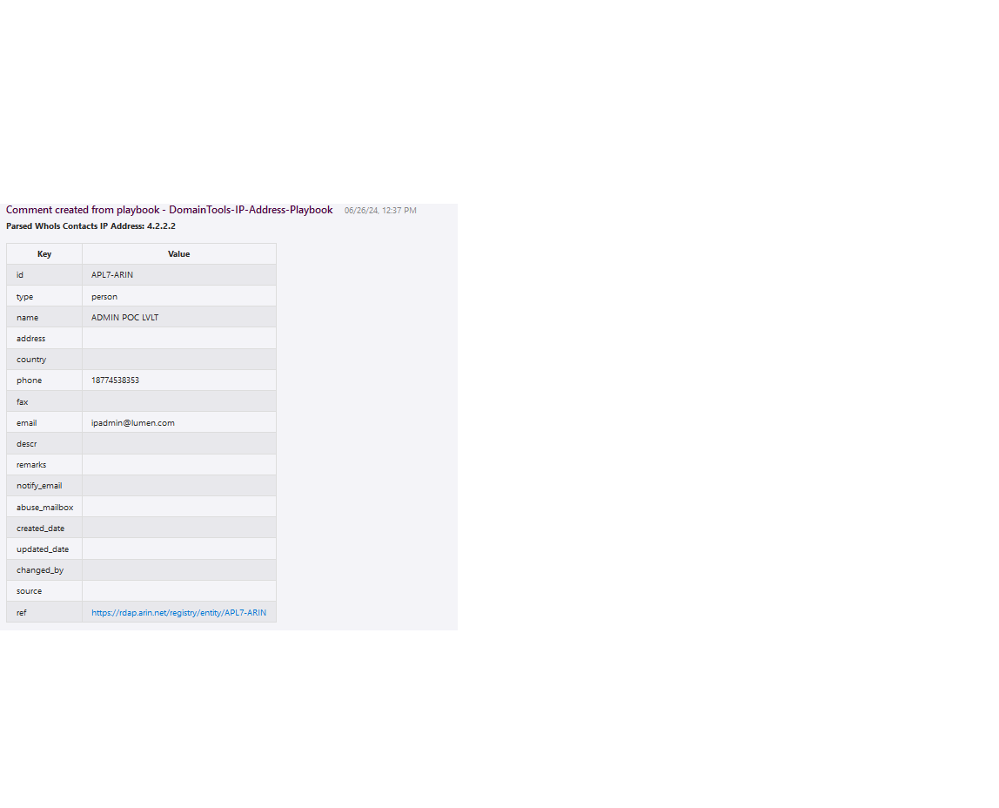
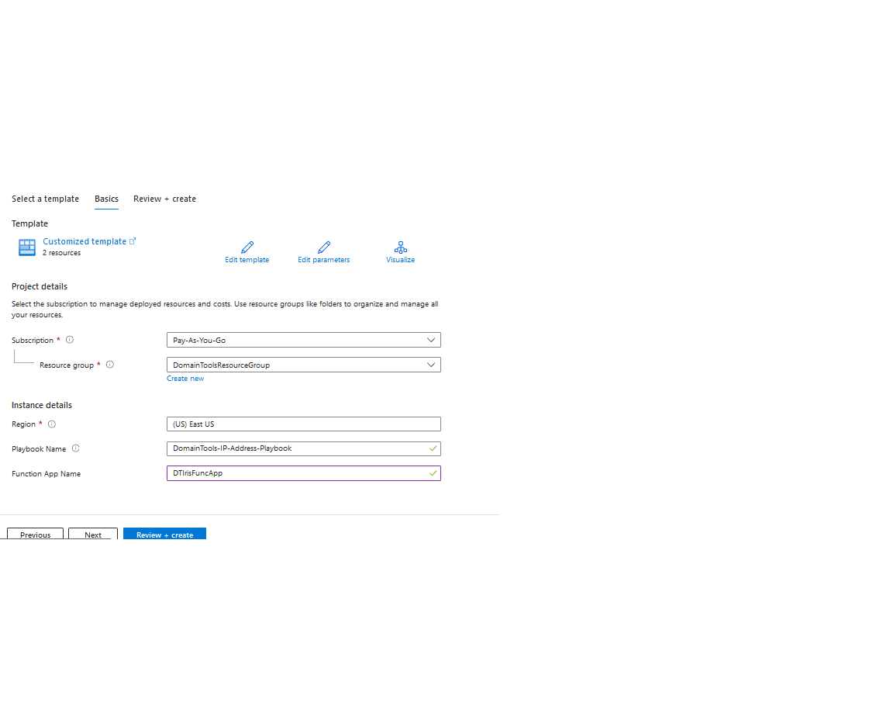

 
## DomainTools IP Address Enrichment Playbook
## Table of Contents

1. [Overview](#overview)
2. [Deploy DomainTools-IP-Address-Playbook](#deployplaybook)
3. [Authentication](#authentication)
4. [Prerequisites](#prerequisites)
5. [Deployment](#deployment)
6. [Post Deployment Steps](#postdeployment)

<a name="overview">

## Overview
This playbook uses the DomainTools Parsed Whois API. It is able to provide whois information for a IP or set of IPs associated with an incident. 
 
Visit https://www.domaintools.com/integrations to request a Api key.

When a new Azure Sentinel Incident is created, and this playbook is triggered, it performs these actions:

- It fetches all the IP entities in the Incident.
- Iterates through the IP entities and fetches the results from Parsed Whois for each entity.
- All the details from DomainTools Parsed Whois will be added as comments in a tabular format.

<a name="deployplaybook">

## Links to deploy the DomainTools IP Address Playbook

 

<a name="authentication">

## Authentication
Authentication methods this connector supports:
 - [API Key authentication](https://www.domaintools.com/integrations)

<a name="prerequisites">

## Prerequisites
- A DomainTools API Key
- DomainTools Function App should be deployed

<a name="deployment">

### Deployment instructions
- Deploy the playbooks by clicking on "Deploy to Azure" button. This will take you to deploying an ARM Template wizard.
- Fill in the required parameters for deploying the playbook.
    
- Click "Review + create". Once the validation is successful, click on "Create".

<a name="postdeployment">

### Post-Deployment instructions:
- As a best practice, we have used the Sentinel connection in Logic Apps that use "ManagedSecurityIdentity" permissions. Please refer to [this document](https://techcommunity.microsoft.com/t5/microsoft-sentinel-blog/what-s-new-managed-identity-for-azure-sentinel-logic-apps/ba-p/2068204) and provide permissions to the Logic App accordingly.
#### b. Configurations in Sentinel:
- In Azure Sentinel, analytical rules should be configured to trigger an incident with risky IP Address indicators.
- Configure the automation rules to trigger the playbook.
