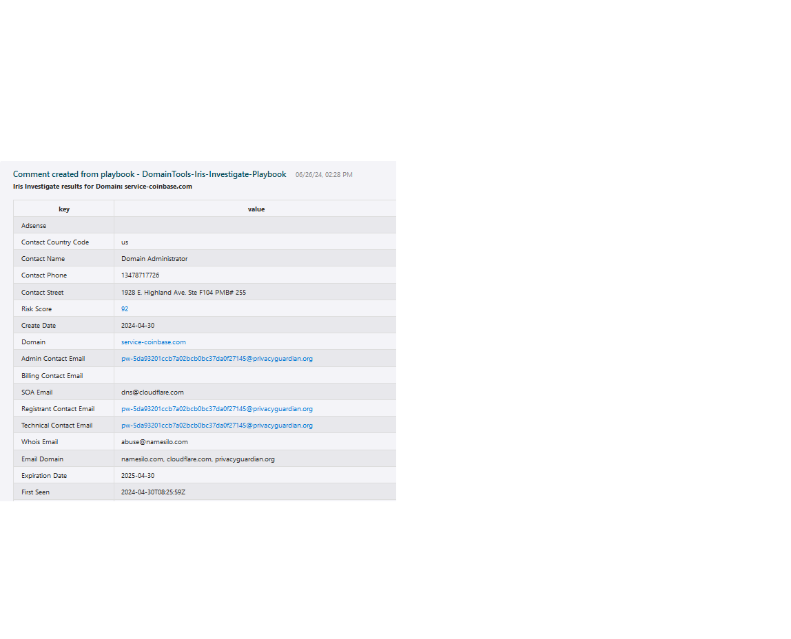
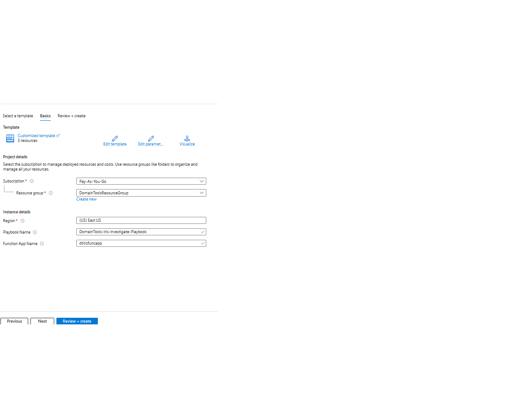
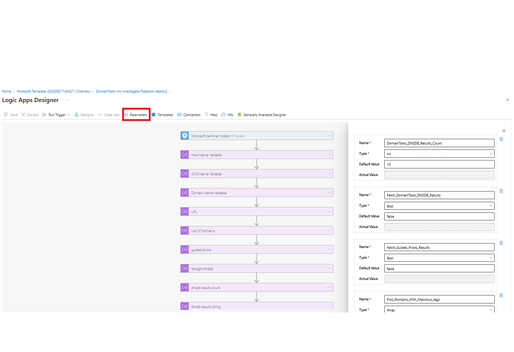
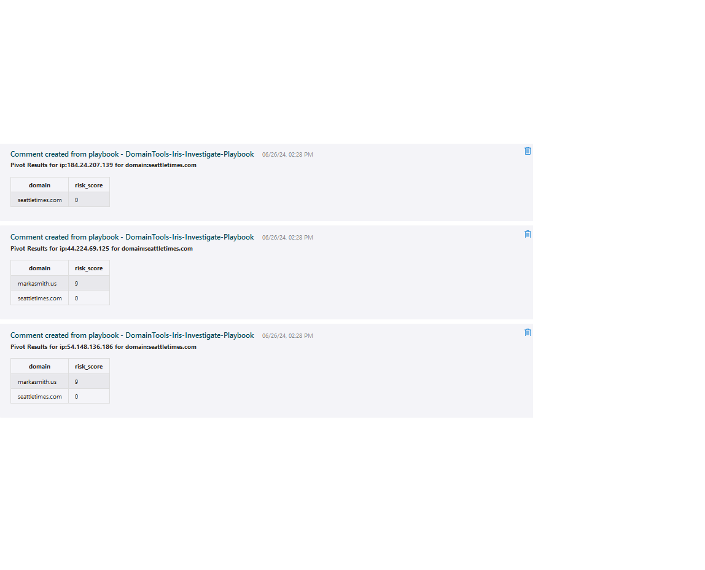
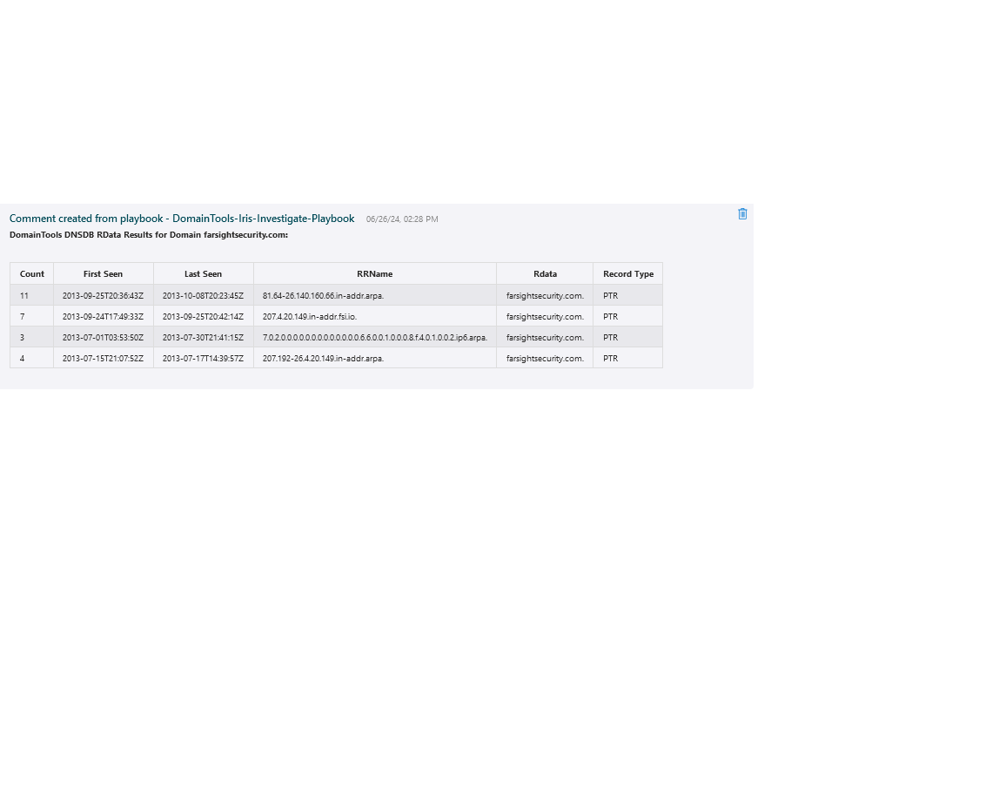

 
## DomainTools Iris Investigate Domain Playbook
## Table of Contents

1. [Overview](#overview)
2. [Deploy DomainTools-Iris-Investigate-Playbook](#deployplaybook)
3. [Authentication](#authentication)
4. [Prerequisites](#prerequisites)
5. [Deployment](#deployment)
6. [Post Deployment Steps](#postdeployment)

<a name="overview">

## Overview
This playbook uses the DomainTools Iris Investigate API. Given a domain or set of domains associated with an incident, return Whois, mailserver, DNS, SSL and related indicators from Iris Investigate, highlighting fields where fewer than 200 domains share an attribute. This is useful in order to clue investigators where there could be additional indicators of interest available via the Iris Investigate UI or API.
 
Visit https://www.domaintools.com/integrations to request a Api key.

When a new Azure Sentinel Incident is created, and this playbook is triggered, it performs these actions:

- It fetches all the Host/DNS/URL entities in the Incident.
- Iterates through the Host/DNS/URL entities and fetches the results from Iris Investigate for each entity.
- All the details from DomainTools Iris Investigate will be added as comments in a tabular format.
- All the response attributes that have count value(Count of connected domains sharing this attribute) greater than 1 and less than "Pivot_Threshold" parameter value in the playbook(default to 200), link the DomainTools Iris Investigate UI for further investigation.

<a name="deployplaybook">

## Links to deploy the DomainTools Iris Investigate Domain Playbook

 

<a name="authentication">

## Authentication
Authentication methods this connector supports:
 - [API Key authentication](https://www.domaintools.com/integrations)

<a name="prerequisites">

## Prerequisites
- A DomainTools API Key provisioned for Iris Investigate
- DomainTools Function App should be deployed

<a name="deployment">

### Deployment instructions
- Deploy the playbooks by clicking on "Deploy to Azure" button. This will take you to deploying an ARM Template wizard.
- Fill in the required parameters for deploying the playbook.
    
- Click "Review + create". Once the validation is successful, click on "Create".
	

<a name="postdeployment">

### Post-Deployment instructions
#### a. Playbook parameters: 
Once deployment is complete, you can change the playbook parameters to get the desired results as explained below.
- Open the Logic App in the edit mode. click on parameters
  
- If "Fetch_Guided_Pivots_Results" is set to True, It will get the following details for each entity:
  - Reverse Email Domain
  - Reverese IP
  - Pivot MX Host
  - Pivot by MX IP
  - Pivot by Nameserver IP Address
  - Pivot Nameserver Host
  - Pivot by Registrant Name
  - Pivot by Registrant Org
  - Reverse Email
  - Pivot SSL Email
  - Pivot by SSL Hash
    
- If you provide tags in the "Find_Domains_With_Malicious_tags" paramter, if a specified set of tags is observed, the playbook will mark the incident as “severe” in Sentinel and add a comment.
    
- If "Fetch_Domain Tools_DNSDB_Results" is set to True, It will get the DNSDB Rdata details for each entity:
    
- Save the Logic App.
- As a best practice, we have used the Sentinel connection in Logic Apps that use "ManagedSecurityIdentity" permissions. Please refer to [this document](https://techcommunity.microsoft.com/t5/microsoft-sentinel-blog/what-s-new-managed-identity-for-azure-sentinel-logic-apps/ba-p/2068204) and provide permissions to the Logic App accordingly.
#### b. Configurations in Sentinel:
- In Azure Sentinel, analytical rules should be configured to trigger an incident with risky Domain indicators.
- Configure the automation rules to trigger the playbook.
