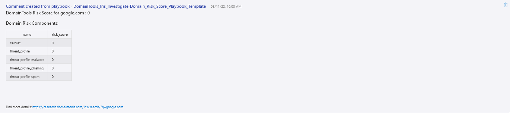

 
## DomainTools Iris Investigate Domain Risk Score Playbook
## Table of Contents

1. [Overview](#overview)
1. [Deploy DomainTools Iris Investigate Domain Risk Score Playbook](#deployplaybook)
1. [Authentication](#authentication)
1. [Prerequisites](#prerequisites)
1. [Deployment](#deployment)
1. [Post Deployment Steps](#postdeployment)

<a name="overview">

## Overview
This playbook uses the DomainTools Iris Investigate API. Given a domain or set of domains associated with an incident, return the risk scores and adjust the severity of the incident if a high risk domain is observed. Add the risk scoring details in the comments of the incident.
 
Learn more about the Custom Connector via https://docs.microsoft.com/connectors/domaintoolsirisinves or visit https://www.domaintools.com/integrations to request an API key.

When a new Azure Sentinel Incident is created, this playbook gets triggered and performs the following actions:

- It fetches all the Domain objects in the Incident.
- Iterates through the Domain objects and fetches the results from DomaintTools Iris Investigate for each Domain.
- The Risk Scoring details from DomainTools Iris Investigate will be added as comments in a tabular format.
- The Incident Severity is updated based on the overall Risk Score of the Domain: 
  - Domain overall Risk Score between 0-49, the incident severity will be set to informational.
  - Domain overall Risk Score between 50-69, the incident severity will be set to low.
  - Domain overall Risk Score between 70-89, the incident severity will be set to medium.
  - Domain overall Risk Score between 90-100, the incident severity will be set to high.

<a name="deployplaybook">

## Links to deploy the DomainTools Iris Investigate Domain Risk Score Playbook

 

<a name="authentication">

## Authentication
Authentication methods this connector supports
 - [API Key authentication](https://www.domaintools.com/integrations)

<a name="prerequisites">

## Prerequisites
- A DomainTools API Key provisioned for Iris Investigate

<a name="deployment">

### Deployment instructions
- Deploy the playbooks by clicking on "Deploy to Azure" button. This will take you to deploying an ARM Template wizard.
- Fill in the required parameters for deploying the playbook.
  
- Click "Review + create". Once the validation is successful, click on "Create".

<a name="postdeployment">

### Post-Deployment instructions
#### a. Authorize connections: 
Once deployment is complete, you will need to authorize each connection:
- Open the Logic App in the edit mode.
- Open "For each" Action.
- Provide connection details for the DomainTools Iris Investigate Custom Connector (A DomainTools API Username and API Key need to be provided).

  
- Click on "Add New", provide a name for the connection, enter your DomainTools Investigate API Username and API Key.
- Click "Create".
- Repeat these steps for any other connections and select the connection details created above.
  
- Save the Logic App. If the Logic App prompts any missing connections, please update the connections similarly.
- As a best practice, we have used the Sentinel connection in Logic Apps that use "ManagedSecurityIdentity" permissions. Please refer to [this document](https://techcommunity.microsoft.com/t5/microsoft-sentinel-blog/what-s-new-managed-identity-for-azure-sentinel-logic-apps/ba-p/2068204) and provide permissions to the Logic App accordingly.
#### b. Configurations in Sentinel:
- In Azure Sentinel, analytical rules should be configured to trigger an incident with risky Domain indicators.
- Configure the automation rules to trigger the playbook.
