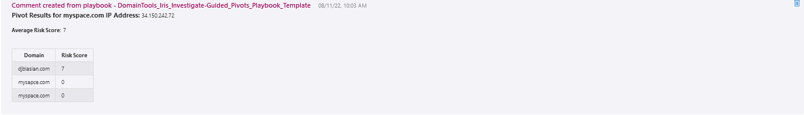
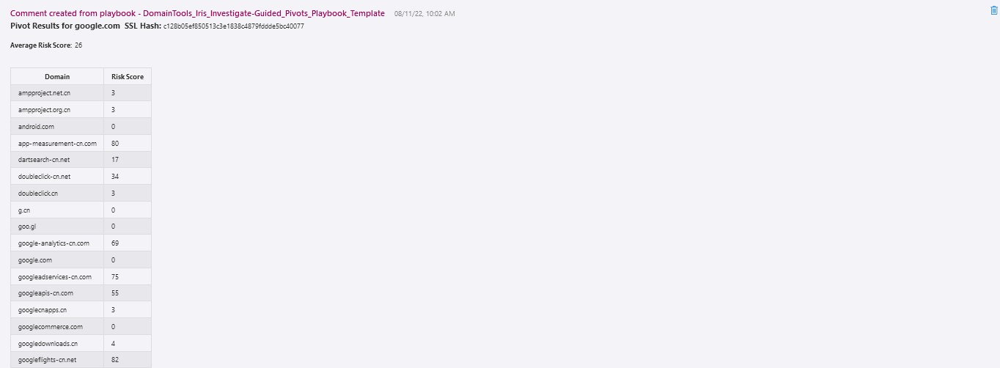

 
## DomainTools Iris Investigate Guided Pivots Playbook
## Table of Contents

1. [Overview](#overview)
1. [Deploy DomainTools Iris Investigate Guided Pivots Playbook](#deployplaybook)
1. [Authentication](#authentication)
1. [Prerequisites](#prerequisites)
1. [Deployment](#deployment)
1. [Post Deployment Steps](#postdeployment)

<a name="overview">

## Overview
This playbook uses the DomainTools Iris Investigate API. Given a domain return all the Iris Investigate data, highlighting fields where < 200 domains share an attribute to clue investigators in to retrieve more data via Iris Investigate UI (or further queries using the Iris Investigate API).
 
Learn more about the Custom Connector via the https://docs.microsoft.com/en-us/connectors/domaintoolsirisinves or visit https://www.domaintools.com/integrations to request a Api key.

- It fetches all the Domain objects in the Incident.
- Iterates through the Domains objects and fetches the results from DomaintTools Iris Investigate for each Domain.
- It will get the details from the following actions of the Iris Investigate Custom Connector
- Reverse Email Domain
- Reverese IP
- Pivot MX Host
- Pivot by MX IP
- Pivot by Nameserver IP Address
- Pivot Nameserver Host
- Pivot by Registrant Name
- Pivot by Registrant Org
- Reverse Email
- Pivot SSl Email
- Pivot by SSL Hash

<a name="deployplaybook">

## Links to deploy the DomainTools Iris Investigate Guided Pivots Playbook

 

<a name="authentication">

## Authentication
Authentication methods this connector supports- [API Key authentication](https://www.domaintools.com/integrations)

<a name="prerequisites">

## Prerequisites
- DomainTools Iris Investigate Api Key

<a name="deployment">

### Deployment instructions
- Deploy the playbooks by clicking on "Deploy to Azure" button. This will take you to deploying an ARM Template wizard.
- Fill in the required parameters for deploying the playbook.

<a name="postdeployment">

### Post-Deployment instructions
#### a. Authorize connections 
Once deployment is complete, you will need to authorize each connection.
- Click the Azure Sentinel connection resource
- Click edit API connection
- Click Authorize
- Sign in
- Click Save
- Repeat steps for other connections such as DomainTools connector API Connection (For authorizing the DomainTools connector API connection, API Key and API secret needs to be provided.)
- Go to sentinel hook playbook to azure sentinel rules.
#### b. Configurations in Sentinel
- In Azure sentinel analytical rules should be configured to trigger an incident with risky user account. 
- Configure the automation rules to trigger the playbooks.
#### c. Managed Identity for Azure Sentinel Logic Apps connector
As a best practice, we used sentinel connection in playbooks that uses "ManagedSecurityIdentity". Please refer [this](https://techcommunity.microsoft.com/t5/microsoft-sentinel-blog/what-s-new-managed-identity-for-azure-sentinel-logic-apps/ba-p/2068204)

