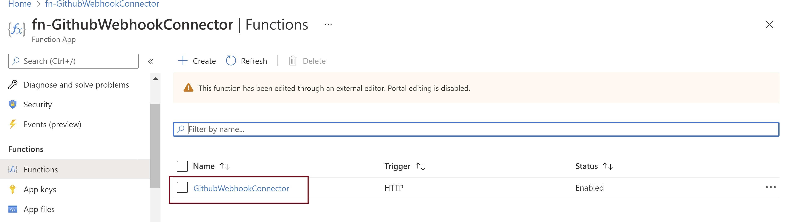
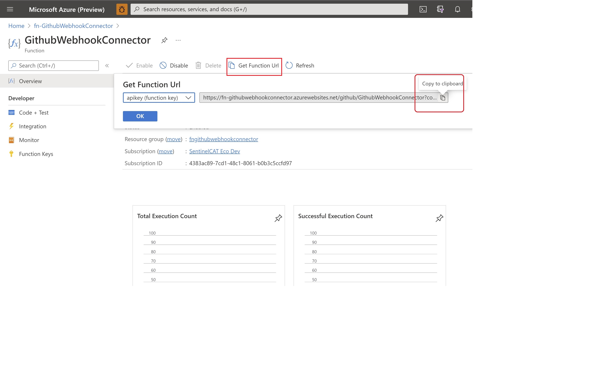
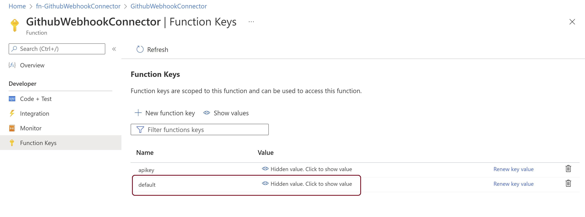
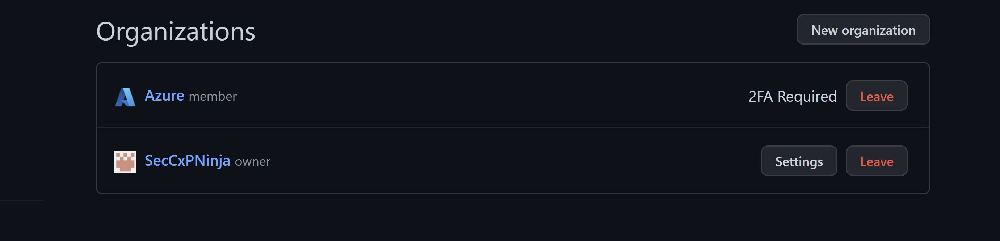
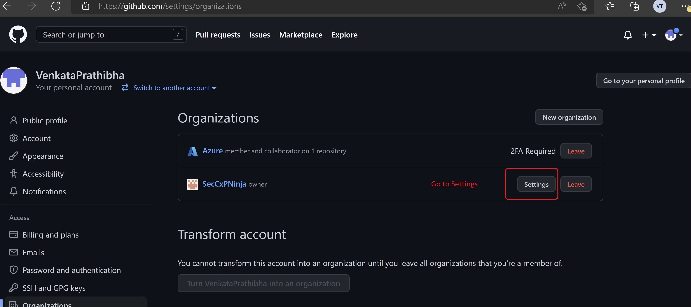
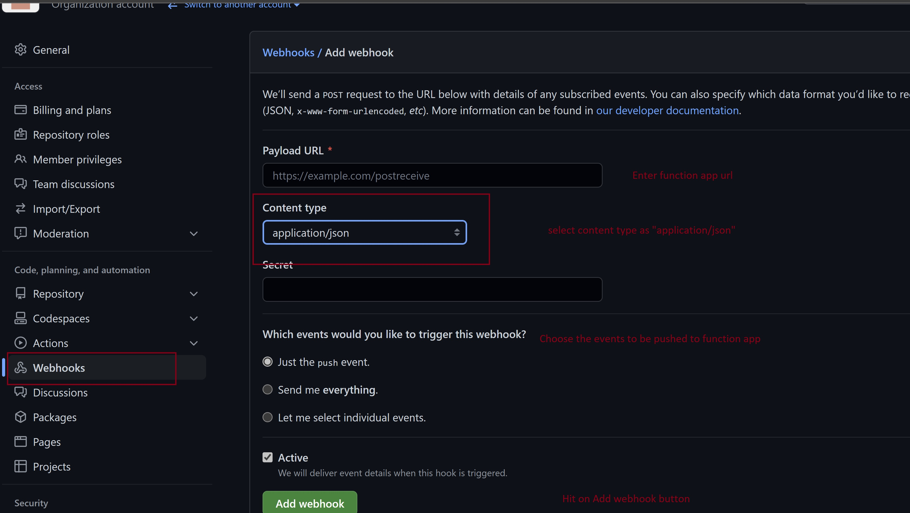
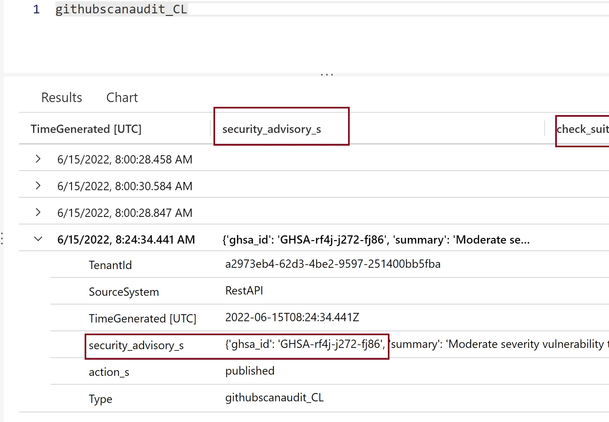

# GitHub Webhook V2 Data Connector

> ⚠️ **IMPORTANT: Migrate to V2**
>
> The original GitHub Webhook connector (`GithubWebhook`) uses the **Azure Monitor HTTP Data Collector API (CLv1 / ODS endpoint)**. Microsoft is replacing this API with the **Logs Ingestion API (CLv2)**. V2 of this connector is the strategic replacement and should be used for all new deployments. Existing V1 deployments should be migrated to V2.
>
> See the [Migrating from V1](#migrating-from-v1) section below for step-by-step instructions.

## Overview

This connector is the designated successor to the original [GitHub Webhook connector](../GithubWebhook/) and ingests [GitHub webhook events](https://docs.github.com/en/developers/webhooks-and-events/webhooks/webhook-events-and-payloads) into Microsoft Sentinel using the **Logs Ingestion API (CLv2)** with **Managed Identity** authentication. It replaces the CLv1 HTTP Data Collector API (ODS endpoint) used by the original connector.

As of now the solution supports the following GitHub Advanced Security events:
- [Code Scanning Alert](https://docs.github.com/en/developers/webhooks-and-events/webhooks/webhook-events-and-payloads#code_scanning_alert)
- [Repository Vulnerability Alert (Dependabot)](https://docs.github.com/en/developers/webhooks-and-events/webhooks/webhook-events-and-payloads#repository_vulnerability_alert)
- [Secret Scanning Alert](https://docs.github.com/en/enterprise-cloud@latest/developers/webhooks-and-events/webhooks/webhook-events-and-payloads#secret_scanning_alert)

| | V1 (original) | V2 (this connector) |
|---|---|---|
| **API** | HTTP Data Collector API (ODS) — being replaced by CLv2 | Logs Ingestion API (CLv2/GIG) |
| **Auth** | SharedKey (`WorkspaceID` + `WorkspaceKey`) | Managed Identity (`DefaultAzureCredential`) |
| **Table** | `githubscanaudit_CL` | `GitHubAdvancedSecurityAlerts_CL` |
| **Column names** | Auto-generated `_s` / `_d` / `_b` suffixes | Explicit schema, identical `_s` / `_d` / `_b` names |
| **Unified view** | `githubscanaudit_CL` only | `githubscanaudit` parser (unions both tables) |
| **Recommendation** | Migrate to V2 | ✅ Recommended for all deployments |

## Architecture

```
GitHub Org Webhook
        │  POST (HMAC-SHA256 signed)
        ▼
Azure Function App (HTTP trigger)
  ├── GithubWebhookConnectorV2/__init__.py
  │     ├── Verify x-hub-signature-256 (HMAC-SHA256)
  │     ├── customizeJson() — flatten nested JSON to _s strings
  │     └── LogsIngestionClient.upload() → DCE → DCR
  │
  ├── System-assigned Managed Identity
  │     └── Monitoring Metrics Publisher role on DCR
  │
  └── App Settings
        ├── DCE_ENDPOINT
        ├── DCR_RULE_ID
        ├── DCR_STREAM_NAME  (Custom-GitHubAdvancedSecurityAlerts_CL)
        └── GithubWebhookSecret  (optional, for HMAC validation)

DCR → Log Analytics Workspace → GitHubAdvancedSecurityAlerts_CL table
```

## Prerequisites

- Microsoft Sentinel workspace
- Permissions to create Azure Function Apps, role assignments, and DCE/DCR resources
- A GitHub Organization with Webhook configuration access

> **Best practice:** Create a new Resource Group for this connector — all provisioned resources (Function App, Storage Account, DCE, DCR, App Insights) will reside there.

## Deployment

### Option 1 — ARM Template (Recommended)

[](https://portal.azure.com/#create/Microsoft.Template/uri/https%3A%2F%2Fraw.githubusercontent.com%2FAzure%2FAzure-Sentinel%2Fmaster%2FSolutions%2FGitHub%2FData%2520Connectors%2FGithubWebhookV2%2Fazuredeploy_GithubWebhookV2_API_FunctionApp.json)

**Required parameters:**

| Parameter | Description |
|---|---|
| `FunctionName` | Name for the new Function App (default: `fngithubwebhookv2`) |
| `WorkspaceName` | The **name** of your Log Analytics workspace (e.g. `my-sentinel-workspace`). Deploy to the **same resource group** as the workspace. |
| `GithubWebhookSecret` | *(Optional)* Secret string used to validate the `x-hub-signature-256` header sent by GitHub |

The template automatically provisions:
- Storage Account, App Service Plan, Function App (with SystemAssigned identity)
- Application Insights
- Custom Log table `GitHubAdvancedSecurityAlerts_CL`
- Data Collection Endpoint (DCE)
- Data Collection Rule (DCR) with `transformKql: "source"` passthrough
- Role assignment granting the Function App's Managed Identity the **Monitoring Metrics Publisher** role on the DCR

### Option 2 — Manual Deployment

1. Deploy the Function App manually following the [Azure Functions manual deployment instructions](https://github.com/Azure/Azure-Sentinel/blob/master/DataConnectors/AzureFunctionsManualDeployment.md).
2. Create the `GitHubAdvancedSecurityAlerts_CL` table with the schema defined in the ARM template.
3. Create a DCE and DCR pointing to `GitHubAdvancedSecurityAlerts_CL`.
4. Enable **System Assigned Managed Identity** on the Function App.
5. Grant the Managed Identity the **Monitoring Metrics Publisher** role on the DCR.
6. Set the following Application Settings:

| Setting | Value |
|---|---|
| `DCE_ENDPOINT` | Logs ingestion endpoint URL from your DCE |
| `DCR_RULE_ID` | `immutableId` of your DCR |
| `DCR_STREAM_NAME` | `Custom-GitHubAdvancedSecurityAlerts_CL` |
| `GithubWebhookSecret` | *(Optional)* Your GitHub webhook secret |

## Post-Deployment Steps

### Get the Function App Endpoint

1. In the Azure Portal, go to your Function App → **Overview** → **Functions** → click **GithubWebhookConnectorV2**.

   

2. Click **Get Function URL** (highlighted below) and copy the URL.

   

3. *(Optional)* Generate a new function key and substitute it into the URL as the `code` query parameter.  
   Example: `https://fngithubwebhookv2.azurewebsites.net/api/GithubWebhookConnectorV2?code={apikey}`

   

### Configure Webhook on GitHub Organization

1. Go to GitHub → click your avatar → **Your Organizations**.

   

2. Open the Organization → click **Settings**.

   

3. Click **Webhooks** → **Add webhook** and fill in the form:
   - **Payload URL**: paste the Function App URL from above
   - **Content type**: `application/json`
   - **Secret**: enter your `GithubWebhookSecret` value (if set)
   - **Events**: select **Let me select individual events** and enable:
     - ✅ Code scanning alerts
     - ✅ Repository vulnerability alerts (Dependabot)
     - ✅ Secret scanning alerts

   

4. Click **Add webhook**. GitHub will send a ping event — the Function App should return HTTP 200.

### Verify Data in Log Analytics

After 5–10 minutes (Log Analytics needs time to spin up resources on first ingest), events will appear in the `GitHubAdvancedSecurityAlerts_CL` table:



> **Tip for testing secret scanning:** GitHub's built-in secret patterns require real credential formats. To reliably trigger a `secret_scanning_alert` webhook during testing, create a **custom secret scanning pattern** in your Organization settings using the pattern `TEST_SECRET_[A-Z0-9]{32}` and commit a matching string such as `TEST_SECRET_ABCD1234EFGH5678IJKL9012MNOP3456` to a repository.

## Querying Data

| Query | Description |
|---|---|
| `GitHubAdvancedSecurityAlerts_CL \| sort by TimeGenerated desc` | All V2 events |
| `githubscanaudit \| sort by TimeGenerated desc` | Unified view (V1 + V2, all historical data) |
| `GitHubCodeScanningData` | Code scanning alerts (uses `githubscanaudit` — works with both tables) |
| `GitHubDependabotData` | Dependabot vulnerability alerts |
| `GitHubSecretScanningData()` | Secret scanning alerts |

## Migrating from V1

> ⚠️ **Microsoft is replacing the CLv1 HTTP Data Collector API (used by the original GitHub Webhook connector) with the Logs Ingestion API (CLv2). V2 is the recommended replacement. Migrate existing V1 deployments to V2 to remain on a supported ingestion path.**

Because both tables share identical column names (`_s` / `_d` / `_b` suffixes), all existing workbooks, analytic rules, hunting queries, and parsers (`GitHubCodeScanningData`, `GitHubDependabotData`, `GitHubSecretScanningData`) continue to work without modification via the `githubscanaudit` union parser.

**Migration Steps:**

1. **Deploy V2.** Complete all deployment steps above.

2. **Update the GitHub webhook URL.** In your GitHub Organization (**Settings → Webhooks**), update the payload URL to point to the new V2 Function App URL. This immediately redirects new events to V2.

3. **Verify V2 is receiving events.** Trigger some GitHub events and confirm data appears in `GitHubAdvancedSecurityAlerts_CL` within 5–10 minutes.

4. **Validate the unified parser.** Run the following in Log Analytics to confirm events appear:
   ```kql
   githubscanaudit
   | sort by TimeGenerated desc
   | take 50
   ```

5. **Stop the V1 Function App.** Once V2 is confirmed working:
   - In the Azure Portal, navigate to your original V1 Function App.
   - Under **Overview**, click **Stop**.
   - This prevents any residual processing while freeing up Function App compute costs.

6. **Retain V1 historical data.** The `githubscanaudit_CL` table data is subject to your workspace retention policy. No action is required — historical V1 data remains queryable via `githubscanaudit` until it ages out.

> **Note:** Do not delete V1 Function App resources until you are satisfied V2 is fully operational and you do not need to roll back.

## File Structure

```
GithubWebhookV2/
├── GithubWebhookConnectorV2/
│   ├── __init__.py          # Azure Function — CLv2 ingestion logic
│   └── function.json        # HTTP trigger binding
├── azuredeploy_GithubWebhookV2_API_FunctionApp.json  # ARM template
├── GithubWebhookV2_API_FunctionApp.json              # Connector definition
├── GithubWebhookV2.zip                               # Pre-built Linux deployment package
├── host.json                # Function host settings (retry, timeout)
├── requirements.txt         # Python dependencies
└── README.md                # This file
```

## Related Resources

- [Original V1 connector](../GithubWebhook/)
- [`githubscanaudit` union parser](../../Parsers/GitHubScanAudit.yaml)
- [Azure Monitor HTTP Data Collector API deprecation](https://aka.ms/Sentinel-Logs_migration)
- [Logs Ingestion API overview](https://docs.microsoft.com/azure/azure-monitor/logs/logs-ingestion-api-overview)
- [Azure Monitor Ingestion client library for Python](https://docs.microsoft.com/python/api/overview/azure/monitor-ingestion-readme)
