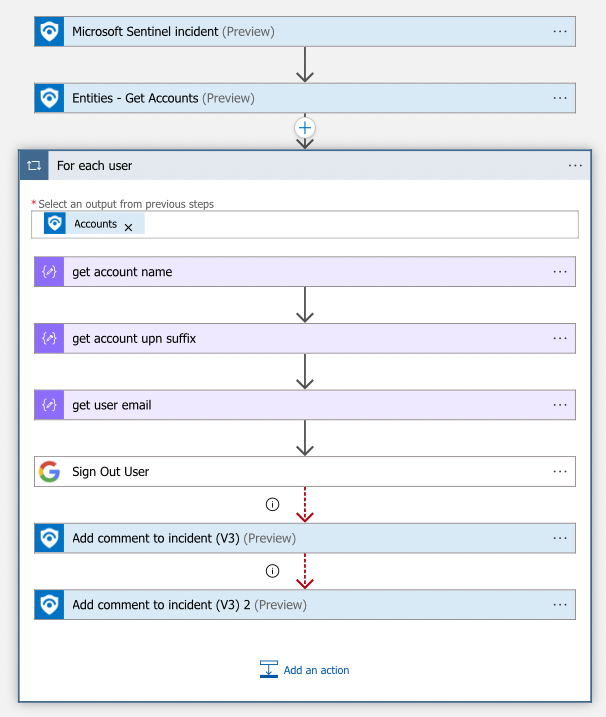

# Google-SignOutUser
 ## Summary
 Once a new Microsoft Sentinel incident is created, this playbook gets triggered and performs the following actions:
 1. Gets users from the incident.
 2. [Signs out users.](https://developers.google.com/admin-sdk/directory/reference/rest/v1/users/signOut)
 3. Adds comment to the incident about signed out users.

 
### Prerequisites 
1. [Google Directory Custom API Connector](./../../GoogleDirectoryAPIConnector/) has to be deployed prior to the deployment of this playbook under the same subscription.
2. Google Directory API credentials are required. Refer to [the Google Directory Custom Connector documentation](./../../GoogleDirectoryAPIConnector/).

### Deployment instructions 
1. To deploy the Playbook, click the Deploy to Azure button. This will launch the ARM Template deployment wizard.
2. Fill in the required paramteres:
    * Playbook Name: Enter the playbook name here
    * Google Directory Connector Name: Logic App Connector Name

 

### Post-Deployment instructions 
#### a. Authorize connections
Once deployment is complete, authorize each connection.
1.	Click the Azure Sentinel connection resource
2.	Click edit API connection
3.	Click Authorize
4.	Sign in
5.	Click Save
6.	Repeat steps for GoogleDirectory connector API Connection.

#### b. Configurations in Sentinel
1. In Microsoft sentinel, analytical rules should be configured to trigger an incident that contains Accounts. In the *Entity maping* section of the analytics rule creation workflow, user email should be mapped to **FullName** identitfier of the **Account** entity type. Check the [documentation](https://docs.microsoft.com/azure/sentinel/map-data-fields-to-entities) to learn more about mapping entities.
2. Configure the automation rules to trigger the playbook. Check the [documentation](https://docs.microsoft.com/azure/sentinel/tutorial-respond-threats-playbook) to learn more about automation rules.
