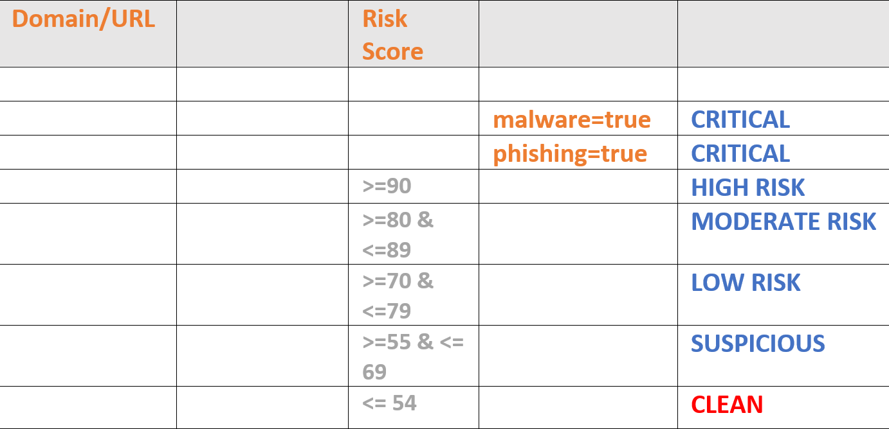

# Enrich-Sentinel-IPQualityScore-URL-Reputation
author: David Mackler, IPQualityScore

This playbook uses the IPQS Fraud and Risk Scoring connector to automatically enrich URL's found in the Sentinel incidents. This Playbook Template provides the Reputation such as **Critical, High Risk, Moderate Risk, Low Risk, Suspicious, Clean** based on Fraud Score. 
Learn more about the integration via the https://docs.microsoft.com/connectors/ipqsfraudandriskscor/ or visit https://www.ipqualityscore.com/contact-us to request a trial key.

## Sentinel Incident Comments Screenshot

## Reputation Threat Metrix

## Links to deploy the Enrich-Sentinel-IPQualityScore-URL-Reputation playbook template:

