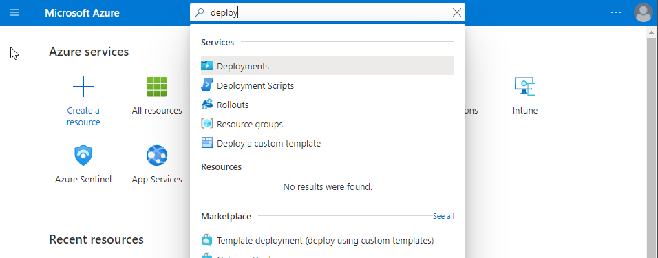
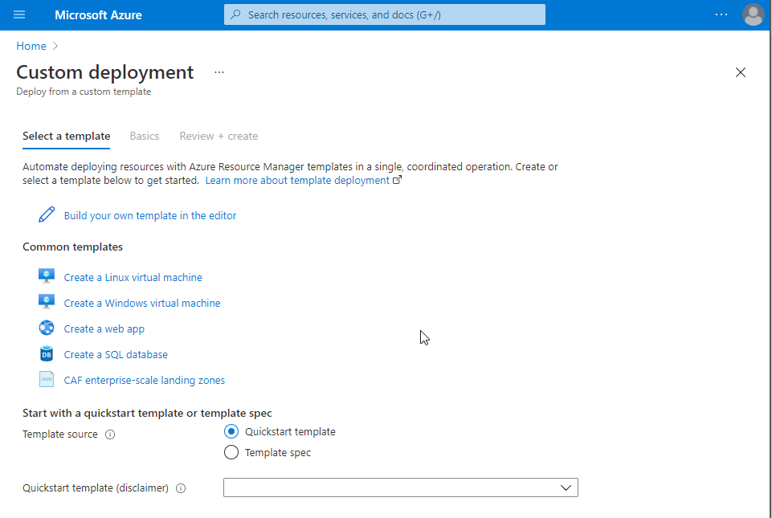
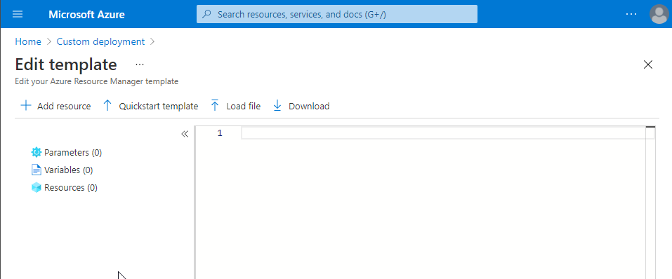
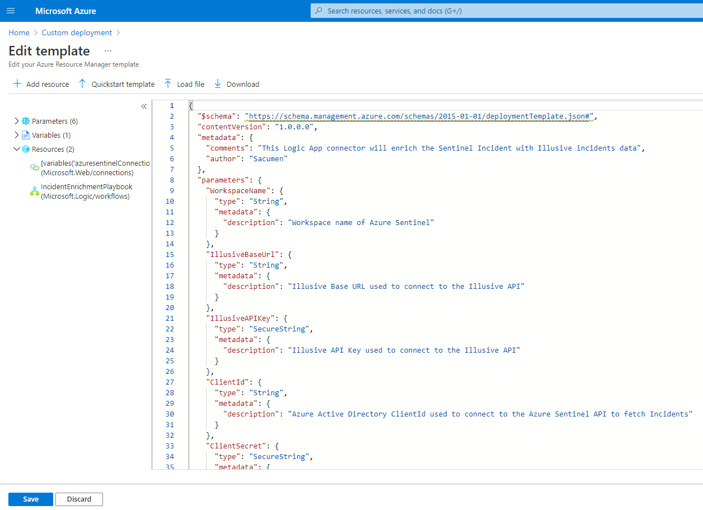
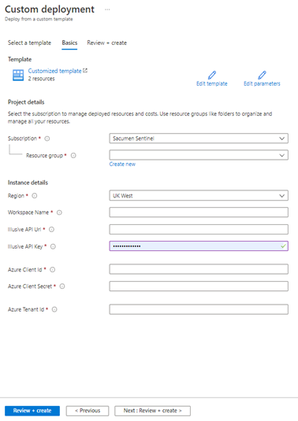
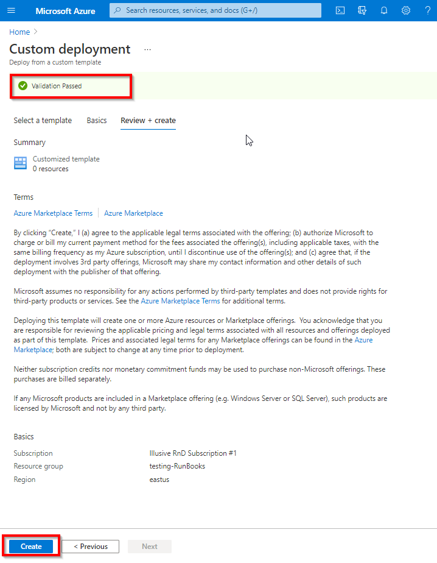
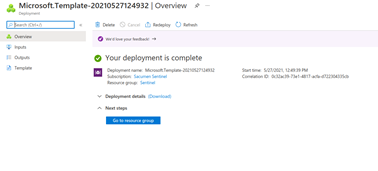
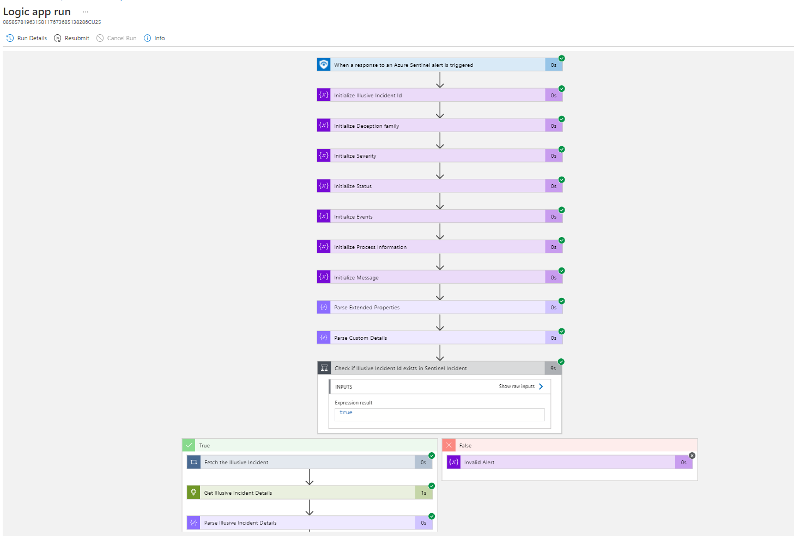
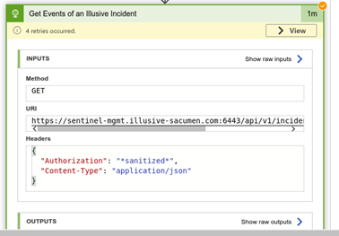

  
 </a>

# Illusive Incident Enrichment Playbook

The Incident Enrichment playbook leverages Sentinel analytic rules to discover Illusive-based alerts and report the associated data and forensics as Sentinel incident sets. 

Use this playbook to enrich Sentinel security incidents originating from Illusive with Illusive incident and forensics information. Illusive continues to enrich relevant Sentinel incidents as new events are detected. This is done using the Illusive API resource.

- [Illusive Incident Enrichment Playbook](#illusive-incident-enrichment-playbook)
  - [Playbook Workflow](#playbook-workflow)
  - [Create the Illusive playbook](#create-the-illusive-playbook)
    - [Deploy a custom template](#deploy-a-custom-template)
  - [Connect the playbook to Azure Sentinel](#connect-the-playbook-to-azure-sentinel)
  - [Playbook Execution](#playbook-execution)
  - [Output](#output)
  - [Access and view the playbook](#access-and-view-the-playbook)
  - [Playbook retry mechanism](#playbook-retry-mechanism)

<a name="playbook-workflow">

## Playbook Workflow

1. Perform the general solution setup. [(see instructions here)](https://github.com/IllusiveNetworks-Labs/Azure-Sentinel/tree/Illusive/Solutions/Illusive%20Active%20Defense)
2. [Create the Illusive playbook.](#create-illusive-playbook)
3. [Connect the playbook to Azure Sentinel](#API_connection)

<a name="create-illusive-playbook">

## Create the Illusive playbook

Deploying the Illusive Incident Enrichment playbook requires a custom deployment template.

- The playbook should be deployed under the same resource group, subscription, and workspace as the Azure app.
- The Illusive API key should contain only the API key and no keywords such as “Bearer” or “Basic”.

### Deploy a custom template

Before deploying the custom template, download the **azuredeploy.json** for the *Incident Enrichment* playbook from the GitHub repository [using this link](https://github.com/IllusiveNetworks-Labs/Azure-Sentinel/blob/2f67abd268398e63da0071b5f7027a49829a5dbd/Solutions/Illusive%20Active%20Defense/Playbooks/Illusive-SentinelIncident-Enrichment/azuredeploy.json).

1. On the Azure home page, filter for Deploy a custom template.
       
  
           </a>
       

2. Under **Custom Deployment>Select a template**, click **Build your own template in the editor**.
       
  
           </a>
       

3. From **Edit template,** click **Load file,** load the **azuredeploy.json** file you downloaded, and click **Save.**
       
  
           </a>
       

       
  
           </a>
       

 1. Under **Custom Deployment>Basics:**
    - Specify the **Subscription** that contains the dedicated Azure app that will run the Illusive Sentinel solution 
    - Specify the **Resource group** that contains the Workspace where you want to install the playbook.
    - Under **Instance details:**
      <table>
       <tr>
        <td><b>Field</b></td>
        <td><b>Instructions</b></td>
       </tr>
       <tr>
        <td>Region</td>
        <td>Filled automatically based on the subscription and cannot be changed.</td>
       </tr>
       <tr>
        <td>Workspace Name</td>
        <td>Specify the Azure Sentinel <b>Workspace Name</b> where you want to create the playbook.</td>
       </tr>
       <tr>
        <td>Illusive API URL   Illusive API Key</td>
        <td>Supply the authentication parameters required to access the Illusive API
         <b>Important:</b> Enter the API key without the keyword</td>
       </tr>
       <tr>
        <td>Azure-Sentinel Client ID:    Azure-Sentinel Client Secret:    Azure-Sentinel Tenant ID:</td>
        <td>Supply the authentication parameters required to access the Azure-Sentinel API</td>
       </tr>
      </table>
      
  
          </a>
      

4. When finished entering details, click **Review + Create**.
      
  
          </a>
      

5. On successful validation, click **Create**.  
This completes the playbook deployment.

   

       </a>
   

<a name="API_connection">

## Connect the playbook to Azure Sentinel

Connect the playbook to Azure Sentinel by configuring the playbook's API connection. 
     
  
        </a>
     

  1. From **Your custom deployment is complete**, click **Go to all resources**. 
     - If there is only one installed playbook in the workspace, clicking on **Go to resource group** will take you to the playbook page. 
     - If there are multiple installed playbooks in the workspace, clicking on **Go to resource group** will take you to the All resources page. The playbook will be available in the list.
  2. Click the deployed playbook and then click **API connections.**
  3. Under API connections, click **azuresentinel**.
  4. On the **azuresentinel** card, click **Edit API connection**.
  5. Edit the **Display Name**. (optional)
  6. Under Authorize, click **Authorize** and provide authorization by signing in.
  7. To save the authorization, click **Save**. To cancel, click **Discard**.

**What to do next:** Go to the Illusive Active Defence solution and [Configure the Illusive analytic rule](./././Illusive%20Active%20Defense#configure-the-illusive-analytic-rule).

<a name="playbook-execution">

## Playbook Execution

- This playbook is triggered by a new Sentinel Alert that originates from a new Illusive event Syslog.
- Sentinel uses Illusive API to fetch the incident details and update the corresponding Sentinel incident.
- Illusive API is used again to fetch the event details and update the Sentinel incident with the event’s Illusive event id and triggering process information.

<a name="playbook-output">

## Output

- The Azure Sentinel incident is updated with the following Illusive incident information:
- Severity - incident severity
- Account - the last seen user on the compromised host
- Host - the compromised host hostname
- Host>OS - the compromised host operating system
- IP - the compromised host IP address
- Status - the incident status will be updated to closed once the Illusive incident is closed
- Added as custom fields:
      - Illusive Incident Id
      - Illusive Event Id’s - string of events already processed, separated by comma
      - Forensics - whether forensics has been collected or not
- Added as comments:
      - Incident creation time - incidentTimeUTC
      - Associated deception family - deceptionFamilies
      - The proximity of the compromised host to high value assets (Risk insights) - stepsToCrownJewel, stepsToDomainAdmin
      - Triggering process information for each event - “Event Id: {event_id} Process Information: {Response of triggering process info}”

<a name="Access_playbook">

## Access and view the playbook

You can view and manage the playbook as well as review the playbook run history. This can be helpful for troubleshooting or for understanding playbook behavior and results.

1. Find the playbook on the Azure Sentinel or All resources page.
2. Click on the playbook to view the playbook run History.
3. Select any executed playbook to view the results.

Sample playbook history:

  
    </a>

<a name="playbook-retry-mechanism">

## Playbook retry mechanism

  
    </a>

Azure Sentinel handles the retry mechanism. If any condition is not met, Sentinel retries the playbook four times.
