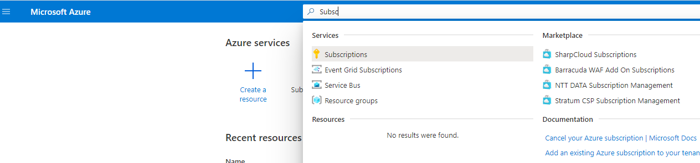
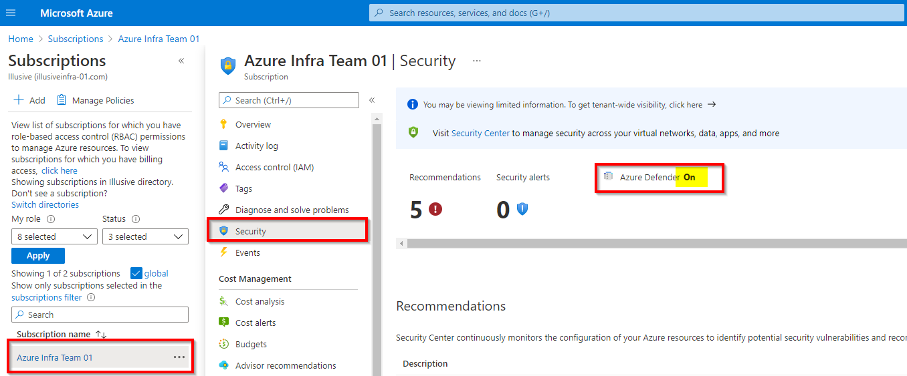
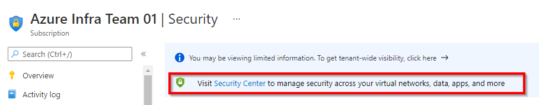
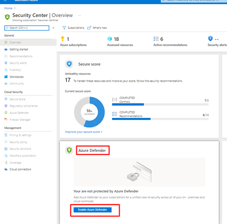
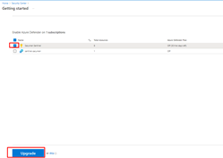
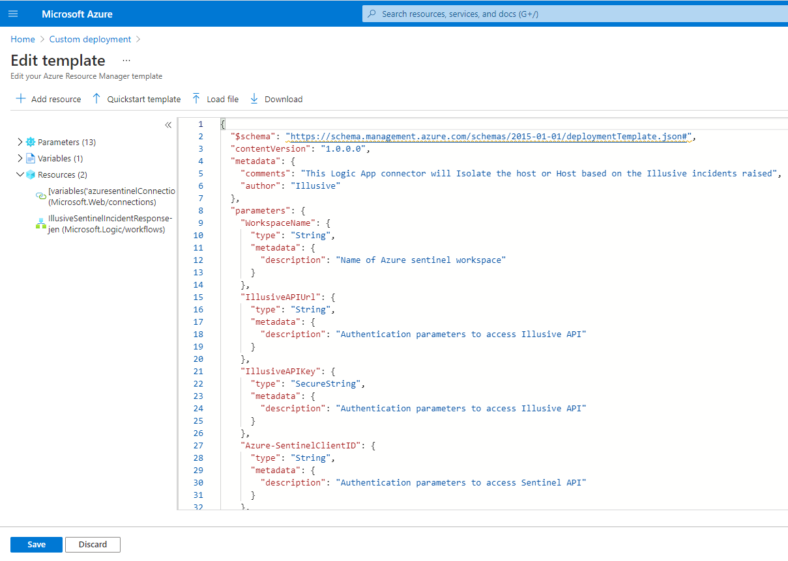
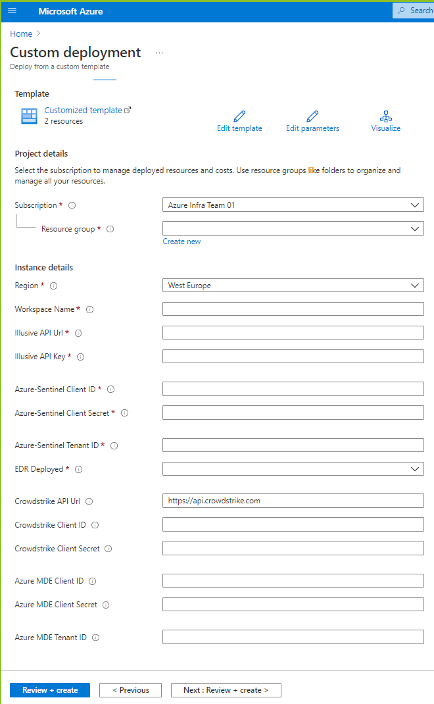
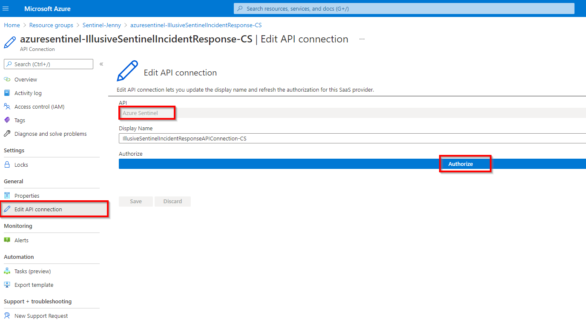

  
 </a>

# Illusive Incident Response Playbook

The Incident Response playbook leverages Sentinel analytic rules and CrowdStrike or Microsoft Defender for Endpoint integration to automate incident response when specified Illusive incidents are discovered.

Use this playbook to quickly stop or slow down ransomware attacks and critical incidents detected by Illusive in your organization. Upon detection, Sentinel is instructed to use the triggering process information reported by Illusive remove or kill the process. If the triggering process cannot be killed, Sentinel is instructed to isolate the host. These capabilities are available for organizations with CrowdStrike Falcon or Microsoft Defender for Endpoint.

1. [Playbook workflow](#playbook-workflow)
2. [Playbook execution](#playbook-execution)
3. [Access Playbook](#Access_playbook)
4. [Playbook retry mechanism](#playbook-retry-mechanism) 

## Playbook Workflow

1. Perform the general solution setup. [(see instructions here)](https://github.com/IllusiveNetworks-Labs/Azure-Sentinel/tree/Illusive/Solutions/Illusive%20Active%20Defense)
2. [Add API permissions to the Azure app](#add-api-permissions)
3. [Enable Microsoft Defender for Endpoint](#enable-mde) (Only when using MDE for incident response) 
4. [Create the Illusive playbook](#create-illusive-playbook)
5. [Connect the playbook to Azure Sentinel](#API_connection)

<a name="add-api-permissions">

## Add API permissions to the Azure app

1. From the Azure console, find the Azure app you created to run the Illusive Sentinel Solution. 
2. Go to **API Permissions**.
3. Click **Add a permission**.
4. Under **Request API permissions>API’s my organization uses**, search for and select **WindowsDefenderATP**, select select **Delegated permissions** and check the following permissions:
   - Machine.Isolate – to isolate device
   - Machine.Read – to find agent ID - to collect data from a single machine. 
   - File.Read.All – for process handling, find and erase/stop suspicious executables
   - Machine.StopAndQuarantine – for process handling, find and erase/stop suspicious executables
5. Select Application permissions and check the following permissions:
    - Machine.Isolate – to isolate device
    - Machine.Read.All – to find agent ID – to query all machines and collect device information even if we don’t have a device ID.
    - File.Read.All – for process handling, find and erase/stop suspicious executables
    - Machine.StopAndQuarantine – for process handling, find and erase/stop suspicious executables
6. Click **Add permissions**.
7. Once all the API permissions are added, click **Grant admin consent for Default Directory** and click **Yes**.
8. Verify admin consent has been granted. This step is important, even if the admin consent status is green. Only a Global Admin can approve admin consent requests.
   1. Go to **Enterprise>Admin Consent requests**.
   2. Go to **My pending** and verify that this permission is not pending.  
 The result should look like this:
   
  
       </a>
   

<a name="enable-mde">

## Enable Microsoft Defender for Endpoint

Allow the Illusive Incident Response playbook to stop an attack by triggering an incident response from MDE.

**Attention:** If you use CrowdStrike as your incident response tool, you can skip this procedure.

 1. From the Azure Search bar, search for the **Subscription** in which MDE is installed.
     
  
         </a>
     

 2. Click on the existing **Subscription.**
 3. Click **Security** in the Subscription menu.
 4. Ensure Microsoft Defender for Endpoint is **On.**
     
  
         </a>
     

 5. If MDE is off, click **Security Center.**
     
  
         </a>
     

 6. Find the Azure Defender card and click **Enable Azure Defender.**
     
  
         </a>
     

 7. Select the desired subscription and click **Upgrade.**
     
  
         </a>
     

<a name="create-illusive-playbook">

# Create the Illusive Incident Response playbook

Deploying the Illusive Incident Enrichment playbook requires a custom deployment template.

Before deploying the custom template, download the **azuredeploy.json** for the *Incident Response* playbook from the GitHub repository [using this link](https://github.com/IllusiveNetworks-Labs/Azure-Sentinel/blob/2f67abd268398e63da0071b5f7027a49829a5dbd/Solutions/Illusive%20Active%20Defense/Playbooks/Illusive-SentinelIncident-Response/azuredeploy.json).

- The playbook should be deployed under the same resource group, subscription, and workspace as the Azure app.
- The Illusive API key should contain only the API key and no keywords such as “Bearer” or “Basic”.
- You will not be prompted for missing information when saving the custom deployment configuration. If the playbook is incorrect or incomplete, the incident response playbook will not be able to isolate hosts, and you will get a playbook execution level error message.

1. On Azure home page, filter for **Deploy a custom template.**
     
  
         </a>
     

2. Under **Custom Deployment>Select a template,** click **Build your own template in the editor.**
     
  
         </a>
     

3. From **Edit template,** click **Load file,** load the **azuredeploy.json** file you downloaded, and click **Save.**
     
  
         </a>
     

     
  
         </a>
     

4. Under **Custom Deployment>Basics:**
    - Specify the **Subscription** that contains the dedicated Azure app that will run the Illusive Sentinel solution 
    - Specify the **Resource group** that contains the Workspace where you want to install the playbook.
    - Under **Instance details:**
      <table>
       <tr>
        <td><b>Field</b></td>
        <td><b>Instructions</b></td>
       </tr>
       <tr>
        <td>Region</td>
        <td>Filled automatically based on the subscription and cannot be changed.</td>
       </tr>
       <tr>
        <td>Workspace Name</td>
        <td>Specify the Azure Sentinel <b>Workspace Name</b> where you want to create the playbook.</td>
       </tr>
       <tr>
        <td>Illusive API URL   Illusive API Key</td>
        <td>Supply the authentication parameters required to access the Illusive API
         <b>Important:</b> Enter the API key without the keyword</td>
       </tr>
       <tr>
        <td>Azure-Sentinel Client ID:    Azure-Sentinel Client Secret:    Azure-Sentinel Tenant ID:</td>
        <td>Supply the authentication parameters required to access the Azure-Sentinel API</td>
       </tr>
       <tr>
        <td>EDR deployed</td>
        <td>The EDR which is deployed in the organization and can be used for incident mitigation.    
        <b>Note</b> Though it is possible to enter integration information for both CrowdStrike and Microsoft Defender for Endpoint, the Illusive solution requires you to select just one tool for incident response.</td>
       </tr>
       <tr>
        <td>CrowdStrike API URL   CrowdStrike Client ID   CrowdStrike Client Secret</td>
        <td>If <b>EDR deployed = CrowdStrike,</b> specify CrowdStrike authentication parameters 
        <b>Note</b> Use the generic CrowdStrike API URL: <https://api.crowdstrike.com>. The playbook will fail to execute if the URL contains a hyphen  which is not supported by Sentinel (i.e., certain region-specific URLs).</td>
       </tr>
       <tr>
        <td>Azure MDE Client ID  Azure MDE Client Secret  Azure MDE Tenant ID</td>
        <td>If <b>EDR deployed = MDE,</b> specify MDE authentication parameters</td>
       </tr>
      </table>
      
  
          </a>
      
      
5. When finished entering details, click **Review + Create.**
      
  
          </a>
      
      
6. On successful validation, click **Create**.  
This completes the playbook deployment. 
      

          </a>
      

<a name="API_connection">

## Connect the playbook to Azure Sentinel

Connect the playbook to Azure Sentinel by configuring the playbook's API connection. 
     
  
        </a>
     

1. From **Your custom deployment is complete**, click **Go to all resources**. 
     - If there is only one installed playbook in the workspace, clicking on **Go to resource group** will take you to the playbook page. 
     - If there are multiple installed playbooks in the workspace, clicking on **Go to resource group** will take you to the All resources page. The playbook will be available in the list.
2. Click the deployed playbook and then click **API connections.**
3. Under API connections, click **azuresentinel**.
4. On the **azuresentinel** card, click **Edit API connection**.
5. Edit the **Display Name**. (optional)
6. Under Authorize, click **Authorize** and provide authorization by signing in.
7. To save the authorization, click **Save**. To cancel, click **Discard**.

**What to do next:** Go to the Illusive Active Defence solution and [Configure the Illusive analytic rule](./././Illusive%20Active%20Defense#configure-the-illusive-analytic-rule).

<a name="playbook-execution">

## Playbook Execution

1. This playbook is triggered by a new Sentinel Alert originating from a new Illusive event syslog.
2. Sentinel uses Illusive API to fetch the incident details and determine whether this is a Ransomware or a Critical severity incident.
3. If the incident is Ransomware or Critical severity, the playbook determines the response as follows:
   1. Checks if an incident response has already been executed. 
   2. If no response has been executed, the playbook tries to stop the triggering process by either killing or deleting it (depending on the integrated EDR). The information about the triggering process is extracted from the Illusive API and the response executed on the triggering process of the most current event.
   3. If an attempt to stop the triggering process has been made in response to a previous event, or if there is presently no option to stop the process, the playbook tries to isolate the host.
   4. **Important**: If an attempt to isolate the host has been made in response to a previous event, the playbook will take no further action on this host for future detected events.
4. The playbook leverages the response capabilities of Crowdstrike or Microsoft Defender for Endpoint, whichever is configured in the custom playbook deployment.

<a name="Access_playbook">
  
## Access and view the playbook

You can view and manage the playbook as well as review the playbook run history. This can be helpful for troubleshooting or for understanding playbook behavior and results. 

1. Find the playbook on the Azure Sentinel or All resources page. 
2. Click on the playbook to view the playbook run History.
3. Select any executed playbook to view the results.

Sample playbook history:

  
    </a>

<a name="playbook-retry-mechanism">

## Playbook retry mechanism

  
    </a>

Azure Sentinel handles the retry mechanism. If any condition is not met, Sentinel retries the playbook four times.
