[image](./Images/logo.jpg)
<p align="left">  
 </a>
</p>

# Illusive Active Defense Sentinel Solution

Instructions for configuring, running, and using the Illusive Active Defense Sentinel solution.

# Table of Contents

 1. [Executive summary](#executive_summary)
 2. [Basic requirements](#BasicRequirements)
 3. [Workflow](#workflowlink)
 4. [Locate the Sentinel workspace](#Sentinel_Workspace)
 5. [Azure application setup](#azureappsetup)
     - [Register an Azure app](#Register_Azure_App)
     - [Collect app information](#Collect_App_Information)
     - [Generate and save a Client Secret](#Generate_ClientSecret)
     - [Add the User Impersonation API permission](#Add_UserImpersonation)
 6. [Generate an Illusive API key](#Illusive_API_Key)
 7. [Configure Illusive to send logs to a Linux-based syslog server](#SIEM_Server)
 8. [Deploy solution package or deploy playbooks](#Deploy_Playbooks)
 9. [Configure the Illusive analytic rule](#Illusive_analytic_rule)
 10. [Access and view the playbook](#Access_playbook)

<a name="executive_summary">

# Executive summary

Configure Sentinel and load custom playbooks to have Illusive open Sentinel incidents, populate them with Illusive-based information, and automate incident response.

This solution contains the following components:

- **Incident Enrichment playbook** – leverages Sentinel analytic rules to discover Illusive-based alerts and report the associated data and forensics as Sentinel incident sets.  
  Use this playbook to enrich Sentinel security incidents originating from Illusive with Illusive incident and forensics information. Illusive continues to enrich relevant Sentinel incidents as new events are detected. This is done using the Illusive API resource.
- **Incident Response playbook** – leverages CrowdStrike or Microsoft Defender for Endpoint integration to automate incident response when specified Illusive incidents are discovered.  
 Use this playbook to quickly stop or slow down ransomware attacks and critical incidents detected by Illusive in your organization. Upon detection, Sentinel is instructed to use the triggering process information reported by Illusive remove or kill the process. If the triggering process cannot be killed, Sentinel is instructed to isolate the host. These capabilities are available for organizations with CrowdStrike Falcon or Microsoft Defender for Endpoint.

- **Analytic Rule** - Trigger a Sentinel alert upon detecting an Illusive event and create a Sentinel incident. The Sentinel incident will correspond to the Illusive incident and will include all subsequent associated Illusive events. The Illusive solution playbooks require the analytic rule to operate.

<a name="BasicRequirements">
  
## Basic requirements (set up in advance)

To use the Illusive Active Defense solution, you must have the following:

- An Azure AD subscription with a configured Sentinel workspace
- An Illusive ADS (deceptions) license
- A Linux-based syslog server. To set up the syslog server, [see these instructions from Microsoft](https://github.com/MicrosoftDocs/azure-docs/blob/master/articles/sentinel/connect-syslog.md). Then, go to **Data connectors**, find and select the **CEF connector**
  
<a name="workflowlink">

## Workflow

  1. [Locate the Sentinel workspace](#Sentinel_Workspace)
  2. [Azure application setup](#azureappsetup)
  3. [Generate an Illusive API key](#Illusive_API_Key)
  4. [Configure Illusive to send logs to a Linux-based syslog server](#SIEM_Server)
  5. [Configure and deploy playbooks](#Deploy_Playbooks)
  6. [Configure the Illusive analytic rule](#Illusive_analytic_rule)

<a name="Sentinel_Workspace">
  
## Locate the Sentinel workspace

The workspace **name**, as well as the **Subscription** and **resource group** it belongs to are required later on during this configuration.

Steps to locate the Sentinel Workspace name, subscription, and resource group:
  
1. In the [Azure portal](https://portal.azure.com/), go to **Azure Sentinel**. 
2. Type "Azure Sentinel" in the **Search bar**, or click on the Azure Sentinel icon.
3. On the Azure Sentinel page, in the list, find the workspace where you want to create the playbook and its associated API connection.
   <p align="center">  
      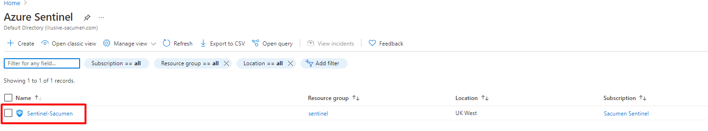 </a>
   </p>
4. Make a note of the workspace **Name**, **resource group**, and **Subscription**.  You will need these during playbook deployment.

<a name="azureappsetup">

# Azure application setup

  The Illusive solution playbooks run with an Azure application with the required API permissions.

  This procedure sets out the general registration and configuration requirements that apply to both the Incident Enrichment and Incident Response playbooks. 
  
<a name="Register_Azure_App">

## Register an Azure app

1. Login to [http://portal.azure.com/](http://portal.azure.com/) 
2. If you have access to multiple tenants, in the top menu, use the Directory + subscription filter to select the tenant in which you want to register the application.
   <p align="center">  
      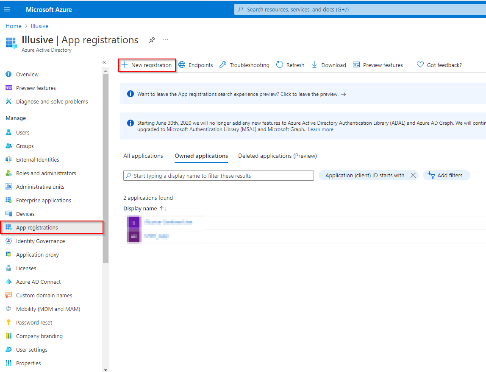 </a>
   </p>
3. Search for and select **Azure Active Directory**.
4. Under Manage, select **App registrations>New registration**.The **Register an application** page appears.
   <p align="center">  
      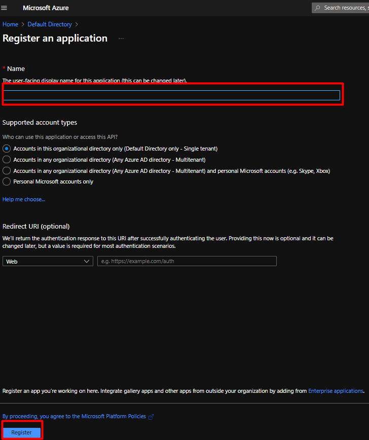 </a>
   </p>
5. Specify a **Name** for your application.

   Conform to company naming conventions. Do not use “illusive” or any other word that might reveal the existence of Illusive in the environment. 
6. Under **Supported account types**, select **Accounts in this organizational directory only**.
7. To complete the initial app registration, click **Register**.
  
<a name="Collect_App_Information">

## Collect app information

You need the **Application (client) ID** and the **Directory (tenant) ID** to configure Illusive solution playbooks.

1. Go to the created application’s **Overview** page.
2. Copy and save the **Application (client) ID** and the **Directory (tenant) ID**. You need this information to configure the Illusive playbooks.

    <p align="center">  
        </a>
    </p>
  
<a name="Generate_ClientSecret">

## Generate and save a Client Secret

You need specify a secret **Value** to configure Illusive solution playbooks.

1. Click **Certificates & Secrets**.
2. Click **New Client Secret**.
3. Add a **Description** for the Client Secret.
4. Select an **Expiry date** for the Client Secret (recommended 6 months).
5. Click **Add**.
6. Copy and save the secret Value. You need this information to configure Illusive playbooks.
        <p align="center">  
             </a>
        </p>
  
<a name="Add_UserImpersonation">

## Add the User Impersonation API permission

The user_impersonation permission is used to read Azure Sentinel incidents.

Additional API permissions are required for the Incident Response playbook. These are specified in the [Incident Response playbook deployment instructions](./Playbooks/Illusive-SentinelIncident-Response).

1. From the Azure console, find the Azure app you created to run the Illusive Sentinel Solution. 
2. Go to **API Permissions**.
3. Click **Add a permission**.
4. Under **Microsoft APIs**, select **Azure Service Management**.
        <p align="center">  
             </a>
        </p>
5. Select **Delegated permissions**, check **user_impersonation**, and click **Add permissions**.
        <p align="center">  
             </a>
        </p>        
6. Click **Grant admin consent for Default Directory** and click **Yes**.
        <p align="center">  
             </a>
        </p>        
7. Verify admin consent has been granted. This step is important, even if the admin consent status is green. Only a Global Admin can approve admin consent requests.
      1. Go to **Enterprise>Admin Consent requests**.
      1. Go to **My pending** and verify that this permission is not pending.

<a name="Illusive_API_Key">
  
# Generate an Illusive API key

You need the Illusive REST API URL and an Illusive API key to configure Illusive solution playbooks.
        <p align="center">  
            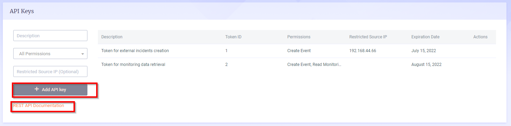 </a>
        </p>

1. In the Illusive Console, navigate to Settings>General>API Keys. 
2. Enter values in the following fields:
             <table>
             <tr>
                 <td>**Field**</td>
                 <td>**Description and values**</td>
             </tr>
             <tr>
                 <td>Description</td>
                 <td>Specify description of key. <br/>
               - All Permissions<br/>
               - Create Event Read<br/>
               - Monitoring Data
                 </td>
             </tr>
             <tr>
                 <td>Permissions</td>
                 <td>Select the permission:</td>
             </tr>
             <tr>
                 <td>Restrict SourceIP</td>
                 <td>Limit the API key to be used only from the specified source IP address. (optional)</td>
             </tr>
           </table>

3. Click **Add API key**. The API Key is created and added to the list of keys shown.
4. Copy the header containing the key to a text file and save it securely. The key is valid for one year to access the REST API on this Management Server only.
5. To get the Illusive API URL, click **REST API Documentation**. This opens the Swagger API page. Copy the URL from the browser address bar.

<a name="SIEM_Server">

# Configure Illusive to send logs to a Linux-based syslog server

Configure Illusive to automatically send Illusive activity logs and event messages to a Linux based Syslog server. Every Syslog message also contains an Illusive incident ID. Sentinel will consume this information and trigger the Illusive solution playbooks.

If you haven't yet configured the syslog server, [see these instructions from Microsoft](https://github.com/MicrosoftDocs/azure-docs/blob/master/articles/sentinel/connect-syslog.md). Then, go to **Data connectors** and find and select the **Common event format connector**.

1. In the Illusive Console, navigate to **Settings>Reporting** and scroll down to **Syslog Servers.**
     <p align="center">  
       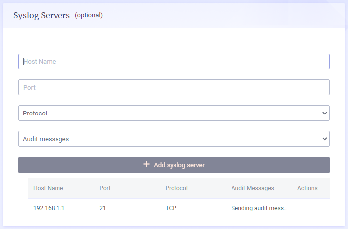 </a>
     </p>
2. In the **Host Name** server field, supply the server IP address or host name.
3. In the **Port** field, supply the Syslog server’s communication port. (Default **514**)
4. From the **Protocol** dropdown menu, select **TCP.**<br>
**Recommendation:** For high reliability, select the TCP protocol.
5. From the **Audit messages** drop-down menu, select one of the following (either option is okay; this integration only requires the event messages):
          <table>
            <tr>
              <th>**Option**</th>
              <th>**Description**</th>
            </tr>
            <tr>
              <td>**Send audit messages to server**</td>
              <td>**Sends Illusive event and audit messages** to your Syslog server</td>
            </tr>
            <tr>
              <td>**Don’t send audit messages to server**</td>
              <td>**Sends only Illusive event messages and system health data** to your Syslog server</td>
            </tr>
          </table>
6. Click **Add**.
  
<a name="Deploy_Playbooks">
  
# Deploy solution package or deploy playbooks

There are several paths for deploying the Illusive Sentinel solution.

- Deploy the complete solution package. Continue with [Deploy the solution package](#solution-package-deployment) below.
- Deploy just the Incident Enrichment playbook, go to [Incident Enrichment Playbook](./Playbooks/Illusive-SentinelIncident-Enrichment).
- Deploy just the Incident Response playbook, go to [Incident Response Playbook](./Playbooks/Illusive-SentinelIncident-Response).

<a name="solution-package-deployment">

## Deploy the solution package

- Before deploying the Illusive solution package, download the **mainTemplate.json** from the GitHub repository [using this link](https://github.com/IllusiveNetworks-Labs/Azure-Sentinel/blob/bd6e870691fd26ee2998c915d2902a9a36015d7c/Solutions/Illusive%20Active%20Defense/Package/mainTemplate.json).
- The playbook should be deployed under the same resource group, subscription, and workspace as the Azure app.
- The Illusive API key should contain only the API key and no keywords such as “Bearer” or “Basic”.
- You will not be prompted for missing information when saving the custom deployment configuration. If the playbook is incorrect or incomplete, the incident response playbook will not be able to isolate hosts, and you will get a playbook execution level error message.

1. On Azure home page, filter for **Deploy a custom template.**
     <p align="center">  
        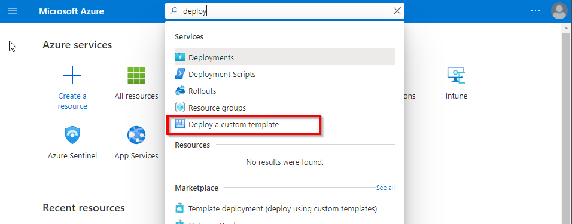 </a>
     </p>
2. Under **Custom Deployment>Select a template,** click **Build your own template in the editor.**
     <p align="center">  
         </a>
     </p>
3. From **Edit template,** click **Load file,** the **mainTemplate.json** file provided by Illusive and click **Save.**
     <p align="center">  
         </a>
     </p>
     <p align="center">  
         </a>
     </p>
4. Under **Custom Deployment>Basics:**
    - Specify the **Subscription** that contains the dedicated Azure app that will run the Illusive Sentinel solution 
    - Specify the **Resource group** that contains the Workspace where you want to install the playbook.
    - Under **Instance details:**
      <table>
       <tr>
        <td><b>Field</b></td>
        <td><b>Instructions<b></td>
       </tr>
       <tr>
        <td>Region</td>
        <td>Filled automatically based on the subscription and cannot be changed.</td>
       </tr>
       <tr>
        <td>Location</td>
        <td>Specify the resource group location.</td>
       </tr>
       <tr>
        <td>Workspace-location</td>
        <td>Specify the workspace location.</td>
       </tr>
       <tr>
        <td>Workspace</td>
        <td>Specify the Azure Sentinel <b>Workspace Name</b> where you want to create the playbook.</td>
       </tr>
       <tr>
        <td>Analytic1-id</td>
        <td>Specify the id of the Illusive analytic rule.</td>
       </tr>
       <tr>
        <td>Illusive API URL <br/> Illusive API Key</td>
        <td>Supply the authentication parameters required to access the Illusive API
         <b>Important:</b> Enter the API key without the keyword</td>
       </tr>
       <tr>
        <td>Azure-Sentinel Client ID:  <br/> Azure-Sentinel Client Secret:  <br/> Azure-Sentinel Tenant ID:</td>
        <td>Supply the authentication parameters required to access the Azure-Sentinel API</td>
       </tr>
       <tr>
        <td>EDR deployed</td>
        <td>The EDR which is deployed in the organization and can be used for incident mitigation <br> 
        <b>Note</b> Though it is possible to enter integration information for both CrowdStrike and Microsoft Defender for Endpoint, the Illusive solution requires you to select just one tool for incident response.
        </td>
       </tr>
       <tr>
        <td>CrowdStrike API URL <br/> CrowdStrike Client ID <br/> CrowdStrike Client Secret</td>
        <td>If <b>EDR deployed = CrowdStrike,</b> specify CrowdStrike authentication parameters<br>
        <b>Note</b> Use the generic CrowdStrike API URL: <https://api.crowdstrike.com>. The playbook will fail to execute if the URL contains a hyphen  which is not supported by Sentinel (i.e., certain region-specific URLs).</td>
       </tr>
       <tr>
        <td>Azure MDE Client ID <br/>Azure MDE Client Secret <br/>Azure MDE Tenant ID</td>
        <td>If <b>EDR deployed = MDE<b>, specify MDE authentication parameters</td>
       </tr>
      </table>
        <p align="center">  
           </a>
        </p>      
5. When finished entering details, click **Review + Create.**
        <p align="center">  
           </a>
        </p>      
6. On successful validation, click **Create**.  
        <p align="center">
           </a>
        </p>
7. Perform steps 2, 3 and 5 in the Incident Response playbook workflow:

   1. [Add API permissions to the Azure app](./Playbooks/Illusive-SentinelIncident-Response#add-api-permissions) for incident response capabilities.
   2. [Enable Microsoft Defender for Endpoint](./Playbooks/Illusive-SentinelIncident-Response#enable-mde)
   3. [Connect the playbook to Azure Sentinel](./Playbooks/Illusive-SentinelIncident-Response#connect-the-playbook-to-azure-sentinel)
   4. Continue with [Configure the Illusive analytic rule](#Illusive_analytic_rule) below.

<!-- heading of URL in case the above links don't work: 
https://github.com/IllusiveNetworks-Labs/Azure-Sentinel/tree/Illusive/Solutions/Illusive%20Active%20Defense -->
<a name="Illusive_analytic_rule">
  
## Configure the Illusive analytic rule

The analytic rule instructs Azure Sentinel to search for information of interest and to supply this information to the Illusive solution playbooks. 

1. Log onto http://portal.azure.com/ 
2. Click **Azure Sentinel.**
3. Select the resource group and workspace in which the Illusive playbooks are deployed. 
4. Select **Analytics.**
5. Click **Create>Scheduled query rule** and click **Next.**
          <p align="center">  
             </a>
          </p>
6. Enter the analytics rule details:
        <table>
          <tr>
            <th>**Field**</th>
            <th>**Instructions**</th>
          </tr>
          <tr>
            <td>Name</td>
            <td>Specify a display name for the rule. (e.g., “Illusive analytic rule”)</td>
          </tr>
          <tr>
            <td>Description</td>
            <td>Add a description for what the rule does.</td>
          </tr>
          <tr>
            <td>Description</td>
            <td>Add a description for what the rule does. 
              <br/>**E.g.:**  Triggers a Sentinel alert upon detecting an Illusive event and creates a Sentinel incident. The Sentinel incident will correspond to the Illusive incident and will include all subsequent associated Illusive events.</td>
          </tr>
          <tr>
            <td>Tactics</td>
            <td>Do not select any tactics.</td>
          </tr>
          <tr>
            <td>Severity</td>
            <td>Select the severity level of incidents created by the Illusive solution. 
              <br> 
              Recommended severity level: **High**</td>
          </tr>
          <tr>
            <td>Status</td>
            <td>Ensure the rule is **Enabled.**</td>
          </tr>
        </table>
    <p align="center">  
        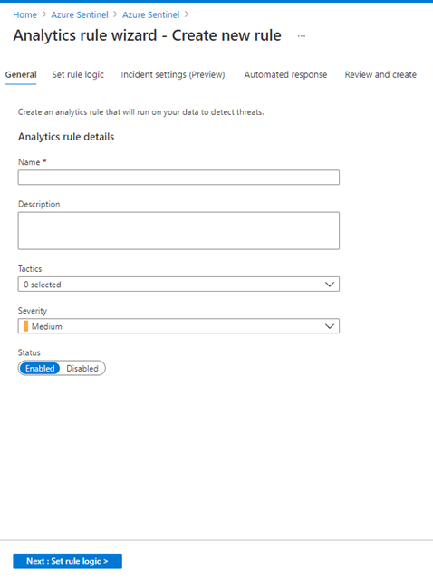 </a>
       </p>
7. When finished entering Analytic rule details, click **Next: Set rule logic.**
8. In **Set rule logic,** under **Rule query,** copy and paste the following KQL query:
   **Note:** You can skip this step if you deployed the complete solution package using the **mainTemplate.json**, which automatically configures the rule query.   
    ```markdown
        CommonSecurityLog
          | where DeviceProduct == "illusive"
          | extend DeviceCustomNumber2 = coalesce(column_ifexists("FieldDeviceCustomNumber2", long(null)), DeviceCustomNumber2, long(null)),
          | summarize arg_max(TimeGenerated, *) by DeviceCustomNumber2, AdditionalExtensions, TimeGenerated
          | extend Category = coalesce(column_ifexists("DeviceEventCategory", ""), extract(@'cat=([^;]+)(\;|$)', 1, AdditionalExtensions), ""), HasForensics = extract(@'cs7=([^;]+)(\;|$)', 1, AdditionalExtensions)
          | where Category == "illusive:alerts"
          | extend isHostIsolated = false
          | extend isProcessIsolated = false
    ```
   <p align="center">  
     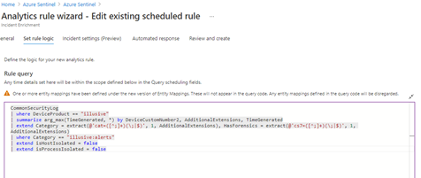 </a>
   </p>
9.  Under **Alert Enrichment,** expand **Entity Mapping** and add entities as below:
      - Host > FullName : SourceHostName
      - IP > Address : SourceIP
      - Host > OMSAgentID : Computer
        <p align="center">  
           </a>
        </p>
10. Under **Alert Enrichment,** expand **Custom details** and add key-value pairs as below:
      - isHostIsolated : isHostIsolated
      - isProcessIsolated : isProcessIsolated 
      - IllusiveIncidentId : DeviceCustomNumber2
      - HasForensics : HasForensics
      - Account : SourceUserName
        <p align="center">  
          </a>
        </p>
11. Under **Alert Enrichment,** expand **Alert details,** and configure the following fields:
       - **Alert Name Format:** Illusive Incident: {{DeviceCustomNumber2}}
       - **Alert Description Format:** {{DeviceCustomNumber2}} generated at {{TimeGenerated}}
        <p align="center">  
          </a>
        </p>
12. Under **Query scheduling,** configure the following details:
       - **Run query every** = “5 minutes”. This is because the minimum time for an analytic rule to trigger is 5 minutes.
       - **Lookup data from the last** = “5 minutes”. This is because the lookup data (Illusive incidents inserted in Azure Sentinel) will run only for 5 minutes.
        <p align="center">  
          </a>
        </p>

13. Under **Alert Threshold,** set **Generate alert when number of query results** “is greater than 0”.
        <p align="center">  
         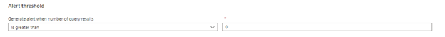 </a>
        </p>
        
14. Under **Event grouping,** select **Trigger an alert for each event (preview).**
        <p align="center">  
         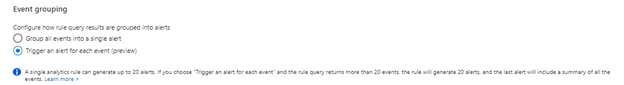 </a>
        </p>

15. Keep **Suppression** “Off”.
16. Click **Next.**
17. On the **Incident setting (Preview)** tab, enable **Create incidents from alerts triggered by this analytics rule.**
18. Enable **Alert Grouping.**<br/>
        **Note:** Up to 150 alerts can be grouped into a single incident. If more than 150 alerts are generated, a new incident will be created with the same incident details as the original. Additional alerts will be grouped into the new incident.
19. Under **Alert Grouping,** select the time range during which an alert’s associated events will be grouped into a single incident in the Sentinel system. (This can be configured based on customer requirements)
        <p align="center">  
         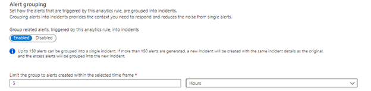 </a>
        </p>

20. Under **Group alerts triggered by this analytics rule into a single incident by,** select **Grouping alerts into a single incident if the selected entity types and details match:** and select the **IllusiveIncidentId** entity as in the image below: 
21. Enable **Re-open closed matching incidents** to allow incidents to be reopened. 
        <p align="center">  
          </a>
        </p>

22. On **Automated response** tab, from the dropdown list under the **Alert automation** section, select the configured Illusive solution playbooks: 
       - **IllusiveSentinelIncidentEnrichment **
       - **IllusiveSentinelIncidentResponse **
23. Then, click **Next:Review.**
24. On the **Review and create** tab, review all the entered data, and click **Save.**

The new analytic rule can be seen in the **Analytics>Active rules** table.

<a name="Access_playbook">

# Access and view a playbook 

You can view and manage Illusive playbooks as well as review playbook run history. This can be helpful for understanding how the playbook responds when triggered, and for troubleshooting. 

1.	Find the playbook on the **Azure Sentinel** or **All resources** pages. 
2.	Click on the playbook to view the playbook run History.
3.	Select any executed playbook to view the results.

Sample playbook history (incident response):
        <p align="center">  
          </a>
        </p>