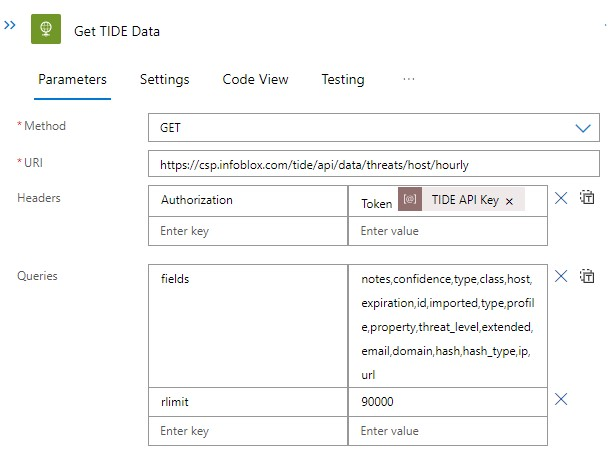
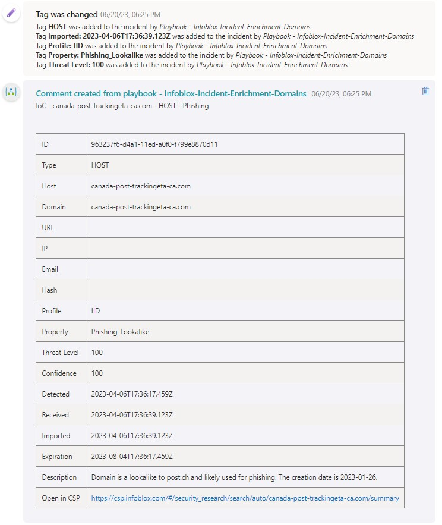
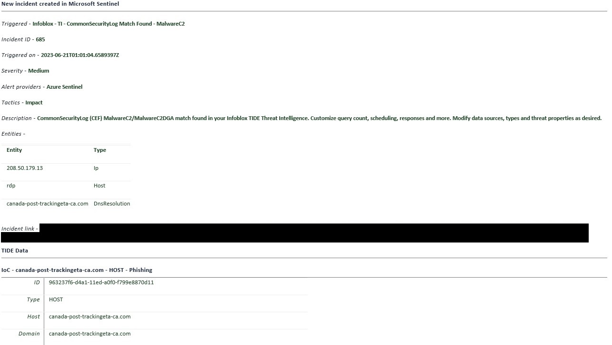

# Infoblox Threat Intelligence Playbooks for Microsoft Sentinel
[](https://www.infoblox.com/)

These playbooks integrate Infoblox [Threat Intelligence Data Exchange (TIDE)](https://docs.infoblox.com/space/BloxOneThreatDefense/35898533) 
data into Microsoft Sentinel.

Use these playbooks to import data from TIDE and enrich incidents and emails.

# Prerequisites
1. Register an app with Azure Active Directory and apply appropriate permissions, and enable the Threat Intelligence data connector. 
Find instructions [here](https://learn.microsoft.com/en-us/azure/sentinel/connect-threat-intelligence-tip). 

2. Apply the **Microsoft Sentinel Contributor** or **Microsoft Sentinel Responder** role to the playbooks. 
It is recommended to assign the role to the resource group that contains your Microsoft Sentinel workspace. 
Find instructions [here](https://learn.microsoft.com/en-us/azure/sentinel/roles).

3. Create and copy a TIDE API key into the playbook parameters. 
Find instructions [here](https://docs.infoblox.com/space/BloxOneThreatDefense/230394187).

# Installation
There are multiple ways to install the playbooks.
- Install the solution from the [Content Hub](https://portal.azure.com/#view/Microsoft_Azure_Marketplace/GalleryItemDetailsBladeNopdl/dontDiscardJourney~/true/id/infoblox.infoblox-cdc-solution/resourceGroupId/%2Fsubscriptions%2Fbe1e61b7-8dbe-4986-a9c2-d85f65524d6e%2FresourceGroups%2Ftme-rg)
(Recommended). This will not only install the playbook templates, but the other Sentinel templates as part of this solution as well.
- Copy and paste the ```azuredeploy.json``` files to a blank playbook.
- Click the **Deploy to Azure** buttons below for each desired playbook.

# The Playbooks
This solution installs several playbooks that fit different needs. 
You may wish to mix and match, omit some or modify others.

## Intelligence Import
These playbooks import TIDE intelligence using the Infoblox TIDE API and send the indicators to Microsoft Sentinel via the Microsoft Security Graph API.
The indicators are stored in the ```ThreatIntelligenceIndicator``` table and can be viewed from the **Threat intelligence** blade.

Because there are millions of indicators provided by TIDE, and thousands of new ones detected per day,
these playbooks are intended to give you a starting point for importing the indicators you want.


You may wish to import everything, or you may only need a handful of threat classes from a single profile or provider.


You can modify or create copies of these playbooks and tweak the action **Get TIDE Data** API call within the playbook to suit your needs. 
Keep in mind due to [current limitations](https://learn.microsoft.com/en-us/azure/logic-apps/logic-apps-limits-and-config?tabs=consumption%2Cazure-portal), there is a 105MB download limit per API call and a 120 second HTTP timeout. 
This is why you may only need to import new emails on a weekly basis, whereas hosts should be imported more frequently with an ```rlimit``` parameter because there are so many more.



Use the following TIDE endpoints to see what is available for you to import. You can also view indicators in the [CSP](https://csp.infoblox.com/#/threat_intelligence/active-threat-indicators).

***GET** available threat properties* - ```/tide/api/data/properties```

***GET** available threat classes* - ```/tide/api/data/threat_classes```

***GET** available profiles (data providers)* - ```/tide/api/entitlements/profiles```

View the list of APIs [here](https://csp.infoblox.com/apidoc?url=https%3A%2F%2Fcsp.infoblox.com%2Fapidoc%2Fdocs%2FTIDEData).

Find a quick technical intro and examples for how to query TIDE data [here](https://docs.infoblox.com/space/BloxOneThreatDefense/117014574/Query+Active+Threats).

---
### Import-AISCOMM-Weekly
This playbook imports all indicators from the AISCOMM data provider on a scheduled weekly basis.

[](https://portal.azure.com/#create/Microsoft.Template/uri/https%3A%2F%2Fraw.githubusercontent.com%2FAzure%2FAzure-Sentinel%2Fmaster%2FSolutions%2FInfoblox%2520Cloud%2520Data%2520Connector%2FPlaybooks%2FInfoblox-Import-AISCOMM-Weekly%2Fazuredeploy.json)
[](https://portal.azure.com/#create/Microsoft.Template/uri/https%3A%2F%2Fraw.githubusercontent.com%2FAzure%2FAzure-Sentinel%2Fmaster%2FSolutions%2FInfoblox%2520Cloud%2520Data%2520Connector%2FPlaybooks%2FInfoblox-Import-AISCOMM-Weekly%2Fazuredeploy.json)
---
### Import-Emails-Weekly
This playbook imports newly detected emails on a scheduled weekly basis.

[](https://portal.azure.com/#create/Microsoft.Template/uri/https%3A%2F%2Fraw.githubusercontent.com%2FAzure%2FAzure-Sentinel%2Fmaster%2FSolutions%2FInfoblox%2520Cloud%2520Data%2520Connector%2FPlaybooks%2FInfoblox-Import-Emails-Weekly%2Fazuredeploy.json)
[](https://portal.azure.com/#create/Microsoft.Template/uri/https%3A%2F%2Fraw.githubusercontent.com%2FAzure%2FAzure-Sentinel%2Fmaster%2FSolutions%2FInfoblox%2520Cloud%2520Data%2520Connector%2FPlaybooks%2FInfoblox-Import-Emails-Weekly%2Fazuredeploy.json)
---
### Import-Hashes-Weekly
This playbook imports newly detected hashes on a scheduled weekly basis.

[](https://portal.azure.com/#create/Microsoft.Template/uri/https%3A%2F%2Fraw.githubusercontent.com%2FAzure%2FAzure-Sentinel%2Fmaster%2FSolutions%2FInfoblox%2520Cloud%2520Data%2520Connector%2FPlaybooks%2FInfoblox-Import-Hashes-Weekly%2Fazuredeploy.json)
[](https://portal.azure.com/#create/Microsoft.Template/uri/https%3A%2F%2Fraw.githubusercontent.com%2FAzure%2FAzure-Sentinel%2Fmaster%2FSolutions%2FInfoblox%2520Cloud%2520Data%2520Connector%2FPlaybooks%2FInfoblox-Import-Hashes-Weekly%2Fazuredeploy.json)
---
### Import-Hosts-Daily-LookalikeDomains
This playbook imports newly detected Lookalike domains on a scheduled daily basis.

[](https://portal.azure.com/#create/Microsoft.Template/uri/https%3A%2F%2Fraw.githubusercontent.com%2FAzure%2FAzure-Sentinel%2Fmaster%2FSolutions%2FInfoblox%2520Cloud%2520Data%2520Connector%2FPlaybooks%2FInfoblox-Import-Hosts-Daily-LookalikeDomains%2Fazuredeploy.json)
[](https://portal.azure.com/#create/Microsoft.Template/uri/https%3A%2F%2Fraw.githubusercontent.com%2FAzure%2FAzure-Sentinel%2Fmaster%2FSolutions%2FInfoblox%2520Cloud%2520Data%2520Connector%2FPlaybooks%2FInfoblox-Import-Hosts-Daily-LookalikeDomains%2Fazuredeploy.json)
---
### Import-Hosts-Daily-MalwareC2DGA
This playbook imports newly detected MalwareC2DGA domains on a scheduled daily basis.

[](https://portal.azure.com/#create/Microsoft.Template/uri/https%3A%2F%2Fraw.githubusercontent.com%2FAzure%2FAzure-Sentinel%2Fmaster%2FSolutions%2FInfoblox%2520Cloud%2520Data%2520Connector%2FPlaybooks%2FInfoblox-Import-Hosts-Daily-MalwareC2DGA%2Fazuredeploy.json)
[](https://portal.azure.com/#create/Microsoft.Template/uri/https%3A%2F%2Fraw.githubusercontent.com%2FAzure%2FAzure-Sentinel%2Fmaster%2FSolutions%2FInfoblox%2520Cloud%2520Data%2520Connector%2FPlaybooks%2FInfoblox-Import-Hosts-Daily-MalwareC2DGA%2Fazuredeploy.json)
---
### Import-Hosts-Daily-Phishing
This playbook imports newly detected Phishing domains on a scheduled daily basis.

[](https://portal.azure.com/#create/Microsoft.Template/uri/https%3A%2F%2Fraw.githubusercontent.com%2FAzure%2FAzure-Sentinel%2Fmaster%2FSolutions%2FInfoblox%2520Cloud%2520Data%2520Connector%2FPlaybooks%2FInfoblox-Import-Hosts-Daily-Phishing%2Fazuredeploy.json)
[](https://portal.azure.com/#create/Microsoft.Template/uri/https%3A%2F%2Fraw.githubusercontent.com%2FAzure%2FAzure-Sentinel%2Fmaster%2FSolutions%2FInfoblox%2520Cloud%2520Data%2520Connector%2FPlaybooks%2FInfoblox-Import-Hosts-Daily-Phishing%2Fazuredeploy.json)
---
### Import-Hosts-Hourly
This playbook imports all newly detected hosts on a scheduled hourly basis.

This playbook will import thousands of IoCs per run, which can become costly for your organization.
It will also create duplicates if concurrently enabled with the Import-Hosts-Daily playbooks, so use one or the other.

[](https://portal.azure.com/#create/Microsoft.Template/uri/https%3A%2F%2Fraw.githubusercontent.com%2FAzure%2FAzure-Sentinel%2Fmaster%2FSolutions%2FInfoblox%2520Cloud%2520Data%2520Connector%2FPlaybooks%2FInfoblox-Import-Hosts-Hourly%2Fazuredeploy.json)
[](https://portal.azure.com/#create/Microsoft.Template/uri/https%3A%2F%2Fraw.githubusercontent.com%2FAzure%2FAzure-Sentinel%2Fmaster%2FSolutions%2FInfoblox%2520Cloud%2520Data%2520Connector%2FPlaybooks%2FInfoblox-Import-Hosts-Hourly%2Fazuredeploy.json)
---
### Import-IPs-Hourly
This playbook imports all newly detected IPs on a scheduled hourly basis.

[](https://portal.azure.com/#create/Microsoft.Template/uri/https%3A%2F%2Fraw.githubusercontent.com%2FAzure%2FAzure-Sentinel%2Fmaster%2FSolutions%2FInfoblox%2520Cloud%2520Data%2520Connector%2FPlaybooks%2FInfoblox-Import-IPs-Hourly%2Fazuredeploy.json)
[](https://portal.azure.com/#create/Microsoft.Template/uri/https%3A%2F%2Fraw.githubusercontent.com%2FAzure%2FAzure-Sentinel%2Fmaster%2FSolutions%2FInfoblox%2520Cloud%2520Data%2520Connector%2FPlaybooks%2FInfoblox-Import-IPs-Hourly%2Fazuredeploy.json)
---
### Import-URLs-Daily
This playbook imports all newly detected URLs on a scheduled hourly basis.

[](https://portal.azure.com/#create/Microsoft.Template/uri/https%3A%2F%2Fraw.githubusercontent.com%2FAzure%2FAzure-Sentinel%2Fmaster%2FSolutions%2FInfoblox%2520Cloud%2520Data%2520Connector%2FPlaybooks%2FInfoblox-Import-URLs-Daily%2Fazuredeploy.json)
[](https://portal.azure.com/#create/Microsoft.Template/uri/https%3A%2F%2Fraw.githubusercontent.com%2FAzure%2FAzure-Sentinel%2Fmaster%2FSolutions%2FInfoblox%2520Cloud%2520Data%2520Connector%2FPlaybooks%2FInfoblox-Import-URLs-Daily%2Fazuredeploy.json)

## Enrichment & Emails
Enrich your incidents and emails with TIDE data.

These playbooks can be configured to run automatically on Analytic Rules. Find instructions [here](https://learn.microsoft.com/en-us/azure/sentinel/detect-threats-custom#set-automated-responses-and-create-the-rule).

You can also run them on demand when viewing incidents.

---
### Incident-Enrichment-Domains
Enrich incidents containing a **DNS entity** with rich TIDE data. Will add a comment and tags to the incident.


[](https://portal.azure.com/#create/Microsoft.Template/uri/https%3A%2F%2Fraw.githubusercontent.com%2FAzure%2FAzure-Sentinel%2Fmaster%2FSolutions%2FInfoblox%2520Cloud%2520Data%2520Connector%2FPlaybooks%2FInfoblox-Incident-Enrichment-Domains%2Fazuredeploy.json)
[](https://portal.azure.com/#create/Microsoft.Template/uri/https%3A%2F%2Fraw.githubusercontent.com%2FAzure%2FAzure-Sentinel%2Fmaster%2FSolutions%2FInfoblox%2520Cloud%2520Data%2520Connector%2FPlaybooks%2FInfoblox-Incident-Enrichment-Domains%2Fazuredeploy.json)
---

### Incident-Send-Email
Sends a detailed email about an incident. Enriches a **DNS entity** within the email with Infoblox TIDE data.



[](https://portal.azure.com/#create/Microsoft.Template/uri/https%3A%2F%2Fraw.githubusercontent.com%2FAzure%2FAzure-Sentinel%2Fmaster%2FSolutions%2FInfoblox%2520Cloud%2520Data%2520Connector%2FPlaybooks%2FInfoblox-Incident-Send-Email%2Fazuredeploy.json)
[](https://portal.azure.com/#create/Microsoft.Template/uri/https%3A%2F%2Fraw.githubusercontent.com%2FAzure%2FAzure-Sentinel%2Fmaster%2FSolutions%2FInfoblox%2520Cloud%2520Data%2520Connector%2FPlaybooks%2FInfoblox-Incident-Send-Email%2Fazuredeploy.json)

