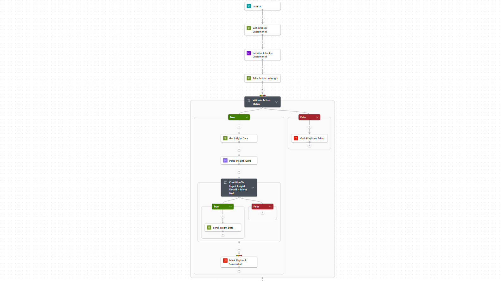

# Infoblox-IQ-for-TD-Take-Action-API

* [Summary](#Summary)
* [Prerequisites](#Prerequisites)
* [Deployment instructions](#Deployment-instructions)
* [Post-Deployment instructions](#Post-Deployment-instructions)

## Summary<a name="Summary"></a>

This playbook leverages the **Infoblox IQ for Threat Defense Insights API** to **take action on an Insight** by applying a provided recommendation. After the action is applied, it fetches the updated Insight details and ingests them into the custom ```InfobloxInsight``` table using the **Log Ingestion API**.

The playbook is **triggered on demand** with an ```insight_id``` and a ```recommendation_id```. It first resolves your Infoblox customer ID, submits the recommendation against the Insight, validates that the action succeeded, and then re-ingests the refreshed Insight data so your ```InfobloxInsight``` table (and the **Infoblox SOC Insight Workbook**) reflect the latest state. If the action cannot be applied, the playbook terminates with a failure and surfaces the reason returned by the API.



### Prerequisites<a name="Prerequisites"></a>

1. User must have a valid Infoblox IQ for Threat Defense API Key.
2. An existing Log Analytics Workspace where the ```InfobloxInsight``` table will be created.

### Deployment instructions<a name="Deployment-instructions"></a>

1. To deploy the Playbook, click the Deploy to Azure button. This will launch the ARM Template deployment wizard.
2. Fill in the required parameters:
    * Playbook Name: Enter the playbook name here
    * Infoblox API Key: Enter valid value for Infoblox IQ for Threat Defense API Key
    * Workspace Name: Name of the Log Analytics workspace where the ```InfobloxInsight``` table will be created

[](https://portal.azure.com/#create/Microsoft.Template/uri/https%3A%2F%2Fraw.githubusercontent.com%2FAzure%2FAzure-Sentinel%2Fmaster%2FSolutions%2FInfoblox%2FPlaybooks%2FInfoblox%20IQ%20for%20TD%20Take%20Action%20API%2Fazuredeploy.json) [](https://portal.azure.com/#create/Microsoft.Template/uri/https%3A%2F%2Fraw.githubusercontent.com%2FAzure%2FAzure-Sentinel%2Fmaster%2FSolutions%2FInfoblox%2FPlaybooks%2FInfoblox%20IQ%20for%20TD%20Take%20Action%20API%2Fazuredeploy.json)

### Post-Deployment instructions<a name="Post-Deployment-instructions"></a>

#### a. No manual authorization needed

This playbook uses **Managed Identity** for authentication with the Log Ingestion API. The deployment automatically:

1. Creates a Data Collection Endpoint (DCE) and Data Collection Rule (DCR)
2. Creates or updates the custom ```InfobloxInsight``` table in the Log Analytics Workspace
3. Assigns the Logic App's Managed Identity the 'Monitoring Metrics Publisher' role on the DCR
