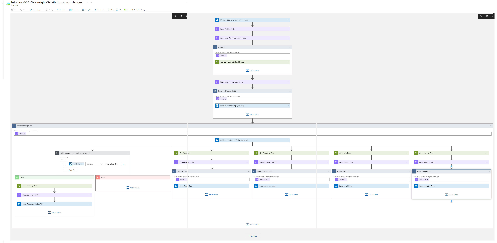

# Infoblox-IQ-for-TD-Get-Insight-Details

* [Summary](#Summary)
* [Prerequisites](#Prerequisites)
* [Deployment instructions](#Deployment-instructions)
* [Post-Deployment instructions](#Post-Deployment-instructions)

## Summary<a name="Summary"></a>

This playbook uses the Infoblox IQ for TD Insights API to **enrich a Microsoft Sentinel Incident** triggered by an **Infoblox IQ for TD Insight** and **ingest Insight details** into the custom ```InfobloxInsight``` tables using the **Log Ingestion API**. These Incidents are triggered by the **Infoblox - IQ for TD Insight Detected** analytic queries packaged as part of this solution. These queries will read your data for insights and create an Incident when one is found, hereby known as a **IQ for TD Insight Incident**.

Then, you can run this playbook on those incidents to **ingest many details about the Insight**, placed in several custom tables prefixed with ```InfobloxInsight```. This data also builds the **Infoblox IQ for TD Insight Workbook** you can use to richly visualize and drilldown your Insights.

It will also add **several tags** to the IQ for TD Insight Incident.

This playbook can be configured to run automatically when a IQ for TD Insight Incident occurs (recommended) or run on demand.



### Prerequisites<a name="Prerequisites"></a>

1. User must have a valid Infoblox API Key.
2. An existing Log Analytics Workspace where the Infoblox IQ for TD Insight custom tables will be created.
3. User must have created an analytics rule from a rule template.
4. Configure the associated automation rule as specified below:
    * Go to Microsoft Sentinel → *select your workspace* → Automation → Create → Automation rule
    * Set Automation rule name
    * Condition → If:
        1. Incident provider → Select Microsoft Sentinel
        2. Analytic rule name → Select Analytic rule name created using step 3
    * Action → Select Run playbook
    * Select Infoblox-IQ-for-TD-Get-Insight-Details playbook
    * Click on Apply

### Deployment instructions<a name="Deployment-instructions"></a>

1. To deploy the Playbook, click the Deploy to Azure button. This will launch the ARM Template deployment wizard.
2. Fill in the required parameters:
    * Playbook Name: Enter the playbook name here
    * Infoblox API Key: Enter valid value for API Key
    * Workspace Name: Name of the Log Analytics workspace where the Infoblox IQ for TD Insight custom tables will be created
    * Assets Data Ingestion: Provide true if you want to enable Assets data ingestion from Infoblox IQ for TD. Default is false, Allowed values are true and false.
    * Events Data Ingestion: Provide true if you want to enable Events data ingestion from Infoblox IQ for TD. Default is false, Allowed values are true and false.
    * Indicators Data Ingestion: Provide true if you want to enable Indicators data ingestion from Infoblox IQ for TD. Default is false, Allowed values are true and false.

[](https://portal.azure.com/#create/Microsoft.Template/uri/https%3A%2F%2Fraw.githubusercontent.com%2FAzure%2FAzure-Sentinel%2Fmaster%2FSolutions%2FInfoblox%2FPlaybooks%2FInfoblox%20SOC%20Get%20Insight%20Details%2Fazuredeploy.json) [](https://portal.azure.com/#create/Microsoft.Template/uri/https%3A%2F%2Fraw.githubusercontent.com%2FAzure%2FAzure-Sentinel%2Fmaster%2FSolutions%2FInfoblox%2FPlaybooks%2FInfoblox%20SOC%20Get%20Insight%20Details%2Fazuredeploy.json)

### Post-Deployment instructions<a name="Post-Deployment-instructions"></a>

#### a. No manual authorization needed for log ingestion

This playbook uses **Managed Identity** for authentication with the Log Ingestion API. The deployment automatically:

1. Creates a Data Collection Endpoint (DCE) and Data Collection Rule (DCR)
2. Creates or updates the custom ```InfobloxInsight```, ```InfobloxInsightAssets```, ```InfobloxInsightIndicators``` and ```InfobloxInsightEvents``` tables in the Log Analytics Workspace
3. Assigns the Logic App's Managed Identity the 'Monitoring Metrics Publisher' role on the DCR

#### b. Assign Role to update the incident

Assign role to this playbook.

1. Go to Log Analytics Workspace → *select your workspace* → Access Control → Add
2. Add role assignment
3. Assignment type: Job function roles -> Add 'Microsoft Sentinel Contributor' as a Role
4. Members: select managed identity for assigned access to and add your logic app as member
5. Click on review+assign

#### c. Configure playbook permissions (required to run this playbook)

1. Go to Microsoft Sentinel → *select your workspace* → Settings
2. Select the Settings tab → Playbook permissions → Configure permissions
3. Select the subscription containing this playbook
4. Click Apply
