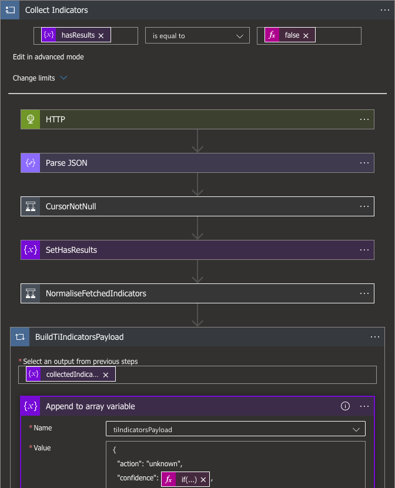

# Intel 471 Malware Intelligence import to Microsoft Graph Security

## Table of contents

1. [Overview](#overview)
2. [Prerequisites](#prerequisites)
3. [Deployment instructions](#deployment-instructions)
4. [Post-deployment instructions](#post-deployment-instructions)
5. [Querying Intel 471 Malware Intelligence data in Sentinel](#querying-intel-471-malware-intelligence-data-in-sentinel)
6. [Data mapping](#data-mapping)
7. [Script for granting ThreatIndicators.ReadWrite.OwnedBy role](#script-for-granting-threatindicatorsreadwriteownedby-role)

## Overview

This playbook fetches malware intelligence indicators from the Intel 471's Titan API and ingests them
as [tiIndicators](https://docs.microsoft.com/graph/api/resources/tiindicator?view=graph-rest-beta)
through [Microsoft Graph Security tiIndicators API](https://learn.microsoft.com/azure/sentinel/connect-threat-intelligence-tip) 
to make them available in Microsoft Sentinel and other Microsoft security solutions such as Defender ATP.

Data connector used in this playbook is on a path for deprecation. For new solutions use the new threat intelligence 
upload indicators API data connector, which is used in [Intel471-ImportMalwareIntelligenceToSentinel](..%2FIntel471-ImportMalwareIntelligenceToSentinel) playbook.
For more information, see [Connect your threat intelligence platform to Microsoft Sentinel with the upload indicators API](https://learn.microsoft.com/azure/sentinel/connect-threat-intelligence-upload-api).

[azuredeploy.json](azuredeploy.json) Azure Resource Manager template (ARM template) is responsible
for building the Logic App along with the necessary connections. The ARM builds following components:

- **[Logic App](https://docs.microsoft.com/azure/sentinel/create-custom-connector#connect-with-logic-apps)** responsible for fetching the data from Titan API and ingesting them into `ThreatIntelligenceIndicator` table
- Connection objects
  - Logic app to Blob storage *(authorized automatically)*
  - Logic app to Key Vault *(**requires manual configuration**)*
  - Logic app to Microsoft Security Graph *(**requires manual configuration**)*



## Prerequisites

1. An active account in Titan platform, which is available as part of Intel 471's subscriptions. For more information, please contact sales@intel471.com.
2. Titan API credentials.
3. Pre-existing [Key Vault](https://docs.microsoft.com/azure/key-vault/general/basic-concepts) for securely storing Titan API credentials. Store Titan API credentials as secrets under `TitanUserNameGraph` and `TitanAPIKeyGraph` keys.
4. Pre-existing [Blob storage](https://docs.microsoft.com/azure/storage/blobs/storage-blobs-introduction) with blob container for persisting data such as cursor between the API calls.
5. Threat Intelligence connector enabled in Sentinel. Go to Sentinel instance → `Content hub` and install `Threat Intelligence` solution.


## Deployment instructions

1. To deploy the Playbook, click the **Deploy to Azure** button. It will launch the ARM Template deployment wizard.
2. Provide following parameters:
    * **Playbook Name**: Either leave the default one or change it as needed
    * **StorageAccountName**: Name of the Storage account (see prerequisites)
    * **StorageAccountContainerName**: Name of the blob container in the Storage account
    * **KeyVaultName**: Name of the Key Vault (see prerequisites)
    * **Target Product**: Security product to which the indicators will be applied. Allowed values: `Azure Sentinel`, `Microsoft Defender ATP`
    * **Action**: The action to apply if the indicator is matched from within the targetProduct security tool. Allowed values: `unknown`, `allow`, `block`, `alert`
    * **Look Back Days**: How many days of history should be pulled on the first run. Leave 0 to start from the current time

    [](https://portal.azure.com/#create/Microsoft.Template/uri/https%3A%2F%2Fraw.githubusercontent.com%2FAzure%2FAzure-Sentinel%2Fmaster%2FSolutions%2FIntel471%2FPlaybooks%2FIntel471-ImportMalwareIntelligenceToGraphSecurity%2Fazuredeploy.json)
    [](https://portal.azure.us/#create/Microsoft.Template/uri/https%3A%2F%2Fraw.githubusercontent.com%2FAzure%2FAzure-Sentinel%2Fmaster%2FSolutions%2FIntel471%2FPlaybooks%2FIntel471-ImportMalwareIntelligenceToGraphSecurity%2Fazuredeploy.json)

## Post-deployment instructions

1. Go to the Key Vault. Select `Access control (IAM)` → `+ Add` → `Add role assignment`. Choose `Key Vault Secrets User`. On the next screen hit `+ Select members`, search for Intel 471 and select newly created logic app. Select it and proceed with granting access rights.
2. Go to created `Logic App` → `Edit`. Navigate to `CollectAndSubmitIndicators → SubmitInBatches → Connections` block. Inside this block create a new connection. Select `Connect with managed identity`, provide connection name and click `Create`.
3. Grant `ThreatIndicators.ReadWrite.OwnedBy` role for the Logic App to allow indicator ingestion through the tiIndicators API. It can't be done in the Azure portal at the moment. You can use the Azure CLI script listed below instead. Consult [Microsoft documentation](https://learn.microsoft.com/azure/app-service/scenario-secure-app-access-microsoft-graph-as-app?tabs=azure-cli#grant-access-to-microsoft-graph) for more details.
4. Optionally change the schedule's frequency in `Recurrence` block (the first one).

## Querying Intel 471 Malware Intelligence data in Sentinel

Get first 10 ingested indicators

```
ThreatIntelligenceIndicator | where Description contains "Intel 471" | limit 10 
```

Look for a specific indicator

```
ThreatIntelligenceIndicator | where Description has "Intel 471" | where NetworkIP == "227.151.66.29"
ThreatIntelligenceIndicator | where Description has "Intel 471" | where Url == "tcp://58.68.162.115:16"
ThreatIntelligenceIndicator | where Description has "Intel 471" | where FileHashValue == "B55C257F8004F6A742B1A252EEDDDD655256955A931C1BD0F47299ADD326ED6D"
```

Get indicators of a specific type

```
ThreatIntelligenceIndicator | where Description has "Intel 471" | where NetworkIP != ""  | limit 10
ThreatIntelligenceIndicator | where Description has "Intel 471" | where Url != ""  | limit 10
ThreatIntelligenceIndicator | where Description has "Intel 471" | where FileHashValue != ""  | limit 10
```

Get IP indicators with specific confidence

```
ThreatIntelligenceIndicator | where Description has "Intel 471" | where NetworkIP != "" | where  ConfidenceScore > 40  | limit 10
```

Get indicators related to a specific malware family

```
ThreatIntelligenceIndicator | where Description has "Intel 471" | where MalwareNames contains "njrat" | limit 10
```

## Data mapping

Data is fetched from `/v1/indicators/stream` Titan API endpoint and is then transformed to conform with `ThreatIntelligenceIndicator` table.
Table below summarizes the mappings and additional transformations that are performed for several fields.

| Titan API object key          | ThreatIntelligenceIndicator record column | Additional transformations                                                                                                                                                          |
|-------------------------------|-------------------------------------------|-------------------------------------------------------------------------------------------------------------------------------------------------------------------------------------|
| -                             | action                                    | Provided by the user. One of `allow`, `alert`, `block` or `unknown`.                                                                                                                |
| data.confidence               | confidence                                | `high` → `85`, `medium` → `50`, `low` → `15`                                                                                                                                        |
| data.context.description      | description                               | -                                                                                                                                                                                   |
| data.expiration               | expirationDateTime                        | -                                                                                                                                                                                   |
| data.uid                      | externalId                                | -                                                                                                                                                                                   |
| data.indicator_data.file.*    | fileHashType                              | In Titan API each file indicator object contains all hashes. In `ThreatIntelligenceIndicator` table there's a separate row for each hash.                                           |
| data.indicator_data.file.*    | fileHashValue                             | Example transformation: `{"indicator_data": {"file": {"md5": "abc", "sha1": "bcd"}}}` → `[{"fileHashType": "MD5", "fileHashValue": "abc"}, {"fileHashType": "MD5", "SHA1": "bcd"}]` |
| data.indicator_data.file.size | fileSize                                  | -                                                                                                                                                                                   |
| data.indicator_data.file.type | fileType                                  | -                                                                                                                                                                                   |
| data.mitre_tactics            | killChain                                 | `command_and_control` → `C2`, `stage_capabilities` → `Installation`, `initial_access` → `Exploitation`                                                                              |
| activity.last                 | lastReportedDateTime                      | -                                                                                                                                                                                   |
| data.threat.data.family       | malwareFamilyNames                        | -                                                                                                                                                                                   |
| data.indicator_data.address   | networkIPv4                               | -                                                                                                                                                                                   |
| -                             | targetProduct                             | Provided by the user, either `Azure Sentinel` or `Microsoft Defender ATP`                                                                                                           |
| -                             | threatType                                | Set to `Malware`                                                                                                                                                                    |
| -                             | tlpLevel                                  | Set to `amber`                                                                                                                                                                      |
| data.indicator_data.url       | url                                       | -                                                                                                                                                                                   |

## Script for granting ThreatIndicators.ReadWrite.OwnedBy role

```bash
#!/bin/bash

# tested against azure-cli==2.42.0

az login

# Logic App name. IF YOU CHANGED IT DURING THE DEPLOYMENT, CHANGE IT HERE AS WELL
logicAppName="Intel471-ImportMalwareIntelligenceToGraphSecurity"

# ID of the Microsoft Graph resource. Do not change.
graphAppId="00000003-0000-0000-c000-000000000000"

# Name of the required role. Do not change.
roleName="ThreatIndicators.ReadWrite.OwnedBy"

# Get the ID of the Logic App
spId=$(az resource list -n $logicAppName --query '[*].identity.principalId' --out tsv)

# Get the ID of the Microsoft Graph resource
graphResourceId=$(az ad sp show --id "$graphAppId" --query 'id' --out tsv)

# Get the ID of the Role
appRoleId=$(az ad sp show --id "$graphAppId" --query "appRoles[?value=='$roleName' && contains(allowedMemberTypes, 'Application')].id" --output tsv)

# Build a Role assignments request for your app
uri=https://graph.microsoft.com/v1.0/servicePrincipals/$spId/appRoleAssignments
body="{'principalId':'$spId','resourceId':'$graphResourceId','appRoleId':'$appRoleId'}"
echo "URI: "$uri
echo "Body: "$body

# Call the endpoint to grant the role
az rest --method post --uri $uri --body $body --headers "Content-Type=application/json"
```