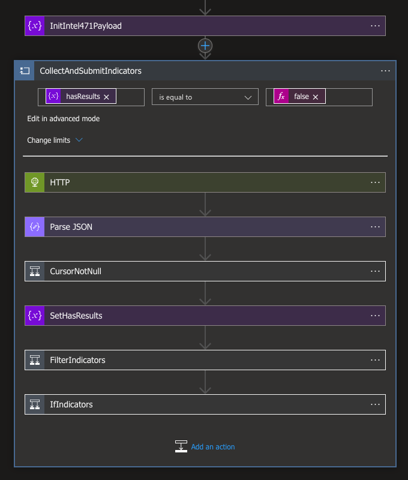

# Intel 471 Malware Intelligence import to Sentinel

## Table of contents

1. [Overview](#overview)
2. [Prerequisites](#prerequisites)
3. [Deployment instructions](#deployment-instructions)
4. [Post-deployment instructions](#post-deployment-instructions)
5. [Querying Intel 471 Malware Intelligence data in Sentinel](#querying-intel-471-malware-intelligence-data-in-sentinel)
6. [Data mapping](#data-mapping)
7. [Script for granting ThreatIndicators.ReadWrite.OwnedBy role](#script-for-granting-threatindicatorsreadwriteownedby-role)

## Overview

This playbook fetches malware intelligence indicators from the Intel 471's Titan API and ingests them
using [Threat Intelligence Upload Indicators API for Microsoft Sentinel](https://learn.microsoft.com/azure/sentinel/connect-threat-intelligence-upload-api).

[azuredeploy.json](azuredeploy.json) Azure Resource Manager template (ARM template) is responsible
for building the Logic App along with the necessary connections. The ARM builds following components:

- **[Logic App](https://docs.microsoft.com/azure/sentinel/create-custom-connector#connect-with-logic-apps)** responsible for fetching the data from Titan API and ingesting them into `ThreatIntelligenceIndicator` table using Upload Indicators API.
- Connection objects
  - Logic app to Blob storage *(authorized automatically)*
  - Logic app to Key Vault *(**requires manual configuration**)*
  - Logic app to Log Analytics workspace *(authorized automatically)*



## Prerequisites

1. An active account in Titan platform, which is available as part of Intel 471's subscriptions. For more information, please contact sales@intel471.com.
2. Titan API credentials.
3. Pre-existing [Key Vault](https://docs.microsoft.com/azure/key-vault/general/basic-concepts) for securely storing Titan API credentials. Store Titan API credentials as secrets under `TitanUserNameSentinel` and `TitanAPIKeySentinel` keys.
4. Pre-existing [Blob storage](https://docs.microsoft.com/azure/storage/blobs/storage-blobs-introduction) with blob container for persisting data such as cursor between the API calls.
5. Threat Intelligence connector enabled in Sentinel. Go to Sentinel instance → `Content hub` and install `Threat Intelligence` solution.


## Deployment instructions

1. To deploy the Playbook, click the **Deploy to Azure** button. It will launch the ARM Template deployment wizard.
2. Provide following parameters:
    * **Playbook Name**: Either leave the default one or change it as needed
    * **StorageAccountName**: Name of the Storage account (see prerequisites)
    * **StorageAccountContainerName**: Name of the blob container in the Storage account
    * **KeyVaultName**: Name of the Key Vault (see prerequisites)
    * **Workspace ID**: ID of the Log Analytics workspace to which the indicators will be directed
    * **Look Back Days**: How many days of history should be pulled on the first run. Leave 0 to start from the current time

    [](https://portal.azure.com/#create/Microsoft.Template/uri/https%3A%2F%2Fraw.githubusercontent.com%2FAzure%2FAzure-Sentinel%2Fmaster%2FSolutions%2FIntel471%2FPlaybooks%2FIntel471-ImportMalwareIntelligenceToSentinel%2Fazuredeploy.json)
    [](https://portal.azure.us/#create/Microsoft.Template/uri/https%3A%2F%2Fraw.githubusercontent.com%2FAzure%2FAzure-Sentinel%2Fmaster%2FSolutions%2FIntel471%2FPlaybooks%2FIntel471-ImportMalwareIntelligenceToSentinel%2Fazuredeploy.json)

## Post-deployment instructions

1. Go to the Key Vault. Select `Access control (IAM)` → `+ Add` → `Add role assignment`. Choose `Key Vault Secrets User`. On the next screen hit `+ Select members`, search for Intel 471 and select newly created logic app. Select it and proceed with granting access rights.
2. Go to the selected Log Analytics workspace and repeat step 1. except grant role `Microsoft Sentinel Contributor`.
4. Optionally change the schedule's frequency in `Recurrence` block (the first one).

## Querying Intel 471 Malware Intelligence data in Sentinel

Get first 10 ingested indicators

```
ThreatIntelligenceIndicator | where Description contains "Intel 471" | limit 10 
```

Look for a specific indicator

```
ThreatIntelligenceIndicator | where Description has "Intel 471" | where NetworkIP == "227.151.66.29"
ThreatIntelligenceIndicator | where Description has "Intel 471" | where Url == "tcp://58.68.162.115:16"
ThreatIntelligenceIndicator | where Description has "Intel 471" | where FileHashValue == "B55C257F8004F6A742B1A252EEDDDD655256955A931C1BD0F47299ADD326ED6D"
```

Get indicators of a specific type

```
ThreatIntelligenceIndicator | where Description has "Intel 471" | where NetworkIP != ""  | limit 10
ThreatIntelligenceIndicator | where Description has "Intel 471" | where Url != ""  | limit 10
ThreatIntelligenceIndicator | where Description has "Intel 471" | where FileHashValue != ""  | limit 10
```

Get IP indicators with specific confidence

```
ThreatIntelligenceIndicator | where Description has "Intel 471" | where NetworkIP != "" | where  ConfidenceScore > 40  | limit 10
```

Get indicators related to a specific malware family

```
ThreatIntelligenceIndicator | where Description has "Intel 471" | where MalwareNames contains "njrat" | limit 10
```

## Data mapping

Data is fetched from `/v1/indicators/stream` Titan API endpoint and is then transformed into STIX2 format as described in the [Reference](https://learn.microsoft.com/azure/sentinel/upload-indicators-api).
Table below summarizes the mappings and additional transformations that are performed on several fields.

| Titan API object key        | STIX 2.1 indicator format | Additional transformations                                                                             |
|-----------------------------|------------------------------------------|--------------------------------------------------------------------------------------------------------|
| -                           | id                                       | Set to `indicator--<UUIDv4>`                                                                           |
| -                           | spec_version                             | Set to `2.1`                                                                                           |
| -                           | type                                     | Set to `indicator`                                                                                     |
| activity.first              | created                                  | -                                                                                                      |
| last_updated                | modified                                 | -                                                                                                      |
| data.threat.data.family     | name                                     | -                                                                                                      |
| data.context.description    | description                              | -                                                                                                      |
| -                           | indicator_types                          | set to `["malicious-activity"]`                                                                        |
| data.indicator_data.file.*  | pattern                                  | file hashes, url and address are transformed according to STIX2 patterning rules                       |
| data.indicator_data.url     | pattern                                  | -                                                                                                      
| data.indicator_data.address | pattern                                  | -                                                                                                      |
| -                           | pattern_type                             | Set to `stix`                                                                                          |
| activity.first              | valid_from                               | -                                                                                                      |
| data.expiration             | valid_until                              | -                                                                                                      |
| data.mitre_tactics          | kill_chain_phases                        | `command_and_control` → `C2`, `stage_capabilities` → `Installation`, `initial_access` → `Exploitation` |
| data.threat.data.family     | labels                                   | -                                                                                                      |
| data.confidence             | confidence                               | `high` → `85`, `medium` → `50`, `low` → `15`                                                           |
| -                           | object_marking_refs                      | Set to `marking-definition--f88d31f6-486f-44da-b317-01333bde0b82` (TLP Amber)                          |
| data.threat.uid             | external_references                      | -                                                                                                      |


