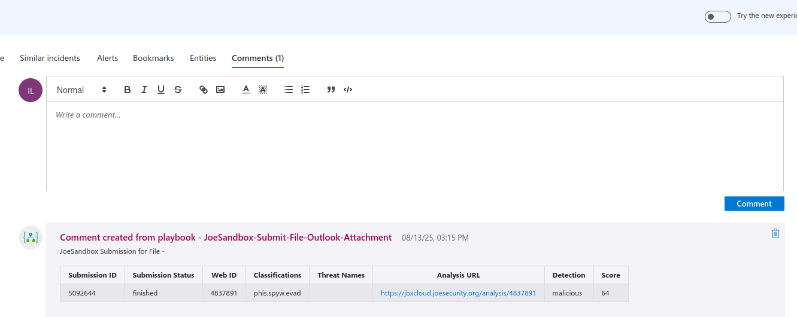

# JoeSandbox File Analysis Playbook

## Table of Contents

1. [Overview](#overview)
1. [Deploy Playbook](#deployplaybook)
1. [Authentication](#authentication)
1. [Prerequisites](#prerequisites)
1. [Deployment](#deployment)
1. [Post Deployment Steps](#postdeployment)

<a name="overview">

# Overview
This playbook gets triggered when an new email is recieved in the configured mail box and performs the following actions:

- It fetches the attachments objects in the Email.
- Iterates through and submits to JoeSanbox for analysis and fetches the results for each File.
- All the details from JoeSanbox will be added as comments in a tabular format.

<a name="deployplaybook">

## Links to deploy Playbook:

 

- Click on Deploy to Azure
- It will redirect to configuration page

- Please provide the values accordingly

|       Fields       | Description                                                |
|:---------------------|:-----------------------------------------------------------
| Subscription		| Select the appropriate Azure Subscription                  | 
| Resource Group 	| Select the appropriate Resource Group                      |
| Region			| Based on Resource Group this will be uto populated         |
| Playbook Name		| Please provide a playbook name, if needed                  |
| Workspace Name		| Please provide Log Analytics Workspace Name                |
| Workspace ID		| Please provide Log Analytics Workspace ID                  |
| Function App Name		| Please provide the JoeSandbox enrichment function app name |

- Once you provide the above values, please click on `Review + create` button.

<a name="authentication">

## Authentication
Authentication methods this connector supports:
- [API Key authentication](https://www.joesecurity.org/joe-sandbox-cloud#subscriptions)

<a name="prerequisites">

## Prerequisites for using and deploying playbook
- A JoeSanbox API Key.
- JoeSandbox Logic App Custom Connector should be installed.

<a name="deployment">

#### Deployment instructions
- Deploy the playbooks by clicking on "Deploy to Azure" button. This will take you to deploying an ARM Template wizard.
- Fill in the required parameters for deploying the playbook.
- Click "Review + create". Once the validation is successful, click on "Create".

<a name="postdeployment">

### Post-Deployment instructions.
- As a best practice, we have used the Sentinel connection in Logic Apps that use "ManagedSecurityIdentity" permissions. Please refer to [this document](https://techcommunity.microsoft.com/t5/microsoft-sentinel-blog/what-s-new-managed-identity-for-azure-sentinel-logic-apps/ba-p/2068204) and provide permissions to the Logic App accordingly.

