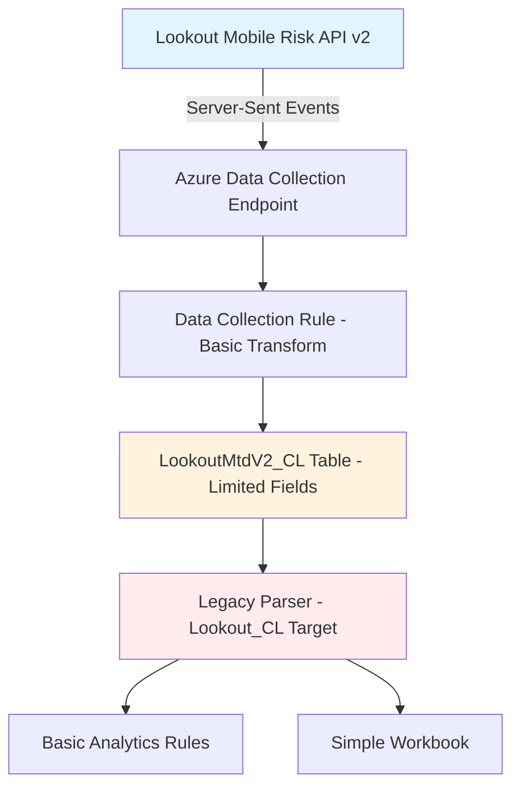
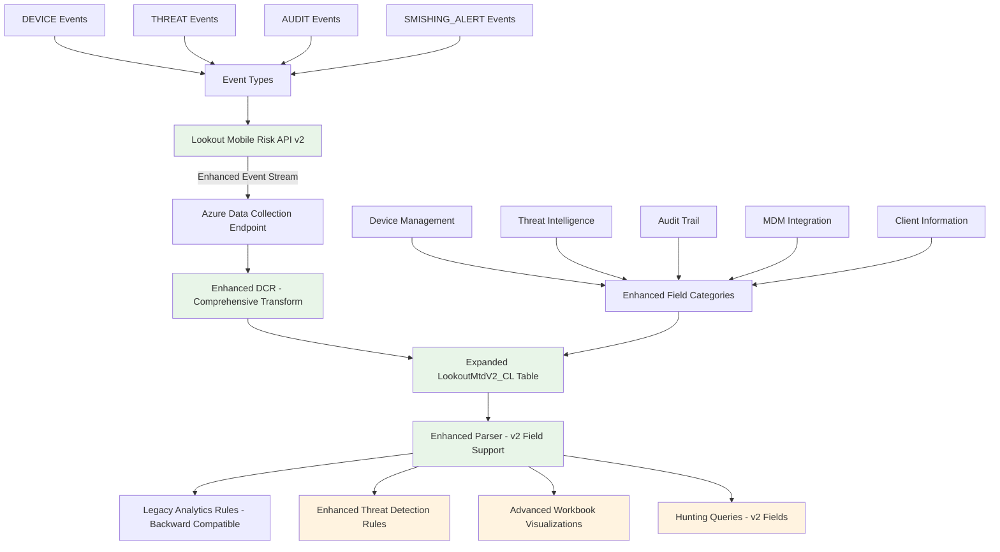
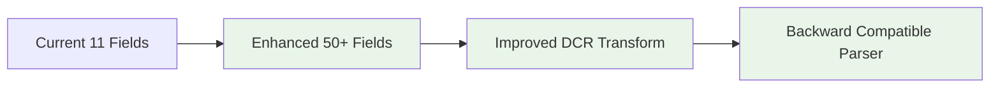
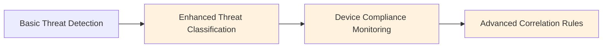
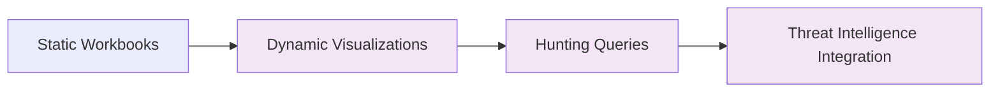
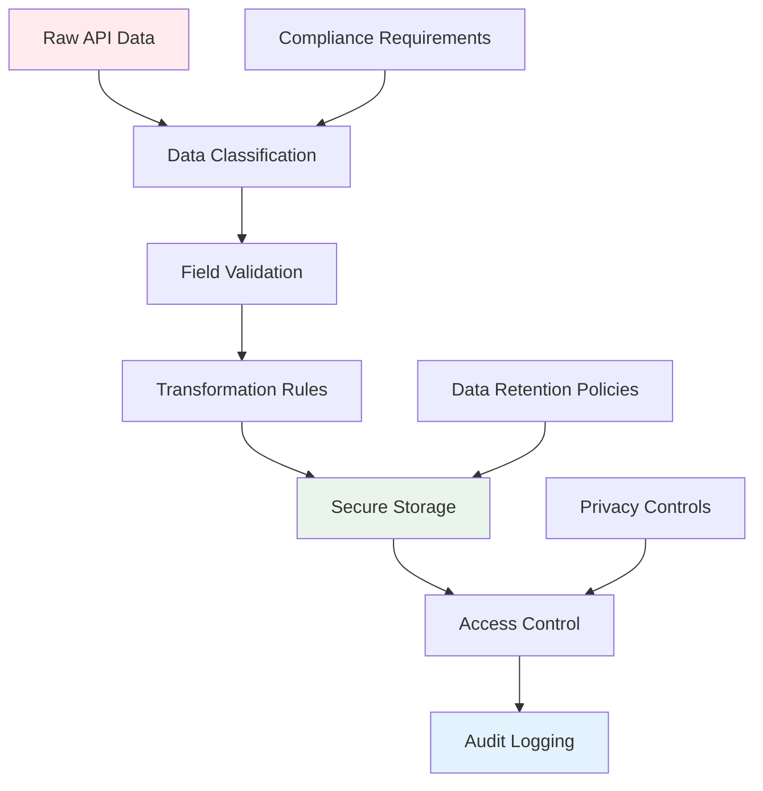
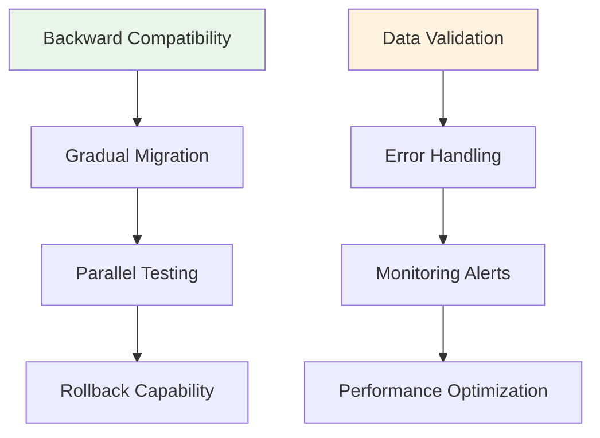

# Lookout Mobile Risk API v2 Architecture Overview

## Current Architecture

## Enhanced v2 Architecture

## Data Flow Enhancement Details

### Phase 1: Infrastructure Enhancement

### Phase 2: Analytics Enhancement

### Phase 3: Advanced Features

## Component Interaction Matrix

| Component | Current State | Enhanced State | Dependencies |
|-----------|---------------|----------------|--------------|
| **Table Schema** | 11 basic fields | 50+ comprehensive fields | DCR updates |
| **DCR Transform** | Basic field mapping | Comprehensive extraction | API v2 understanding |
| **Parser** | Legacy Lookout_CL target | Dual compatibility | Table schema |
| **Analytics Rules** | Basic threat detection | Multi-layered detection | Parser updates |
| **Workbooks** | Simple visualizations | Rich dashboards | Enhanced data |
| **Hunting Queries** | Limited scope | Comprehensive coverage | All above |

## Security and Compliance Flow

## Implementation Phases

### Phase 1: Core Infrastructure (Weeks 1-2)
- Expand table schema
- Update DCR transformations
- Enhance parser compatibility

### Phase 2: Analytics Enhancement (Weeks 3-4)
- Update existing analytics rules
- Create new threat detection rules
- Enhance workbook visualizations

### Phase 3: Advanced Features (Weeks 5-6)
- Create hunting queries
- Implement advanced correlation
- Add comprehensive validation

## Risk Mitigation Strategy

## Success Metrics

1. **Data Completeness**: 95%+ field population rate
2. **Performance**: <10% increase in ingestion latency
3. **Compatibility**: 100% backward compatibility maintained
4. **Detection Enhancement**: 30%+ improvement in threat detection coverage
5. **User Adoption**: Analytics rules utilizing new fields within 30 days