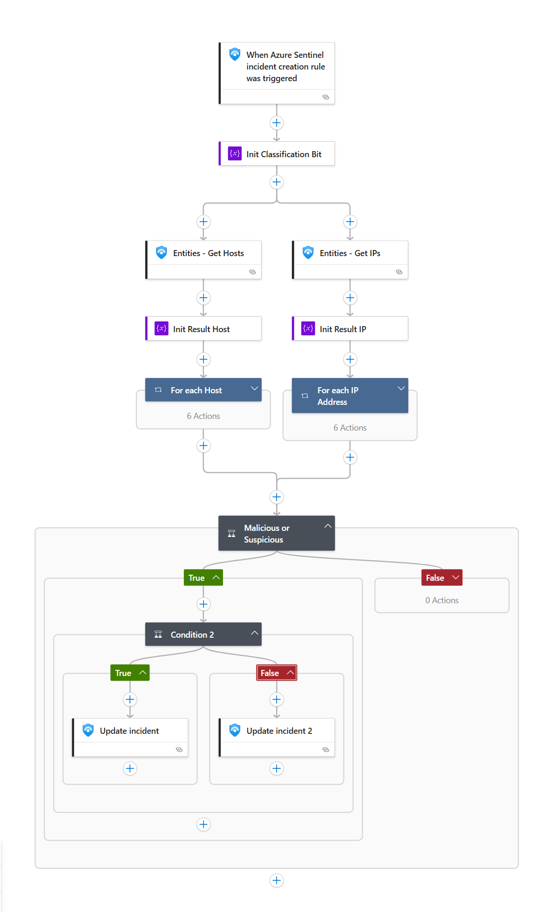
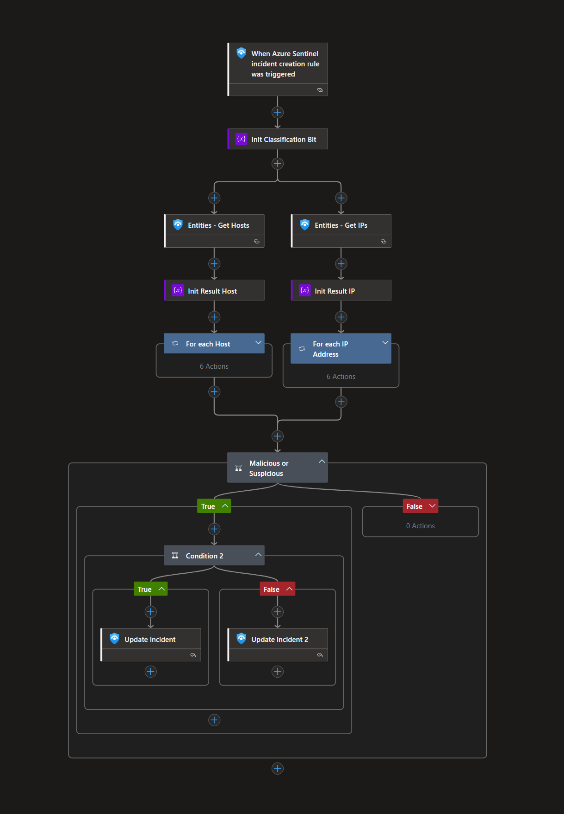

# MDTI-Automated-Triage

## Overview
This playbook uses the [Microsoft Defender Threat Intelligence](https://learn.microsoft.com/en-us/defender/threat-intelligence/what-is-microsoft-defender-threat-intelligence-defender-ti) Reputation data to automatically enrich incidents generated by Microsoft Sentinel. Indicators from an incident will be evaluated with MDTI [Reputation](https://learn.microsoft.com/en-us/defender/threat-intelligence/reputation-scoring) data. If any indicators are labeled as "suspicious", the incident will be tagged as such and its severity will be marked as "medium". If any indicators are labeled as "malicious", the incident will be tagged as such and its severity will be marked as "high". Regardless of the reputation state, comments will be added to the incident outlining the reputation details with links to further information if applicable.


## Prerequisites
1. Microsoft Defender Threat Intelligence (MDTI) Premium license enabled on your tenant.
2. Security Administrator, Global Administrator, or Privileged Role Administrator role in Azure AD to assign the required API permissions to the playbook's Managed Identity.

## Deployment

### Playbook Parameters
| Name            | Description                        | Default Value                  |
|-----------------|------------------------------------|-------------------------------|
| PlaybookName    | Name of the playbook               | MDTI-Automated-Triage         |
| MDTI-BaseUrl    | Base URL for MDTI API              | https://graph.microsoft.com   |
| Api-Version     | API version for MDTI API           | v1.0                          |

<a href="https://portal.azure.com/#create/Microsoft.Template/uri/https%3A%2F%2Fraw.githubusercontent.com%2FAzure%2FAzure-Sentinel%2Fmaster%2FSolutions%2FMicrosoft%2520Defender%2520Threat%2520Intelligence%2FPlaybooks%2FMDTI-Automated-Triage%2Fazuredeploy.json" target="_blank">
    
</a>
<a href="https://portal.azure.us/#create/Microsoft.Template/uri/https%3A%2F%2Fraw.githubusercontent.com%2FAzure%2FAzure-Sentinel%2Fmaster%2FSolutions%2FMicrosoft%2520Defender%2520Threat%2520Intelligence%2FPlaybooks%2FMDTI-Automated-Triage%2Fazuredeploy.json" target="_blank">
    
</a>


## Post-Deployment Instructions


**1. Assign ThreatIntelligence.Read.All Permission to Playbook's Managed Identity**

To allow the playbook to query Microsoft Defender Threat Intelligence data, you must grant the managed identity of the playbook the `ThreatIntelligence.Read.All` application permission in Microsoft Graph. Follow these steps:

1. Ensure you have the necessary Azure AD permissions (Security Administrator, Global Administrator, or Privileged Role Administrator).
2. Open the [Azure Cloud Shell](https://shell.azure.com/) or use a local PowerShell session with the Microsoft Graph module installed.
3. Run the following commands, replacing `'MDTI-Automated-Triage'` with your playbook's name if different:

```powershell
# Install and import Microsoft Graph module if not already present
Install-Module Microsoft.Graph -Scope CurrentUser -AllowClobber -Force
Import-Module Microsoft.Graph # It takes a minute to import


# Connect to Microsoft Graph with the required scopes
Connect-MgGraph -Identity

# Get the Microsoft Graph service principal
$graphSp = Get-MgServicePrincipal -Filter "displayName eq 'Microsoft Graph'"

# Get the App Role ID for ThreatIntelligence.Read.All
$role = $graphSp.AppRoles | Where-Object { $_.Value -eq "ThreatIntelligence.Read.All" -and $_.AllowedMemberTypes -contains "Application" }

$logicAppName = 'MDTI-Data-Cookies'   # Change if different
# Get your Logic App's managed identity service principal
$logicAppSp = Get-MgServicePrincipal -Filter "displayName eq 'MDTI-Automated-Triage'"

# Assign the permission to the Logic App's managed identity
New-MgServicePrincipalAppRoleAssignment -ServicePrincipalId $logicAppSp.Id `
    -PrincipalId $logicAppSp.Id `
    -ResourceId $graphSp.Id `
    -AppRoleId $role.Id

Write-Host "Permission assigned successfully to Logic App ${logicAppName}."
```

**2. Authorize Connections**

After deployment, authorize all connections:

1. Click the Microsoft Sentinel connection resource
2. Click edit API connection
3. Click Authorize
4. Sign in
5. Click Save
Repeat steps for all connections.

**3. Assign Microsoft Sentinel Contributor Role to Playbook**

This playbook uses a managed identity, which must have the Microsoft Sentinel Contributor role assigned in the Sentinel instances to enable adding comments.

1. Select the Playbook resource.
2. In the left menu, click Identity.
3. Under Permissions, click Azure role assignments.
4. Click Add role assignment (Preview).
5. Use the drop-down lists to select the resource group that your *Sentinel Workspace* is in. If multiple workspaces are used in different resource groups consider selecting subscription as a scope instead.
6. In the Role drop-down list, select the role 'Microsoft Sentinel Contributor'.
7. Click Save to assign the role.

**4. Attach the Incident Triggered Playbook to an Automation Rule**

To run the playbook automatically:

1. In Microsoft Sentinel, go to **Automation** > **Automation rules**.
2. Click **+ Add new** to create a new automation rule.
3. Set the rule conditions (e.g., when an alert/incident is created, or based on alert/incident details).
4. In the Actions section, select **Run playbook** and choose your Alert Triggered Playbook.
5. Save the automation rule.

For more details, see the [official documentation on automation rules](https://docs.microsoft.com/azure/sentinel/automate-incident-handling-with-automation-rules#creating-and-managing-automation-rules).

**5. Configure Analytics Rules to run Playbook**

To ensure this playbook is triggered by alerts/incidents containing URL entities, configure your analytics rules as follows:

1. In Microsoft Sentinel, go to **Analytics** and create a new scheduled query rule or edit an existing one.
2. In the rule creation workflow, go to the **Set rule logic** tab.
3. In the **Alert enhancement** section, expand **Entity mapping**.
4. Click **Add new entity**:
   - For IPs, select **IP** as the entity type, then map the **Address** identifier to the field in your query that contains the IP address value.
   - For Hostnames, select **Host** as the entity type, then map the **FullName** identifier to the field in your query that contains the IP address value.
5. You can map up to 10 entities per rule and up to 3 identifiers per entity.
6. Complete the rest of the rule configuration and save.

For more details, see the official documentation on [mapping data fields to entities in Microsoft Sentinel](https://learn.microsoft.com/en-us/azure/sentinel/map-data-fields-to-entities#how-to-map-entities).


## Screenshots

### Playbook Example Screenshots

<p align="center">
    
    <br/>
    <em>MDTI-Automated-Triage Light</em>
</p>

<p align="center">
    
    <br/>
    <em>MDTI-Automated-Triage Dark</em>
</p>


## References
- [Microsoft Defender Threat Intelligence Documentation](https://learn.microsoft.com/en-us/defender/threat-intelligence/what-is-microsoft-defender-threat-intelligence-defender-ti)
- [Reputation Scoring](https://learn.microsoft.com/en-us/defender/threat-intelligence/reputation-scoring)