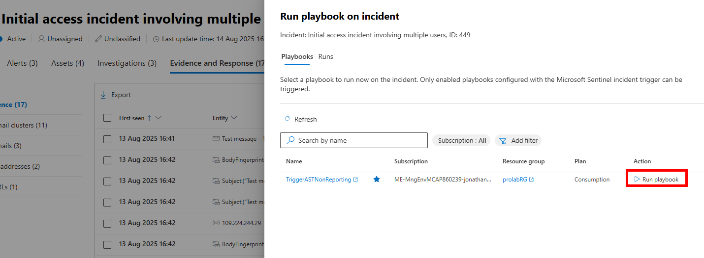
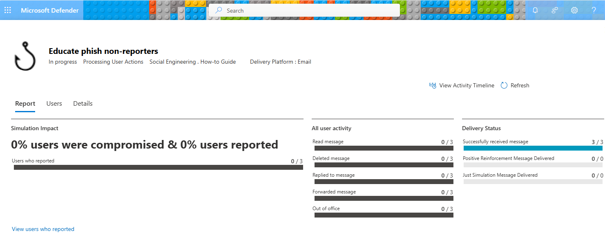
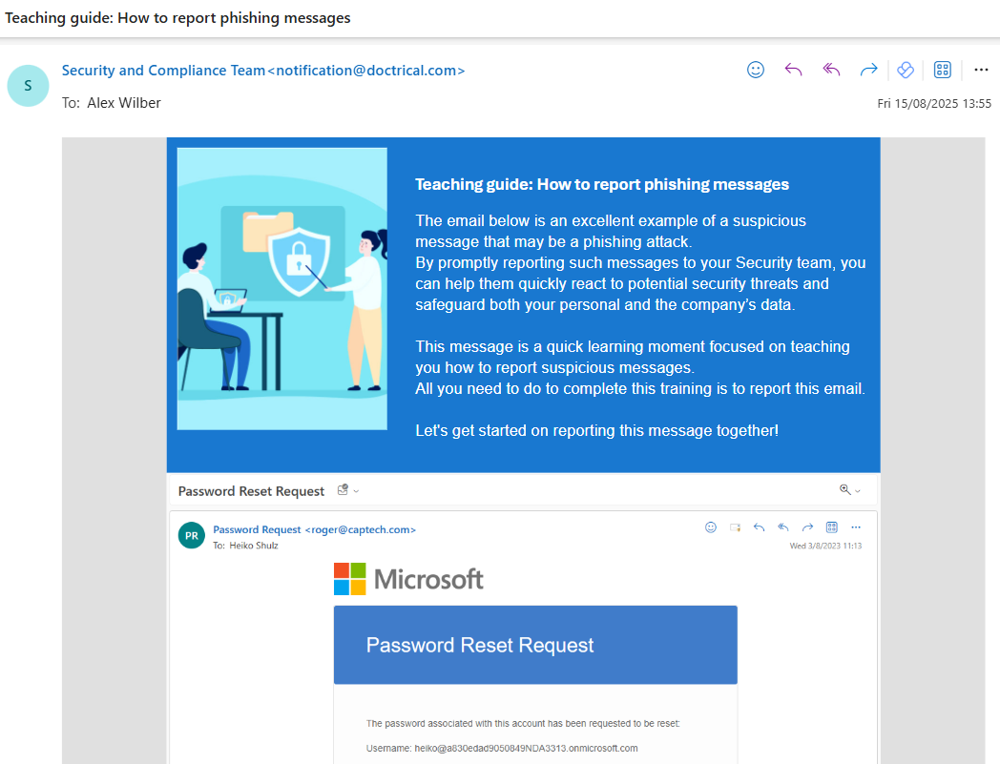

# Perform Attack Simulator training for Phishing non-reporters

## Summary

This playbook will execute using an incident based trigger and determine which mailboxes received malicious phishing emails, and calculate which users failed to report a message as phishing (e.g. reported as junk, deleted the email, etc.) to the SOC. It will trigger an Attack Simulator 'How-To Guide' simulation to educate these end-users on the correct response when receiving a Phish email in an inbox.








## Deployment instructions

1. To deploy the Playbook, click the Deploy to Azure button. This will launch the ARM Template deployment wizard.
2. Fill in the required parameters:
    * Workflow Name: Enter the name of the Logic App to deploy (Default: TriggerASTNonReporting)
    * Email Address: Enter an email address. This will only control the 'Created By' field in the admin portal for any simulations created by the runbook. (This does _not_ modify the sender email address for emails sent via this runbook, which is configured as part of the Attack Simulator payload.)

[](https://portal.azure.com/#create/Microsoft.Template/uri/https%3A%2F%2Fraw.githubusercontent.com%2FAzure%2FAzure-Sentinel%2FSolutions%2FMicrosoft%2520Defender%2520XDR%2FPlaybooks%2FAttackSimulatorTrainingNonReporters%2Fazuredeploy.json)
[](https://portal.azure.us/#create/Microsoft.Template/uri/https%3A%2F%2Fraw.githubusercontent.com%2FAzure%2FAzure-Sentinel%2FSolutions%2FMicrosoft%2520Defender%2520XDR%2FPlaybooks%2FAttackSimulatorTrainingNonReporters%2Fazuredeploy.json)


## Post-Deployment instructions

After deployment, the following Graph API scopes (Application) still need to be added to the Managed Service Principal that was created.

* SecurityIncident.Read.All
* SecurityAlert.Read.All
* ThreatHunting.Read.All
* AttackSimulation.ReadWrite.All

This can be done by running the `addGraphPermissions.ps1` script from this repository in PowerShell.


Ensure you have the required PowerShell modules to run this script by running:

```powershell
Install-Module -Name Microsoft.Graph.Authentication,Microsoft.Graph.Applications
```